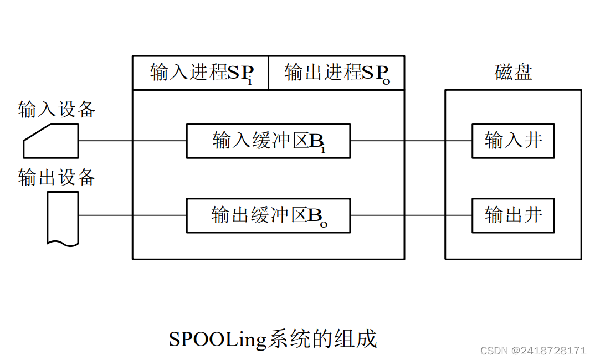

# 3

## 计算机系统概述

### 操作系统基本概念

* **操作系统**：管理各种计算机硬件,为应用程序提供基础,充当计算机硬件和用户之间的中介,综上所述,操作系统`OS`是控制和管理整个计算机硬件软件资源,组织调度计算机工作和资源分配,为用户和其他软件提供接口和环境的程序集合
    > 操作系统是一种系统软件
* 操作系统的基本特性:并发,共享,虚拟,异步
  * **并发**:程序并发执行,提高系统利用率
  * **共享**:操作系统的资源可供多个并发执行的进程使用
  * **虚拟**:通过时分复用和空分复用的方式使设备得到有效利用
  * **异步**:由于资源等因素的限制,进程的执行通常停停走走,何时能够获取`I/O`设备,程序将如何推进都是不可预知的
* 操作系统的目标:
  1. **方便性**:方便用户,使计算机易学易用
  2. **有效性**:提高系统的资源的利用率,合理地组织计算机的工作流程,加速程序的运行,缩短程序的运行周期,从而提高系统的吞吐量
  3. **可扩充性**:适应计算机硬件、体系结构和计算机应用发展的要求,`OS`必须方便地添加新的功能和模块,对原有的功能进行修改
  4. **开放性**:所谓开放性,是指系统能够遵循世界标准规范,特别是遵循`开放系统相连OSI`国际标准
* 操作系统的作用:
  1. **OS系统作为用户和计算机硬件系统之间的接口**:通过命令调用方式、系统调用和图标窗口方式来实现与操作系统的通信
  2. **OS作为计算机系统资源的管理者**:`OS`的主要功能就是对处理器,存储器,`I/O`设备及文件(数据和程序)管理
  3. **OS实现了对计算机资源的抽象**:对于无操作系统的裸机,它向用户提供的只是物理接口,用户需要对物理接口的实现有所了解,为了方便用户使用,人们在上面覆盖一层操作系统,由它来实现细节,方便管理

### 发展历程

* **人工操作**:最早的计算机操作是通过人工操作的方式进行的,用户独占主机,`CPU`需要等待人工操作,计算机资源利用率低,`I/O`设备的速度提升缓慢,`CPU`和`I/O`设备之间速度不匹配
* **脱机输入方式**:为了解决`CPU`和`I/O`设备速度不匹配的矛盾,将程序通过外围机读入磁盘,当`CPU`需要时,再调入内存,减少了`CPU`等待输入的时间
* 单道批处理:为了实现连续处理,需要先把一批作业脱机输入到磁带上,并配上监督程序(`Monitor`),在它的作用下,使作用能够一个接一个地连续处理,这种执行方式里内存中始终保持一个作业,故称为单道批处理系统
  * 自动执行处理,顺序读取执行,只使用单道作业
  * 缺点:系统资源得不到充分运用,当发出`I/O`请求时,`CPU`处于等待状态
* **多道批处理**:在单道批处理的基础上改进,用户提交的作业先放在外存上,并排成后备队列,然后作业调度程序根据算法一次选择若干个作业调入内存
  * 优点:资源利用率高,系统吞吐量大
  * 缺点:平均周转时间长,无交互能力
* **分时系统**:推动分时系统发展的动力是人机交互的需求,分时系统是一台主机连接了多个终端设备,系统允许多个人操作终端,以交互的方式使用计算机,共享主机资源
  * 分时系统没有作业调度,程序直入内存,采用轮转运行方式,每个程序只能运行一个时间片的时间,然后暂停该作业,立即调度下一个作业执行
  * 分时系统的特征:**多路性**(同时性,允许多个终端同时操作),**独立性**(多个终端之间相互独立),**及时性**(请求能在短时间内响应),**交互性**(能够方便进行人机交互对话)
* **实时系统**:所谓实时是表示及时,实时任务的类型的一种分法为周期性实时任务和非周期性实时任务,周期性实时任务是指外部定期发送激励信号要求系统周期循环执行,以便周期性控制某外部设备;非周期性实时任务没有明显的周期性,但都联系着一个截止时间,要求在某一开始截止时间前开始或某一完成截止时间前结束

* **网络操作系统**:网络操作系统把计算机网络中的各台计算机结合起来,实现计算机间的通信
* **分布式操作系统**:将多台计算机连接起来,他们之间能相互通信,所有计算机具有同样的地位,工作由他们协同并行完成
* **PC操作系统**:常见的有Windows/Linux

### 操作系统的运行环境

* **通过处理器运行模式**:通常`CPU`执行操作系统内核程序和用户自定义的应用程序,内核程序能够管理应用程序,内核程序可能需要执行一些特权指令,应用程序没有权限执行特权指令
  * **特权指令**:指用户不能直接使用的指令,如中断指令,I/O指令,送状态字指令等
  * **非特权指令**:允许用户直接使用的其他指令,不能访问物理硬件资源,只能访问用户的地址空间
    >在具体实现上,CPU将允许模式分为用户态(目态)和核心态(管态),它们之间的切换称为模式切换
    >在不同工作模式下执行不同的程序,内核程序由和硬件关联紧密的底层软件和设备进程管理等高频程序构成,这些操作在核心态工作
    >在一个用户态和核心态下,一个进程所用的堆栈不同,分别为用户堆栈和系统堆栈,从用户态转换到核心态的唯一途径就是中断或异常
* **操作系统内核的功能**
  * 时钟管理:提供标准系统时间,对程序进行中断控制
  * 中断机制:中断机制的初步阶段(保护记录断点现场信息转到相应处理程序)属于内核
  * 原语:大量能被公共调用的小程序,它们处于操作系统的底层,最接近硬件,工作具有原子性,运行时间短但调用频繁
  * 系统控制的数据结构及处理:系统中记录数据的数据结构很多,系统能够对它们进行管理
    >实际上,核心态指令包括系统调用和对时钟,中断,原语处理的指令
* **中断和异常介绍**:见[计算机组成原理](计算机组成原理.md#异常和中断机制)
* **系统调用**:用户程序中调用操作系统提供的子功能,系统调用可视为调用特殊的公共子程序,主要进行**资源管理**,**控制和进程控制**,**通信**(对系统影响非常大的操作)
  * 这些指令都需要**核心态特权指令**才能完成,相当于把`CPU`的使用权交给操作系统内核程序,执行完成还回用户程序,相当于用户执行自陷指令请求操作系统(系统内核程序)进行相应处理
  * 用户无法直接操作危险的指令,这样可以最大限度保证计算机系统稳定性
    >用户进入核心态,需要使用访管指令,不是特权指令,而回到用户态的指令一般是中断返回指令,是特权指令

### 操作系统结构

* 随着操作系统的不断发展,在设计过程中提供合理的结构,降低设计的难度很重要,主要有以下设计构架
  * **分层法**(分层式构架):将系统如计算机网络一样分层,最低层为硬件,最高层为用户接口,只能调用相邻低层的功能
    * **优点**:
      1. 便于系统的调试和验证,简化了设计和实现:可以逐层调试,设计,错误被定位在最高层
      2. 易扩充和易维护:添加一层或修改一层简单方便
    * **问题**:
      1. 合理定义层次困难
      2. 效率差:每层之间逐级调用,速度慢
  * **模块化**(模块化构架):将操作系统按功能分为多个模块,每个模块具有某方面的功能,规定好模块的接口,使他们之间能够进行通信,将模块细分为具有一定功能的子模块,同时设计好子模块之间的接口,**模块的划分按高内聚低耦合思想衡量**
    * **优点**:
      1. 提高了操作系统设计的正确性,理解性和可维护性
      2. 增强操作系统的可适应性
      3. 加速了操作系统的开发过程
    * **缺点**:
      1. 模块间的接口规定难以满足需求
      2. 各模块之间同时设计,设计难以建立一个已验证的正确基础上
  * **宏内核**:将操作系统的主要功能模块作为一个紧密相连的整体运行在核心态,因为功能模块中管理模块共享信息,能够有效利用它们之间的特性,有无与伦比的性能优势
    * 由于现在的体系结构不断变化,需要提供的系统服务越来越复杂,操作系统的设计规模不断增长,现在出现了微内核技术
    >现在主流操作系统Windows和Linux都是基于宏内核构架,但已经广泛吸收了微内核构架优点发展的混合内核
  * **微内核**:将内核中最基本的功能留在内核,不需要在内核态执行的功能,移到用户态执行,降低内核设计的复杂性,移出去的操作系统代码根据**分层法**划分成若干程序,他们的执行相互独立,交互都借助微内核(机制与策略分离+面向对象)
    * 组成:微内核将系统分为微内核和多个服务器,微内核是实现操作系统最基本核心功能的小型内核,包括硬件部分,基本功能,客户进程和服务器之间的通信,而操作系统的大部分功能都放在服务器中(单机或联网C/S模式)
    >微内核运行在内核态,但其余服务器模块在用户态,一个模块的错误只会导致一个模块崩溃,只要重启该模块就可以重新使用
    * **微内核的基本功能**
      * 进程(线程)管理:进程通信是微内核的**最基本功能**,此外还有进程的切换调度
      * 低级存储器管理:逻辑/物理地址变换,与硬件有关,放在微内核,其他放在微内核外
      * 中断和自陷处理:硬件紧密相关的部分放在微内核,主要是捕获事件和中断响应,识别完成后交给相关服务器处理
      * **微内核的特点**:微内核便于扩展,可靠性好,操作系统可移植性好,能够支持分布式网络系统计算,但微内核存在性能问题,频繁进行状态切换,系统执行开销大,在需要可靠性的领域多有应用
    * **外核**:对机器进行分区,给每个用户资源的子集,在底层中一个被称为外核的程序运行,为虚拟机分配资源,每个虚拟机都可以运行自己的操作系统
      * **外核的优点是减少了映射层**,每个虚拟机都认为自己拥有硬盘,在通常情况下,虚拟机监控程序需要维护一张表格对分配给虚拟机的资源重映像,有了外核,就不需要了,外核只需记录分配的资源,保持多个虚拟机彼此不冲突

### 操作系统引导

* 操作系统也是一种程序,放在硬盘的某个分区,`CPU`运行操作系统,需要一步一步识别出操作系统位置,通过程序启动操作系统
  1. 激活`CPU`,读入`ROM`中的`boot`程序,将指令寄存器置为`BIOS`第一条指令
  2. 启动`BIOS`,进行机器自检,如果出现故障,启动终止,蜂鸣
  3. 加载带操作系统的硬盘,自检完成后,`BIOS`将控制权交给启动顺序在第一位的硬盘,如果发现它不是可引导盘(特定的标识符标识)检查下一个设备
  4. `CPU`将该盘主引导记录`MBR`(包含硬盘分区表)加载到内存,告诉`CPU`去哪个分区找操作系统
  5. 扫描硬盘分区表,加载硬盘活动分区,将控制权交给活动分区
  6. 读取硬盘活动分区的第一个扇区,这个扇区存放分区引导记录`PBR`,作用是寻找并激活目录下用于引导操作系统的程序(启动管理器)

### 虚拟机

* 虚拟机是使用虚化技术,隐藏特定计算机平台的实际物理特性,为用户提供抽象的,统一的,模拟的计算机环境
* **第一类虚拟机管理程序**:就像一个操作系统,是一个唯一运行在最高特权级的程序,向上提供若干台虚拟机
  * 虚拟机执行特权指令会陷入虚拟机管理程序,对操作系统执行会安排指令正确执行,对用户程序执行会模拟真实硬件执行的行为
  * 硬件虚化前,`CPU`执行敏感指令都会被转化为虚拟机管理程序调用
* **第二类虚拟机管理程序**:依赖于`Windows`等操作系统分配调度资源的程序
  * 运行在程序上的操作系统称为客户操作系统,在程序下的操作系统称为宿主操作系统
  * 客户操作系统首次启动时虚拟机管理程序会像一台刚启动的计算机运转,将操作系统存放到虚拟硬盘上(只是真实硬盘上的一个文件)

## 进程与线程

### 进程简介

* 进程是程序的一次执行过程,是系统进行资源分配和调度的独立单位
* **进程实体**由程序段,相关数据段和`PCB`三部分构成,`PCB`是进程存在的唯一标志,操作系统总是根据`PCB`实施对进程的控制和管理
* 进程的特征:
  * 动态性:进程的本质是一次执行过程,动态性是进程最基本的特征
  * 并发性:是指多个进程实体同时处于内存中,且在一段时间内同时运行
  * 独立性:每个进程实体独立运行,独立获得资源和独立接受调度
  * 异步性:程序按照异步的方式向前运行
* 程序并发执行的特征:间断性,失去封闭性,不可再现性
* 程序顺序执行的特征:顺序性,封闭性,可再现性
* 进程的三个基本状态:就绪状态,执行状态,阻塞状态,三种状态互相转换图如下:
  
  * 在实际系统中,为管理需要,还存在着两种比较常见的状态：创建状态和终止状态

---

* **进程控制**:通过原语实现
  * 进程的**创建**
    * 导致进程创建的事件:用户登录,作业调度,提供服务,应用请求,同时允许进程创建子进程,子进程继承父进程的资源
    * 进程创建的事件:申请空白`PCB`,为新进程分配运行所需资源,初始化`PCB`,如果进程就绪队列能够接纳新进程,使进程插入就绪队列
    >如果资源不足,会停留在创建态,等待资源
  * 进程的**终止**
    * 导致进程终止的事件：正常结束,进程执行完毕,退出运行;异常结束,进程执行过程中出现了某种异常事件;外界干预,进程应外界的请求而终止运行
    * 进程终止的事件
      * 根据终止进程的标识符,从`PCB`集合中检索出该进程的`PCB`,读出该进程的状态
      * 若处于执行状态,终止执行,并置调度标识为真,用于指示该进程终止后应重新调度
      * 若进程有子孙进程,子孙进程也应当终止,将进程所拥有的全部资源归还给父进程或系统
      * 将终止进程`PCB`从所在队列移除,等待其他程序收集信息
  * 进程的**阻塞和唤醒**
    * 如果发生以下情况会将进程阻塞或唤醒
      * 请求共享资源失败
      * 等待某种操作完成
      * 新数据尚未到达
      * 等待新任务到达
    * 进程调用`block`原语将自身阻塞,阻塞过程:找到该进程`PCB`,如果是执行状态保护现场,`PCB`插入等待队列
    * 进程由相关进程调用`wakeup`原语,将等待该事件的进程唤醒,唤醒过程:找到`PCB`置为就绪态,从等待队列中移出,插入就绪队列

---

* **进程的PCB**
* `PCB`是一个进程的核心,系统总是通过`PCB`对进程实现控制的,唯有`PCB`才能使系统感知到进程的存在
* `PCB`通常包含的内容:
  * **进程标识符和用户标识符**,进程标识符一般用于查找`PCB`和标志该进程,用户标识符一般为进程提供共享和保护服务
  * **进程的控制和管理信息**,描述当前状态和进程优先级等信息,存储了进程运行状态(运行时间和使用的信号量)
  * **资源分配清单**,说明内存和虚拟存储空间状况,使用的文件和`IO`设备信息
  * **处理机(`CPU`)相关信息**,指各寄存器的值和状态字,方便进程中断后能从断点继续执行
* `PCB`管理方式:系统中在不同状态的`PCB`有很多,因为调度和管理的需要,有两种`PCB`组织方式,链接和索引,通过**标识符**进行检索
  * 链接:将同一状态的`PCB`连成一个队列,也可以对不同的阻塞原因设置多个队列
  * 索引:将同一状态的`PCB`组织在一张表中,表项指向`PCB`
* 进程的程序段可以被多个程序运行
* 进程的数据段可以是原始数据也可以是加工过的中间/最终结果

---

* **进程的通信**:进程之间的信息交换
* `PV`方式
* 高级通信方式:高效率传输数据的通信方法,主要有以下三种
  * **共享存储**:两进程之间存在一块可直接访问的共享空间,通过同步互斥工具(如`PV`操作)对读写进行控制,共享存储有两种,对数据结构的低级共享和对存储区的高级共享,这些由用户程序自己安排实现
  >进程空间一般是独立的,想让进程共享空间需要操作系统实现,而一个进程的线程是共享空间的
  * **消息传递**:进程之间以数据交换的格式化消息进行交换,进程之间没有共享空间就必须通过此方法实现,通过系统提供的发送和接收原语实现,有直接通信和间接通信两种
    * 直接通信:发送进程直接将消息发送给接收进程
    * 间接通信:发送进程把消息交给某个中间实体,由中间实体(信箱)转交
  >消息传递使用原语隐藏细节,通信过程对用户透明,是当前应用最广泛的进程通信机制,微内核和服务器之间通信就使用了此方法
  * **管道通信**:通过共享文件(`pipe`文件)传递消息

---

* **线程基本概念**
* 线程:一个`CPU`的基本执行单元,引入线程的目的是减小程序在并发时的时空开销,同一进程的多个线程之间可以并发执行

>线程是一个轻量级的进程,由线程ID,程序计数器,寄存器集合和堆栈组成,线程不拥有任何系统资源,只有一部分必不可少的资源,线程只共享进程的所有资源,在切换时消耗小

* 线程也有就绪(具备各种执行条件,只需获得处理机可以立即执行),阻塞(因为某事受阻而暂停),执行状态(获得处理机而正在执行),转换和进程的基本状态转换一致
* 线程与进程比较
  * 调度:引入线程后,线程是调度的基本单位,但进程仍然是分配资源的基本单位
  * 并发性:引入线程后,不仅进程可以并发执行,线程也可以,提高了系统的吞吐量
  * 拥有资源:线程不拥有系统资源,仅有一些保证独立运行的资源
  * 独立性:同一进程的线程共享地址空间和资源,但一个进程的线程对其他进程不可见
  * 系统开销:进程创建时,系统需要创建`PCB`,而线程创建时,开销小,同步和通信易于实现
  * 支持多处理机系统:对于多线程进程,可以将多个线程分配到多个处理机上
  >同一个线程可以被多个进程调用，即它们是相同的线程
* **线程的特点**
  * 线程是一个轻型实体,每个线程有唯一标识符和线程实体(记录寄存器和现场状态)
  * 不同的线程可以执行相同的程序,即同一个程序被不同的用户调用时创建成不同的线程
  * 线程共享进程的资源
  * 线程是处理机的独立调度单位
  * 线程创建后和进程一样开始生命周期
* **线程的控制**
  * **线程控制块**`TCB`,其中包括:线程标识符,寄存器组,线程运行状态(描述处于能够状态),优先级,线程存储区(保存现场),堆栈指针(保存局部变量和返回地址)
  >由于一个线程之间是共享资源的,一个线程甚至可以清除另一个线程的堆栈
  * 线程创建:线程由创建而产生,在操作系统中有相应的函数创建和终止线程(系统调用),创建进程需要提供相应的参数,创建完成返回进程标识符
  * 线程终止:线程完成任务后,由终止线程调用终止函数执行终止操作,但是存在一些进程一旦执行不会被终止
    * **线程终止后不会立即与资源分离**,只有其他线程执行完成分离函数后,被终止线程和资源分离,其他线程才能使用,在终止和分离函数执行中间可以被其他线程调用恢复执行
* **线程的实现方式**
* **用户级线程**:在用户态创建和终止线程,内核感觉不到线程的存在
  * 优点:在创建终止切换线程的时候不用切换到内核态,减小开销,线程实现与操作系统无关,调度算法由进程根据需要设计
  * 缺点:不能发挥多处理机优势,内核只会分配一个`CPU`给进程(不可能并行),一个处理机只能执行一个线程,一个线程调用,其他线程堵塞
  * 线程库:可以通过线程库管理用户级线程,可以通过两种方法实现
    * 用户空间提供一个没有内核支持的库,库的代码执行都在用户空间中
    * 调用内核中的由操作系统直接支持的库
* **内核级线程**:在内核的支持下运行,调度在内核空间实现
  * 优点:能发挥多处理机优势,一个进程的线程并行执行,如果一个线程堵塞,进程其他线程执行,内核支持更小的数据结构和堆栈,切换时损耗小,内核本身也可以多线程,提高效率
  * 缺点:线程切换需要转换到内核态执行,开销大
* **组合方式**:内核支持多个内核级线程建立调度管理,同时允许用户建立调度管理用户级线程,一些用户级线程对应一个内核级线程,通过时分多路复用内核级线程实现
* 根据使用组合方式的不同,有三种**线程模型**
  * 多对一模型:多个用户线程映射到一个内核线程,只有一个内核线程能够访问处理机
  * 一对一模型:一个用户线程映射到一个内核线程,创建开销大
  * 多对多模型:多个用户线程映射到多个内核线程,用户线程数目比内核线程数目多,多个内核线程都能访问处理机

### 调度

* 调度:对处理机进行分配,实现进程并发执行
* 调度的层次
  * **高级调度**(作业调度):在外存处于后备队列的作业中挑选一个,提供资源,建立进程,调入内存
  * **中级调度**(内存调度):将那些不能运行的进程调到外存等待,此时进程进入挂起状态,当它们具备工作条件且内存空闲时,又把它们调入内存
  * **低级调度**(进程调度):按照某种算法在就绪队列选择一个进程,将处理机分配给它
* 调度的实现
  * **调度程序**(调度器):由三部分组成
    * 排队器:将系统进程按照一定策略排成一个或多个队列,当一个程序转变为就绪态时,排队器就把它插入对应的就绪队列中
    * 分派器:将进程从就绪队列中取出,将`CPU`分配给新进程
    * 上下文切换器:将当前的上下文保存到进程`PCB`中,再装入分派程序的上下文,进行分派程序执行;移出分派程序上下文,将新进程`PCB`中现场信息装入各个相应寄存器
    >上下文切换过程中需要执行大量load和store指令,现在有硬件实现减少上下文切换时间,通过设置大量寄存器组,每次上下文切换时,只需要改变指针,指向需要的寄存器组即可
  * **调度的时机,切换与过程**
    * 调度程序是系统内核程序,不能进行调度和切换的情况
      * 处理机中断过程中,进行中断处理不应该剥夺处理器资源
      * 进入临界区,需要独占式访问
      * 其他需要屏蔽中断的原子操作过程中
    * **进程调度方式**(处理机调度):一般有两种方式,**抢占**和**非抢占式**,抢占式允许调度程序根据某种原则暂停正在执行的进程,将处理机分配给更紧急的进程,非抢占式则必须等待正在执行的程序执行完或无法执行,才能获得处理机
  * 当无进程就绪时,就会调度**闲逛进程**执行,当有新的进程进入就绪状态时,闲逛进程就会立刻让出处理机
  >闲逛进程不需要额外资源,不会被阻塞
  * **线程调度**
    * 用户级调度:由于内核不知道线程的存在,内核只会选择一个进程,进程中的调度程序决定哪个线程运行
    * 内核级调度:内核知道线程的存在,不考虑这是哪个进程的线程,赋予它一定的时间片,当时间片用完,线程挂起
    * 用户级线程切换只需要少量机器指令,而内核级线程切换需要完整的上下文切换,修改内存映像等,导致更大的延迟
  * 调度算法
    * `FCFS`**先来先服务调度算法**:可用于作业和进程调度,最简单的调度算法,属于不可剥夺调度算法,每次选择最先进入就绪队列的进程获得处理机,使它投入运行,对长作业有利
    * `SJF`**短作业优先调度算法**:可用于作业和进程调度,选择运行时间最短的进程获得处理机,对短作业有利,长作业可能存在饥饿现象
    >由于处理时间是用户提供的估计值,无法实现真正的短作业优先也是一个缺点,短进程优先能使平均周转时间最短
    * **优先级调度算法**:可用于作业和进程调度,每次选择优先级最高的进程获得处理机,分为可抢占和不可抢占式两种,优先级的设置可以在创建进程时确定(静态优先级),也可以在进程运行过程中,根据情况动态设置(动态优先级)
    * **高响应比调度算法**:主要用于作业调度,考虑了每个作业的等待时间和估计的运行时间$$响应比=\frac{等待服务时间+要求服务时间}{要求服务时间}$$初始时,响应比为`1`,之后响应比会越来越大,算法会选择响应比最大的作业投入运行
    * **时间片轮转调度算法**:时间片轮转算法主要适用于分时系统,系统将所有进程按`FCFS`算法排成一个队列,调度程序每次选择第一个进程执行一个时间片的时间,时间到后不论如何,释放出处理机,给下一个进程
    >时间片轮转算法中,时间片的选择很重要,当时间片过长,算法退化成FCFS算法,当时间片过短,处理机切换开销增大,给用户进程的时间减少
    * **多级队列调度算法**:该算法在系统中设置多个**就绪队列**,将不同类型和性质的进程**固定分配**到不同的就绪队列中,系统可以对不同用户进程的需求提供不同的调度策略,同一个队列的进程可以设置不同的优先级,不同队列本身也可以设置优先级,还可以对多个处理机分别设置就绪队列,根据用户需求,将多个线程分配到一个或多个处理机上运行
    * **多级反馈队列调度算法**:是时间片和优先级调度算法的综合和发展,思想如下:
      * 设置多个就绪队列,第一级就绪队列优先级最高
      * 赋予每一级的时间片不同,$i+1$级比$i$级长`1`倍
      * 在每一级队列中使用`FCFS`算法,当在这一级队列中没有执行完成后,进程降到下一级队列,直到最后一级采用时间片轮转算法
      * 按队列优先级调用,仅当前$i$级队列都空闲时,才能执行$i+1$级队列进程,当优先级低的$i$级进程执行时,出现了高优先级进程,将该进程放回$i$级队列,执行高优先级进程(**抢占式**)
  * 进程切换
    * 上下文切换:对`CPU`而言,切换到另一个进程需要保存当前进程状态并恢复另一个进程状态,这便是上下文切换,上下文切换只能发生在**内核态**
    * 切换的步骤
      * 挂起进程,保存`CPU`上下文,包括`PC`程序计数器和其他寄存器
      * 更新PCB信息
      * 将进程PCB移入对应队列
      * 选择另一进程执行,更新其PCB
      * 跳转到`PCB`中`PC`所指的指令位置执行
      * 恢复处理机上下文
    * 切换的消耗:上下文切换需要大量的计算时间,有些处理器提供大量寄存器组,使上下文切换变成简单的修改指针

### 同步与互斥

* 进程的制约关系:由于进程并发执行,进程之间存在着不同的制约关系
* 临界资源:这种资源一次只能为一个进程使用,许多物理设备都属于这一种,代码过程如下:
  * 进入区:设置标志,阻止其他进程同时进入临界区
  * **临界区**:指访问临界资源的代码
  * 退出区:将临界区的标志清除
  * 剩余区:代码中其他部分
* 同步:也称为直接制约关系,是指为了完成某些任务的进程需要在某些代码段前等待其他进程完成或传递信息而产生的制约关系,进程的同步源于进程之间合作
* 互斥:也称为间接制约关系,当进程访问临界资源时,另一个进程需要等待该进程退出临界区,才能访问临界资源,访问临界区原则:
  * 空闲让进
  * 忙则等待
  * 有限等待
  * 让权等待
* 实现临界区两进程互斥方法
  * 软件:
    * 利用`turn`:设置一个整型变量`turn`,在进程想要进入时,赋值为进程编号,如果`turn`不为进程编号,允许进入,如果为本进程编号等待
    >这种方法称为单标志法:如果进程不能一直交替进入临界区,必有一个进程无法执行而不停等待,并不完善
    * 利用`flag`:设置`flag`数组,`flag[i]=true`表示进程想要进入临界区,如果发现另一个进程想要进入临界区时,则等待,进程退出临界区时,将`flag`置`false`
    >由于flag要在判断前设置,如果发生进程切换,有可能两进程都设置标志之后再判断,都发现对方想要进入临界区,会出现一起等待饥饿的现象
    * `Peterson's Algorithm`:结合上面两种思想,在进入区,同时设置`flag`数组和`turn`,然后再判断另一个进程是否想要进入临界区且`turn`还是自己修改的值(进程编号)
      * 上方两算法缺陷部分:`turn`未修改时,即代表对方不想进入临界区,因此程序直接进入临界区;两个`flag`同时变化时,总有一个后修改`turn`,因此必有一个进程能够进入临界区,结束后修改`flag`,使另一个成功进入

      ```c++{.line-numbers}
        //pi进程
        flag[i] = true;turn = i;    //进入区
        while(flag[j]&&turn == i) ; //flag解决互斥访问,turn解决饥饿现象
        //临界区操作                 //临界区
        flag[i] = false;           //退出区

        //pj进程
        flag[j] = true;turn = j;    //进入区
        while(flag[i]&&turn == j) ;
        //临界区操作                 //临界区
        flag[j] = false;           //退出区
      ```

  * 硬件:比起软件实现简单,但无法实现让权等待
    * 中断屏蔽:最简单的做法,收到一个进入临界区之前关中断,cpu只有在收到中断请求时,才会切换进程,保证互斥,当完成临界区操作后再开中断
    * 硬件指令:通过硬件指令`TestAndSet`可以查询和设置临界资源标志位,当该标志位为真时,不允许其他进程使用,实现互斥访问,通过硬件指令`swap`也可以(每个资源设置标志位,每个进程设置标志位,进入前设置自身标志位为true,不停使用`swap`交换进程和资源标志位直到自身标志位变为false,退出后设置资源标志位为false)
    >硬件指令不会被中断,也就不会发生进程切换
* 互斥锁:解决临界区的简单工具是互斥锁,一个应用进入时,使用`acquire()`获得锁(如果锁可用,否则忙等待),退出时,使用`release()`释放锁,互斥锁通过硬件实现,必须是原子操作

---

* **信号量机制**:用于解决同步与互斥问题,只能由`wait(s)`原语和`signal(s)`原语访问(一般也写为p(s)/v(s)操作)
* 整型信号量:定义为一个资源的数量,如果数量为$0$,使用`wait`原语时,会进入忙等
* 记录型信号量:`wait`和`signal`被定义为申请和释放资源,当资源不足时,进程调用block原语自我阻塞,等释放资源时,发现存在进程等待(每次申请阻塞前将信号量减1,如果信号量为负数,说明有进程阻塞),唤醒该信号量阻塞链上一个进程
* 实现**同步**:根据同步前驱图实现同步机制,对于一个前驱图,每一条边都代表需要传递的一条信息(p/v操作),对于边的起始进程而言,需要在完成任务后,执行v操作唤醒后续进程,对于边的终点而言,需要在执行开始时就执行p操作将自己阻塞
* 实现**互斥**:每次只允许一个进程进入临界区,因此信号量应该设置为1,在每个进程进入临界区前使用p操作,在退出临界区时,使用v操作

---

* 管程:对资源进行统一管理,确保每次只有一个进程访问资源的一组资源管理程序称为管程,无需程序员自己实现进程**互斥**
* 管程使用了面向对象的设计思路,将共享资源的部分封装起来,进程只能使用管程的方法申请资源和规还资源
* 条件变量:管程一次只能服务一个进程,如果一个进程进入管程后发生阻塞,则需要释放管程,为此将进程阻塞的原因设置为若干条件变量,当阻塞时,进入对应等待队列,对条件变量的操作只有`wait`和`signal`两种
  * `x.wait`:当x对应条件不满足时,调用`x.wait`进入x的等待队列
  * `x.signal`:当x对应条件发生变化时,调用`x.signal`唤醒一个因x条件阻塞的进程
* 条件变量和信号量比较:
  * 相同点:条件变量wait/signal和p/v操作很像
  * 不同点:条件变量没有值,只实现排队功能,而信号量的值反映资源数

---

* 经典问题
* 生产者消费者问题
* 读者写者问题
* 哲学家进餐问题
* 抽烟者问题

* 注意事项:
  * 对设置的整数型信号量(数目不为1)设置互斥信号量实现互斥访问
  * 实现同步的信号量在不同进程实现p/v操作,实现互斥的信号量在同一个进程实现p/v操作夹紧临界区代码
  * 在不改变结果的情况下,制定规则可以解决一些问题(如哲学家进餐问题)

### 死锁

* 死锁:多个进程因为竞争资源造成的僵局
* 产生原因:1️⃣系统资源的竞争;2️⃣进程推进顺序非法

>死锁和饥饿是有区别的,饥饿不代表死锁
>1️⃣饥饿进程可以只有一个,死锁必须大于一个
>2️⃣处于饥饿的进程可以是就绪进程(请求),处于死锁的进程一定是阻塞进程(请求与保持)

* 必要条件:
  * 互斥条件:资源在一段时间内只能被一个进程占有
  * 不剥夺条件:进程的资源在没有使用完前,无法被其他进程抢走
  * 请求并保持条件:进程一边请求资源一边保持着至少一个资源
  * 循环等待条件:存在一种进程资源的循环等待链,链中的每一个进程获得的资源都在被下一个进程请求
  >对于一个资源分配图而言,如果所有资源都只有一个,且图中有环,则必然存在死锁,如果资源数量不止一个则无法仅根据环判断

---

* 解决死锁的策略
  * 死锁预防:通过破坏必要条件防止死锁产生,**分配保守,效率低,不便于灵活申请资源**
    * 互斥条件不可破坏
    * 破坏不可剥夺条件:当一个保持了资源的进程请求资源失败时,必须释放之前请求的资源,可能造成前一段时间的工作失效,用于易保存和恢复的资源
    * 破坏请求与保持条件:在进程运行前一次性申请所有需要的资源,否则不投入运行,操作简单,但系统资源将被严重浪费
    * 破坏循环等待条件:采用顺序申请法,给每个资源编号,按编号递增申请资源,同类资源一次申请完,下一次只能申请更高编号的资源,不会存在进程之间互相需要对方资源的情况
    >从另一角度,在系统中总存在一个申请资源号最高的进程,由于前面没有进程能够和它争抢资源,它一定能够完成,之后同理会存在一个进程能够完成
  * 死锁避免:在资源动态分配的过程中,防止进入不安全状态,**必须知道将来的请求**
    * 安全状态:系统能够根据某种进程推进顺序,为每个进程分配资源,使每个进程完成
    >安全序列:系统分配资源,使进程依次完成,进程完成顺序就是安全序列,找不到安全序列说明系统不安全
    * 银行家算法:进程运行时,要求给出各种资源的最大数量,如果分配资源数超过该数量,拒绝分配,未超过检查现有资源能否满足进程尚需的最大资源量,满足则分配,否则推迟分配

    ```c++{.line-numbers}
      //---对进程资源而言---
      //设置Max矩阵储存进程所需的最大数量
      //设置Allocation储存已分配资源
      //设置Need矩阵储存还需要资源,Need=Max-Allocation
      //Request矩阵表示本次i进程申请的j资源数目
      //---对系统资源而言---
      //设置Available矩阵表示系统中存在的资源数目
      
      //尝试分配
      Available[j] -= Request[i][j];
      Allocation[i][j] += Request[i][j];
      Need[i][j] -= Request[i][j];

      //安全性算法
      Work = Available;
      /*
      TODO:根据Need矩阵中找到一个能够用Available(系统空闲资源)满足的进程
      当做完成该进程,释放资源,循环该过程
      如果能够找到使进程都顺利完成的安全队列,说明安全,否则撤销分配
      */
    ```

  * 死锁的检测和解除:允许发生死锁,在系统检测到死锁后及时解除死锁,**需要剥夺资源**
    * 资源分配图:图中大圆表示进程,框表示资源,框中圆表示资源数量,从进程到资源的有向边称为请求边,从资源到进程的边称为分配边
    
    * 死锁定理(检查死锁的方法):在资源分配图中,找到一个不孤立的进程,找出其所有请求资源,如果申请的资源小于等于系统空闲资源,则该进程能够运行完毕,然后释放资源,消去其所有边,成为孤立节点
      * 在释放资源的过程中,可能使某些进程能够执行,如果所有节点都能够孤立,消去所有边,则称资源分配图可以完全简化,**死锁的条件是当且仅当资源分配图不可简化**
      >判断某种资源是否空闲,应该用它的资源总数-资源分配图中出度
    * 死锁解除:
      * 资源剥夺法:挂起某些死锁进程,抢占其资源
      * 撤销进程法:撤销某些甚至全部死锁进程,撤销可以按进程优先级和代价高低进行
      * 进程回退法:让一个或多个进程回退到避免死锁的地步,此时进程会**自愿释放**资源而非掠夺,这要求系统保存还原点和历史信息

## 内存管理

### 概念

* 内存管理的主要功能:
  * 内存空间的分配与回收
  * 地址转换
  * 内存空间的逻辑扩充
  * 内存共享
  * 存储保护
* 程序的编译与装入:源程序变成内存中执行的程序,需要经过编译,链接,装入三个步骤
  * 编译:编译程序将源程序编译成若干个目标模块
  * 链接:将编译后的模块及他们所需的库函数链接在一起,形成完整的装入模块
    * 静态链接:在运行前就链接完毕,需要将每个目标模块的使用的地址修改
    * 装入时动态链接:边装入边链接,优点是便于修改和更新,便于实现目标模块的共享
    * 运行时动态链接:对目标模块的链接是在需要目标模块时才进行的,优点是加快装入过程,还能节省内存空间
  * 装入:由装入程序将模块装入内存运行
    * 绝对装入:**只适合单道程序环境**,不需要对程序和数据的地址进行修改
    * 可重定位装入:由于目标模块地址都是从0开始,程序的地址都是相对于起始地址的,需要根据内存当前情况,装入时对目标程序的地址修改(**该过程称为重定位**),当作业通过此方法装入内存后就不能在内存中移动和申请空间
    * 动态运行时装入:装入模块装入内存后不立刻进行重定位,而是推迟到程序真正执行时进行,优点就是**可以将程序不连续装入**,程序可只装入部分代码就运行
* 逻辑地址和物理地址:逻辑地址是每个目标模块从零开始编址得到的目标模块相对地址,物理地址是内存中物理单元的最终地址,操作系统通过内存管理部件`MMU`完成逻辑地址转换成物理地址
* **内存映像**:当一个程序调入内存运行时,就构成了一个内存映像
  * 代码段:程序的二进制代码,只读,可共享
  * 数据段:程序运行时加工的对象
  * `PCB`:存放在系统区,系统通过`PCB`控制和管理进程
  * 堆:用来动态分配的变量,通过调用`malloc`函数可以动态向高地址分配空间
  * 栈:实现函数调用,从空间从最高地址向最低地址增长
  

---

* 内存保护:确保每个进程有自己的内存空间,不受其他进程影响
  * 在`CPU`中设置一对上下限寄存器,存放用户作业在内存中的上下限地址,当`CPU`访问一个地址时,判断有无越界
  * 采用重定位寄存器(存放起始物理地址)和界地址寄存器(存放相对地址最大长度),若相对地址未发生越界,加上起始物理地址,后交给内存单元
* 内存共享:进程的内存空间中,只有只读区域可以共享,这些被共享的只读代码称为可重入代码,对于段页系统具体实现是所有共享该区域的段都在表中设置对于段项和页项,也可以用内存映射文件实现共享
* 内存分配与回收:存储管理方式随着操作系统发展而发展
  * 从单一连续分配到固定分区分配
  * 从固定分区分配到动态分区分配
  * 从连续分配(**上三种都属于连续分配**)到离散分配(**段页式存储管理**)
* 覆盖与交换:是多道程序环境下用于扩展内存的方法
  * 覆盖:用户空间分成固定区和覆盖区,将经常使用的部分放到固定分区,其余部分按调用关系分段,将即将访问的段放到覆盖区,将其他段放外存中,需要其他段时,替换覆盖区
  * 交换:基本思想是将处于等待状态的程序从内存移到辅存,把内存空间腾出来(换出),将需要竞争`CPU`的进程移入内存(换入)

### 内存连续分配

* **单一连续分配**:在系统中设置系统区和用户区,系统区仅供操作系统使用,通常在低地址部分,在用户区只有一道用户程序,**用户区的空间由该程序独占**
* **固定分区分配**:将用户内存中划分若干固定大小的块,每个区域只能装入一道作业,存在**内部碎片**,为了便于分配,建立分区使用表,记录块的信息,有两种分区方法
  * 分区大小相等:太大存在浪费,太小无法装入,缺乏灵活性
  * 分区大小不等:划分多个小分区,适量中等分区,少量大分区
* **动态分区分配**:在进程装入时,可以动态分配内存,使分区大小正好适合进程,系统中分区大小和数量可变,随着时间的推移,会出现**外部碎片**,需要操作系统不时对进程移动和整理(需要动态重定位寄存器支持,且费时),使用的**动态分区选择算法**
  * 首次适应`First Fit`:空闲分区依地址大小链接,分配内存时,从链首开始,找到第一个满足条件的分区分配给作业
  * 邻近适应`Next Fit`:由首次适应算法演变而来,每次分配从上次查找结束位置继续查找
  * 最佳适应`Best Fit`:空闲分区按容量大小递增形成空闲链,找到第一个能够满足要求的最小空闲分区分配给作业
  * 最坏适应`Worst Fit`:空闲分区按容量大小递减形成空闲链,找到能够满足的最大空闲分区分配给作业


### 内存离散分配(基本)

* **基本分页存储管理**:由于使用连续分配,会出现内碎片和外碎片,希望能够减少碎片产生,因此引入分页思想,把存储空间分为一个个大小相等,位置固定且大小相对较小的块作为主存基本单位,进程在执行过程中以块为单位申请空间,**不会产生外碎片**,**内碎片相对较小**
* 页面:在进程中的块称为页或页面;内存中的块称为页框或页帧;外存中同样以块划分,称为块或盘块,进程申请空间即为每个页面分配可用页框对应
* 地址机构:使用基本分页的逻辑地址示例如图,使用的是`32`位地址,这决定了寻址空间的大小,从页内偏移量可以看出每页大小为$2^{12}$即`4KB`,页号部分可以看出总共最多有$2^{20}$页

* 页表:记录页面在内存中对应的物理块号,作用是实现页号到物理块号的地址映射,在其中的页表项第一部分是**页号**(一般省略,使用对应项的索引),第二部分是物理地址中的**块号**
* **基本地址变换**:页表存储在内存中,在系统中设置了页表寄存器存储页表起始地址和长度,进程执行前,进程页表地址和长度放在进程`PCB`中,当需要执行时,才将页表起始地址和长度装入寄存器,每次转换前先判断是否越界(如果越界,产生越界中断),未发生越界,通过硬件进行地址拼接,得到物理地址
* **使用快表地址变换**:由于使用的页表存储在内存中,每次访问数据或指令,需要访存两次,为此在`cache`中设置快表(也称为相联存储器`TLB`),与基本地址变换相比,使用快表,每次查找先查找快表,如果快表中没有对应页表项,才访问内存,读取页表中的页表项,得到物理地址,在得到页表项后还需要写入快表(快表满了,则按一定算法替换)
* 多级页表:由于页表项可能很多,这就导致需要很大空间存储页表,为了压缩页表,可以速多级页表索引,将页号分成多级,这样建立索引,每级页表只要记录自己的页号和下一级地址/最终物理地址,节约了空间

---

* **基本分段存储管理**:按照程序的自然段划分地址空间(分段)
* **地址结构**:同分页地址结构,分段地址结构由段号`s`和段内偏移量`w`组成,与分页地址结构不同在于,分页地址结构对程序员透明,分段地址需要用户**显式**提供段号和偏移量,在高级语言中由编译程序完成
* 段表:每个段表项对应进程中的一段,段表项记录该段在内存中的**始地址**和**长度**
* 地址变换机构:设置段表寄存器,存储段表始地址和长度,和分页地址变换机构一样,先比较是否越界,再进行转换
* 段的共享和保护:段的共享通过在两个作业的段表中都存在指向共享段的同一个物理副本实现;段的保护通过存取控制保护(段表新增**保护码**,指示可读可写可执行情况)和地址越界保护实现,其中地址越界保护和分页存储不同,分页只需要判断页号是否越界(页内长度一致,对应页内偏移量的位数),而**分段需要判断段内偏移量是否越界**

---

* **段页式存储管理**:在段页式存储中,作业的地址空间先分成若干段,再将每一段分成若干大小相同的页(内存分配以存储块为基本单位),作业的逻辑地址分成段号,页号和页内偏移量
* 段表和页表结合:系统为每一进程建立一张段表,每一段建立一张页表,段表项至少包括段号,页表长度和页表起始地址,页表项至少包括页号和块号,在硬件上系统有段表寄存器和页表寄存器

>段表寄存器和页表寄存器的作用都有两个:1️⃣在段表和页表中寻址,2️⃣判断是否越界
>另外要注意进程中段表只有一个,页表可能有多个

* 使用快表可以加快查找速度,其中快表的索引(关键字)需要改为段号和页号组成,值为页帧号和保护码

### 虚拟内存管理(请求存储管理)

* 传统内存特征:一次性(一次装入全部),驻留性(执行完成前一直留在内存)
* 局部性原理(时间,空间)
* 虚拟存储:在程序装入时,只需要将当前运行的少数页面或段装入内存,而将其他部分暂留在外存,程序就可以执行,系统只是提供部分装入,请求调入和置换功能,容量大是一种错觉
  >虚拟存储的最大容量只和MAR的位数有关
* 虚拟技术的实现:请求分页存储管理,请求分段存储管理,请求段页式存储管理

>引入虚拟存储是为了让多道并发的进程能够更好地共享内存空间,让CPU忙碌起来,而虚拟内存确实在逻辑上扩大了内存空间,但虚拟地址空间不是无限的,虚拟地址容量<=Min(内外存容量之和,计算机地址位数能够索引的最大容量)

---

* **请求分页管理**:建立在基本分页的基础上,系统还需要有对应的页表机制,缺页中断机构和地址变换机构
* 页表机制:由于作业一次不全装入内存,之后还需要替换和写回,因此需要增加字段

* 缺页中断机构:当要访问的页面不在内存中时,便产生一个缺页中断,缺页的进程因此阻塞,调页完成唤醒,选择将该页装入一个块,并修改对应页表项

>虽然缺页中断被叫做中断,实际上它属于内部异常,是CPU内部事件导致的,而且一条指令可能产生多次缺页中断

* **地址变换机构**:先查询快表,如果在快表中找不到,查询页表,如果显示该页未调入内存,执行缺页中断后的调入操作,如果该页已调入,将该页写入快表(快表满了使用一定方法替换)
  * 在正式访问的时候,需要修改页表项中的访问位,如果修改了还应该修改修改位,然后利用页表项中给出的物理块号和页内地址形成物理地址
  >页表是每个进程设置一张,非请求式的页表始终保存在内存中,请求式的页表允许需要时再从磁盘调入
* 页框分配:
  * 驻留集:给一个进程分配的物理页框的集合就是这个进程的驻留集,分配时要考虑以下因素,分配给一个进程的页框越少,驻留的进程就越多,缺页率就相对较高(分配页框过多,对缺页率影响不大)
  * **内存分配策略**:在请求分页系统中可采取两种分配策略(固定分配和可变分配),两种置换策略(全局置换和局部置换),对应三种策略(**考过命名**)
    * 固定分配局部置换:为每个进程分配一定数目的物理块,之后不在变化;局部置换指如果发生缺页,选择该进程在内存中的一个页面换出
    * 可变分配全局替换:先为进程分配一定数量的物理块,之后根据情况适当增加和减少;全局置换是指如果发生缺页,从空闲物理块中选择一个分配给该进程,将缺页调入,这种方法灵活,但可能会为进程盲目增加物理块,影响并发能力
    * 可变分配局部替换:先为进程分配一定数量的物理块,之后根据情况适当增加和减少;缺页时,只允许从该进程内存页面中选择一页换出,不会影响其他进程运行
  * **物理块调入算法**:采用**固定分配**时,系统将空闲块分配给进程可采用
    * 平均分配算法:将系统所有可分配的物理块平分给每个进程
    * 按比例分配算法:根据进程大小按比例分配物理块
    * 优先权分配算法:为重要或紧迫的进程分配较多的物理块
    >通常情况下,采取的方法是将物理块分为两部分,一部分按比例分配,另一部分根据优先权分配
  * **调入页面的时机**(`When`):为了确定进程运行时系统调入页面的时机,可以使用
    * 预调页策略:根据局部性原理,该页附近的其他页也可能需要调入,但也可能不用,使用以预测为基础的算法,将预计需要调入的页面先调入内存,成功率只有$50\%$,因此该策略一般仅用于首次调入,由程序员指定调入的页
    * 请求调页策略:进程在运行中需要访问的页面不在内存,便提出请求,系统将所需页面调入内存,易于实现,但每次只调入一页,增大开销
    >预调入实际上是在运行页面前调入,请求调页实际是运行该页时调入
  * **从何处调入**(`Where`):外存在请求分页系统中分为两部分,存放对换页面的对换区和存放文件的文件区,其中文件区是离散分配,对换区是连续分配,因此对换区`I/O`更快
    * 系统有足够对换区空间:可以全部从对换区调入,提高速度,因此,在系统运行前将进程有关文件复制到对换区
    * 系统缺少足够的对换区空间:对于不会修改的文件从文件区调入,之后页不必写回换出,对可修改的部分换出时应该要放在对换区,以后也在对换区调入
    * `UNIX`方式:将与进程有关的文件放在文件区,即未运行过的页面从文件区调入;将曾经运行过的界面换出时放在对换区,即下次调入从对换区调入(如果共享的页面已调入,则无需再调入一遍)
  * **调页过程**(`How`)
    * 当发现页面不在内存(存在位为`0`),产生缺页中断
    * 中断响应启动缺页中断处理程序,查找对应的页表,得到物理块地址,如果内存未满,启动硬盘`I/O`,直接调入内存,修改页表表项
    * 如果内存已满,按置换算法选出一个页面置换,如果该页未修改(修改位为`0`),不需要换出写回磁盘;如果修改位为`1`,则必须写回磁盘,再调入页面,修改页表表项
    * 之后根据修改后的页表形成访问数据的内存地址
      >要注意的是,一个元素在未调入内存时,开始时,先查找快表,再查找主存,发现缺页后,调入并将地址写入快表也表,之后重新查找快表,因此对于一个缺页元素一次查找两次快表,但一般写入快表的第二次访问,**若题目未说明写入时间,一般忽略写入的时间**

---

* **页面置换算法**
* **最佳置换算法**(`OPT`):淘汰之后最长时间不访问的页面,保证最低缺页率,目前无法获取未来哪个页面最长时间不访问,无法实现,一般用于评价其他算法
* **先进先出页面置换算法**(`FIFO`):淘汰最早进入的页面,实现简单,通过将页面连成一个依进入次序链接的队列,一个指针指向最老的页面,替换它
  >FIFO还会出现LRU和OPT都不存在的Belady异常,即增加提供的页面驻留集,反而可能使缺页数增加
* **最近最久未使用置换算法**(`LRU`):选择最近最长时间未访问的页面淘汰,为每个页面记录一个访问字段,记录上次访问以来经历的时间,淘汰页面时选择值最大的淘汰
  * 实现上,可以利用一个特殊的**栈**来保存当前使用的各个页面的页面号,每当进程访问某页面时,便将该页面的页面号从栈中移出,将它压入栈顶
  * 通过设置**移位寄存器**,访问页面时,修改访问字段最高位为1,一段时间通过移位寄存器对访问字段的右移,将拥有最小的访问字段页面置换
  * 因此,栈顶始终是最新被访问页面的编号,而栈底则是最近最久未使用页面的页面号
  >LRU性能好,但需要寄存器和栈的硬件支持,在理论上可以证明堆栈算法不会出现Belady异常
* **时钟置换算法**(`CLOCK`):由于`LRU`算法实现起来开销大,因此操作系统设计者试图用较小开销实现接近的性能,这类算法都是`CLOCK`算法的变体
  * 简单的`CLOCK`算法(最近未用`NRU`):为每一页面设置一个访问位,当页面首次装入或访问时置为`1`,替换算法将所有页面视为一个循环队列,并设置一个替换指针
    * 当需要替换时,检查访问位,如果访问位为`0`,直接换出;访问位为`1`,给予该页二次驻留的机会,将访问位置`0`,循环检查下一个页面,替换完成后指针**指向替换页面的后一个页面**
  * 改进型`CLOCK`置换算法:由于替换时,修改后的页面开销大,因此选择页面换出时,应该优先考虑未修改的页面
    * 在内存中存在的页面组合如下(访问位`A`,修改位`M`)
      1. $A=0,M=0$,最近未访问未修改,最佳的淘汰页面
      2. $A=0,M=1$,最近未访问已修改,不是很好的淘汰页面
      3. $A=1,M=0$,最近已访问未修改,可能再访问
      4. $A=1,M=1$,最近已访问已修改,可能再访问
      >在选择替换页面的过程中,应该按以上顺序从上到下依次寻找
    * 执行过程(同样设置循环队列和淘汰指针)
      * 从指针当前位置开始寻找`1`类页面,期间不改变访问位
      * 如果没有找到,进行第二轮扫描,寻找`2`类页面,扫描同时改变访问位为`0`
      * 如果没有找到,再像上面一样对`3`类页面扫描,失败再对`4`类页面扫描
      >改进后的CLOCK算法减少了I/O次数,但可能寻找多次,增加了算法开销

---

* 抖动:在页面替换过程中,最糟糕的情况就是,刚替换页面又要换入主存,或者换出主存,这种情况称为抖动
* 工作集:某段时间间隔内,进程将要访问的页面集合,可以用最近访问的页面确定工作集,一般情况下,因素包括时间`t`和工作集窗口大小`Δ`,即指在`t`时刻,前`Δ`个页面(包括目前运行页面)组成的集合
  * **工作集防止抖动**原理是让操作系统跟踪每个进程工作集,并分配大于工作集的物理块,落在工作集内抖动页面需要进行滞留,在工作集外的页面可以换出
  * 而对于操作系统本身而言,若还有空闲物理块,再调一个进程到内存,如果物理块不够,选择一个进程暂停,分配物理块给其他进程
  >在一般情况下,工作集中的页面数目小于工作集窗口大小(驻留集大小)
* 内存映射文件:通过类似虚拟内存方法,将磁盘文件的全部或部分内容与虚拟地址空间对应建立映射关系(存入内存),就可以实现直接访问该文件,而不需要`I/O`操作,这时候的所有操作都在内存执行,当文件解除映射时,再写回磁盘
  * 通过内存映射文件,可以达到多个进程共享文件,以此可以实现进程的通信
* **虚拟存储器的影响因素**(新增内容):
  * **页面大小**:根据局部性原理,页面较大时,缺页率较低,但页面大小过大过小会产生内外碎片,且会导致内存中的页面总数和页表长度发生变化
  * **分配物理块数**:分配给进程的物理块越多,缺页率越低,但当超过一个数目,再增加对缺页率的改善就不明显了
  * **置换算法**:使用一个好的置换算法可以使进程运行时有较低的缺页率,提高访问速度
  * **写回频率**:如果每当一个进程互斥时就写回磁盘,效率很低,为此可以在内存中建立已换出的已修改的页面链表,当链表中页面数目达到一定值时,统一换出,减少`I/O`次数,如果需要再访问这些页面,就不需要从外存调入,而是从该链表调入
  * 程序局部化程度:越高缺页率越低,同时如果使用按行存储,就应该尽量采取按行访问
* 地址翻译([计算机组成原理](计算机组成原理.md/#虚拟存储))
  * 根据`cache`使用的映射方式确定`cache`索引和物理地址之间的关系,得到数据地址
  * 操作系统寻找一个地址时,首先查询快表,如果在直接形成物理地址,如果不在查询页表(未调入则调入),再根据页表得到物理地址
  * 得到物理地址后查找`cache`中是否存在(新添加块的肯定不在),在`cache`存储的话,直接访问;不在`cahce`,读取内存块,并写入`cache`
  >一般情况下,cache中可以存储对应块,要注意快表和cache使用的索引方式可能不同

## 文件管理

### 文件系统中的文件

* 文件:以硬盘为载体存储在计算机上的信息的集合,系统运行时,计算机以进程为基本单位实现资源的调配,而在输入输出中,以文件为基本单位
  >用户希望可以访问,修改,保存文件,操作系统中的文件系统就是实现这些管理需求的
* **文件的组成**:文件肯定包括一块存储空间,即**存储的数据**;为了方便操作系统管理和索引,必定包含**分类和索引的信息**;由于不同的用户对文件权限不同,文件包含一些**访问权限的信息**
  * 文件结构从底到上依次是:
    * 数据项:数据的最低级组织形式,包含基本数据项(仅描述一个对象的一个值)和组合数据项(由多个基本数据项组成)
    * 记录:一组相关的数据项的集合,描述对象在某个方面的属性
    * 文件:由创作者定义的具有文件名的一组相关元素的集合
    >虽然文件结构能够细化,但是文件并无严格的定义,在操作系统中通常将程序和数据组织成文件,基本访问单位可以是记录或字节
* 文件属性(文件元数据):除了文件数据,操作系统还会保存和文件相关的信息,通常包含
  * 名称:文件名称唯一,以容易读取的形式保存
  * **类型**:被支持不同类型的文件系统使用
  * 创建者:文件创建者`ID`
  * 所有者:文件当前所有者`ID`
  * **位置**:指向设备和设备上对应文件的指针
  * 大小:文件当前大小(字节,字或块表示)
  * **保护**:对文件保护的访问控制信息
  * 创建时间,最后修改时间和最后存取时间:用于保护和跟踪文件的使用
  >操作系统通过文件控制块FCB来维护文件元数据
* **文件控制块**`FCB`:用来存放控制文件所需的各种信息的数据结构,实现**按名存取**,`FCB`的有序集合就称为**文件目录**,一个`FCB`就是一个文件系统目录项
  * `FCB`包括基本信息(名称,类型等),存取控制信息(存取权限等),使用信息(时间等)
  >一个文件目录的实质也是一个文件,称为目录文件
* **文件的索引结点**:文件目录通常放在磁盘上,当文件很多时,文件目录占用大量盘块,在查找文件时,会先将盘内第一盘块目录调入内存,与给定文件名依次比较,若未找到指定文件,就需要不断向下将下一盘块的目录调入内存,在这查找过程中,其实没有用到其他描述信息,为此,可以采用**文件描述信息和文件名分开**的方法,使文件描述信息单独形成一个索引结点的数据结构,简称`i`结点,**目录项就可以只用文件名和指向对应节点的指针构成**,节省开销
  * 磁盘索引结点:指存放在磁盘上的索引结点,包括
    * 文件主标识符:拥有该文件的小组或个人的标识符
    * 文件类型:包括普通文件,目录文件或特别文件
    * 文件存取权限:各类用户对文件的存取权限
    * **文件物理地址**:每个索引节点含有`13`个地址表项,即`iaddr(0)~iaddr(12)`,它们直接或间接过程数据文件所在的盘块编号(实现见[文件系统](#文件系统))
    * 文件长度:以字节为单位
    * **文件链接计数**:文件系统中指向该文件文件名的指针计数
    * 文件存取时间:文件近期存取时间,文件近期修改时间,索引近期修改时间
  * 内存索引结点:指存放在内存中的索引结点,当文件打开时,需要将磁盘索引结点复制到内存(打开文件表)中,便于以后使用,还有**增加**以下内容
    * 索引结点编号:用于标识内存索引结点
    * 状态:`i`结点是否上锁或修改
    * 访问计数:每当有进程在访问时,计数`+1`,结束计数`-1`
    * 逻辑设备号:文件所属的文件系统逻辑设备号
    * 链接指针:设置指向空闲链表和散列队列的指针
  >FCB和索引结点都是用来寻找文件的索引

---

* **文件操作**
* 基本操作
  * 创建:创建文件需要两个步骤,为新文件分配必要的内存空间;在目录中创建对应的目录项(调用逻辑文件系统,它知道目录结构的格式,分配一个新的`FCB`),将`FCB`读入内存,记录文件的信息,写回磁盘
  * 写文件:为了写文件,需要执行系统调用,对于给定的文件名,系统搜索目录找到文件位置,系统必须为该文件维护一个写位置的指针,每当发生写操作时,更新写指针
  * 读文件:为了读文件,需要执行系统调用,对于给定的文件名,系统搜索目录找到文件位置,系统必须为该文件维护一个读位置的指针,每当发生写操作时,更新读指针
  * 重新定位文件:搜索目录找到合适的条目,将文件位置指针重新定位到指定值,不涉及读写操作
  * 删除文件:为了删除文件,先从目录检索指定文件名的目录项,然后释放文件所占的存储空间,以便其他文件重复使用,并删除目录项
  * 截断文件:文件所有属性不变,删除文件内容,将文件长度置`0`,释放其余空间
  >通过这些基本操作,可以组合起来执行其他操作
* **文件的打开和关闭**
  * 当用户对一个文件执行操作时,每次都要从检索目录开始,为了避免多次重复检索目录,操作系统要求在文件使用之前调用`open`显式打开文件,操作系统会维护一个所有打开文件信息的表(**打开文件表**)
  * 所谓的打开是指调用`open`根据文件名称**搜索目录**,将指定文件的属性(磁盘索引节点或`FCB`)从外存**复制**到打开文件表中的一个表目中(这时根据权限判断是否合法,并将表项和`i`结点用指针联系),并将对应表目的**文件描述符**`fd`返回给用户,之后用户再提出文件操作请求时,可以通过索引获得文件信息,节省搜索目录开销,当文件不在使用时,可以调用`close`关闭,操作系统就会删除该表目
  * 在多个进程可以打开同一文件的系统中,通常采用两级表:**进程表**和**系统表**,每个进程表中存储的是进程对文件的使用信息,系统表存储的是文件的`FCB`相关信息(磁盘位置,大小等),一旦有进程打开文件,系统表就会记录一条表项,当另一个进程打开时,只是在访问计数的打开计数器增加,当文件访问计数为`0`,就销毁系统表表项
  >文件名不必是打开文件表的一部分,因为之后的操作都通过文件表项索引完成(一般使用文件标识符或称为句柄),只要文件未关闭,所有文件操作都通过打开文件表进行
  * 打开文件有如下的**关联信息**
    * 文件指针:系统跟踪上次读写位置作为当前的文件位置的指针,该指针对进程是唯一的,因此与磁盘信息分开保存
    * 文件打开计数
    * 文件磁盘位置
    * 访问权限

---

* **文件保护**:为了防止文件共享可能导致文件的破坏或未经允许的修改,文件系统必须控制用户对文件的存取,可以通过口令或密码保护(防止他人存取窃取)和访问控制(控制用户对文件的访问方式)等方式实现
* 访问类型:文件保护可以从限制文件的访问类型出发,可以加以控制的访问类型有以下几种,读,写,执行,添加(附加信息到末尾),删除(删除文件),列表清单(列出文件名和文件属性)
  >通过这些访问类型控制,可以实现更高级的控制,如重命名,复制,编辑等,这些都通过系统调用低层系统调用实现
* 访问控制:解决访问控制最常用的方法是根据用户的身份进行访问控制
  * 为每个文件和目录增加一个**访问控制列表**,规定每个用户名及其允许的访问类型,优点是可以使用复杂的访问方法,缺点是表的长度无法估计,使用精简的访问列表可以解决该问题
  * 精简的访问列表可采用拥有者,组(一组共享文件且有类似访问的用户)和其他三种用户类型,创建时,只需要说明拥有者和所处的组名,将这些信息存在`FCB`中,用户访问文件时,根据对应权限访问(是`UNIX`采用的方法)
  * 口令和密码是另外两种控制方法
    * 口令是在创建文件时,提供一个口令,系统建立的`FCB`中附上该口令,并将对应口令提供给共享文件的其他用户,用户请求访问时必须提供相应口令
    * 密码是对文件进行加密,文件被访问时,需要密钥,保密性强,但编码,译码需要花费一定时间
  >口令和密码并没有控制用户对文件的访问类型,现代操作系统常用的保护方法是将访问控制列表和UNIX方法一同采用,而且由于使用多级目录,而目录机制和文件不同,因此需要对目录提供目录保护机制

### 文件结构

* **文件的逻辑结构**:指从用户观点出发看到的文件组织形式,即与存储介质无关的,数据逻辑如何组织起来的
  * 无结构文件:将数据按顺序组织成记录并积累保存,以字节为单位,对其中数据的访问只能通过穷举搜索实现,一般用于源程序文件
  * 有结构文件(记录式文件):
    * 顺序文件:文件中的记录顺序排列,记录一般是定长的,有两种实现方式,串结构(按存入时间排列),位置与关键字无关,只能从头开始查找;顺序结构(按关键字实现排列),可采用折半查找方式
    >一个连续存放的文件是指文件的虚拟地址必须连续,物理地址不必须
    * 索引文件:有定长和变长两种,对于定长文件,如果需要查找`i`位置的记录,知道记录长度`L`,可以利用地址相对于第一条记录的地址$A_i=i*L$,对于变长文件,必须顺序查找前面`i-1`条记录的长度,才能计算出第`i`条记录首地址(可以在记录开头指明记录长度,减少时间),为此,可以建立**索引表**(本身是一个定长记录的顺序文件),记录索引号,长度和指针,加快检索速度
    * 索引顺序文件:是顺序文件和索引文件的结合,索引顺序文件将顺序文件中的所有记录分成若干组,在索引表中为每个组的第一个记录建立索引项,即关键字和指向该记录的指针,在每个组内记录的关键字递增排列
    * 直接文件或散列文件:将给定的记录的键值通过散列哈希函数转换之后直接决定记录的物理地址,可能会产生冲突,需要进行相应处理,但具有很高的速度,没有顺序的特性
  * 查找比较
    * 对于一个含有`N`条记录的顺序文件,查找关键字的记录式,平均需要查找`N/2`次
    * 对于含有`N`条记录的索引顺序文件,假设分为$\sqrt{N}$组,,即索引表中有$\sqrt{N}$个表项,每个组中有$\sqrt{N}$个记录,因此查询一个文件平均需要查询$\sqrt{N}/2$次索引表,并在组内平均查找$\sqrt{N}/2$次,平均需要查找$\sqrt{N}$次
    >查找记录时,通过索引寻找组,然后在组内顺序寻找,就能很快找到记录
* **文件的物理结构**:即文件在物理存储设备上是然后分布和组织的
* 文件的分配方式:
  * 连续分配:要求每个文件在磁盘上占有一组连续的块,这种排序使作业访问磁盘时需要的寻道数和寻道时间最小
    * 优点:实现简单,方便
    * 缺点:不宜动态增加文件长度,后面的盘块可能分配给其他文件;为保证连续,删除和插入记录时需要移动记录;反复增删文件会产生外部碎片
  * 链接分配:有两种方式
    * 隐式链接:每个文件对应磁盘块的链表,目录项中包含文件第一块和最后一块的指针,每个盘块可能分布在该盘的任何地方,除最后一个盘块外,每个盘块都有指向下一个盘块的指针,这些指针对用户透明
    * 显式链接:将指针提取出来,显式地存放在一张链接表中,该表在整个磁盘中唯一设置,称为**文件分配表**`FAT`,记录盘块号和下一块号,文件目录只记录起始块号,后续盘块通过查找文件分配表得到
    >FAT在系统启动时会读入内存,因此查找记录是在内存中进行的,提高了检索速度,减少了访问磁盘
    * 优点:消除外部碎片,提高磁盘利用率,且增加删除记录方便
    * 隐式链接缺点:指针可能由于运行损坏,同时指针的占比大(可以通过将几个盘块作为簇一起分配节省,但会出现内碎片)
    * 显示链接缺点:文件链接表占用大量内存空间
  * 索引分配:将文件链接表变成每个文件单独设置,节约内存空间,每次打开文件只需要将该文件的**索引块(表)**调入内存
    * 索引块的大小设置:每个文件必须有一个索引块,因此索引块应该尽可能小,而过小的索引块无法支持大文件,需要采用以下方法解决
      * 链接方案:将多个索引块链接起来
      * 多层索引:第一层索引块指向下一级索引块地址,采用第二层索引查找所需的块
      * 混合索引:即系统允许多种索引方式并存,这种方式就变成了混合索引分配
  * **混合索引分配**:为了全面照顾各种大小文件,使用混合索引分配方式
    * 对于小文件:将盘块地址直接放入`FCB`,这样就可以直接获得地址,称为直接寻址
    * 对于中型文件:可以从`FCB`寻找对应索引表,获得盘块地址,称为一次间址
    * 对于大型或超大型文件:采用二级和三级间址方式,称为多次间址
  * `UNIX`实现:使用混合索引分配,索引结点(`UNIX`将`FCB`中的内容提取得到,也称为`i`结点)中设置13个地址项,`i.addr(0)~i.addr(12)`,假设使用的盘块号对应`4kB`
    * 直接寻址:使用`i.addr(0)~i.addr(9)`存放直接地址,即文件的盘块号,文件小于`40kB`时能够直接存下
    * 一次间址:超过直接寻址大小时,再在`i.addr(10)`中存放索引块地址,提供一次间址,一次间址块可存放`1024`个盘块号,即`4MB`
    * 多次间址:当文件大小超过`40kB+4MB`时,需要采用多次间址,使用`i.addr(11)`作为二次间址块,能够索引`4GB`,同理`i.addr(12)`作为三次间址块,能够索引`4TB`

### 目录

* 目录的概念:`FCB`的有序集合称为文件目录,一个`FCB`就对应一个目录项
* **目录结构**
  * 单级目录结构:系统中指建立一张目录表,查找速度慢,文件不允许重名,对于多用户不适用
  * 两级目录结构:为了克服单级目录的缺点,采用两级目录方案,也就是将目录分为主文件目录`MFD`和用户文件目录`UFD`,主文件目录只记录用户文件目录地址,能够在一定程度满足多用户系统的安全使用
  * 树形目录结构:进行访问,由根目录出发的路径称为绝对路径,相对于当前目录的路径称为相对路径,每个用户都有自己的当前目录,在登录后进入各自的当前目录,但是在查找文件时,需要按路径逐级访问,增加磁盘访问次数,影响速度
  * 无环图目录结构:在树形结构的基础上,增加指向同一节点的有向边,使目录成为有向无环图,当增加文件共享时,增加共享链,该文件计数器增加1,当提出删除时,计数器减1,当计数器为0时,才删除文件,适合进行共享,但使操作系统变得复杂
* 目录实现
  * 线性列表:将目录项组成列表,创建和删除文件都对列表进行遍历操作
  * 哈希表:哈希表根据文件名得到对应地址,插入,删除,查找文件快速,但全部程序是通过反复搜索实现的,开销大,使用哈希表,还需要避免冲突
* 文件共享
  * 硬链接:将共享文件或目录链接到多个用户目录中,这种共享方式,文件的地址和其它文件信息都不在放置在目录项,而是放在索引结点中,索引结点中还应该设置链接计数,表示链接的数目,只有链接为0,才会删除文件
  >硬链接相当于将文件的FCB提供一份给另一个用户，两个FCB不完全相同
  * 软链接:由系统创建`Link`类型的文件,将该文件写入另一个用户的目录中,系统查看到`Link`文件会去查找原文件,然后对它进行读,实现共享
    * `Link`文件不拥有索引节点的指针(不会留下空指针),只有对应的文件路径名,当文件主删除文件后,`Link`访问失败,删除`Link`文件,不会造成任何影响
  >建立符号链接时,引用计数字段直接复制,当建立硬链接时,硬链接和原文件的引用计数字段+1

### 文件系统

* 文件系统层次结构:
  * `I/O`控制:包括驱动程序和中断处理程序,他们使用特定指令使`I/O`设备和系统交互
  * 基本文件系统:向对应的设备驱动程序发出命令,读取和写入磁盘的物理块;磁盘块运输前分配合理的内存缓冲区,并管理缓冲区
  * 文件组织模块:将文件逻辑块地址转换成物理地址,并设置空闲空间管理器,跟踪未分配的块,根据需求提供给文件组织模块
  * 逻辑文件系统:管理文件系统(不包括数据),如管理目录结构,为文件组织模块提供所需信息,通过`FCB`维护文件结构,逻辑文件结构同时还负责文件保护

* 文件系统布局:
  * 磁盘中:包含启动操作系统方式,总块数,空闲块数和目录结构等
    * **主引导记录**`MBR`:位于磁盘0号扇区,用于引导操作系统,计算机启动时由`BIOS`读入
    * **分区表**:一个磁盘可能有多个分区,该表给出每个分区起始和终止地址,每个分区都将被`MBR`确认是否为活动分区,如果是将读入该分区第一块即引导块
    * **引导块**:执行引导块中的程序后,该程序将负责启动该分区中的操作系统,引导块中的数据包括引导信息(引导程序代码),在引导时文件系统还没有加载,所以不能解释引导信息,每个分区中都有引导块,因为无法保证之后不会安装操作系统,**引导块之后内容不固定,一般有**
    * **超级块**:包含文件系统的关键信息,计算机启动或该文件首次使用时将被读入内存,一般包含该分区块的数目大小,空闲块和空闲`FCB`数目和指针等
    * **空闲空间管理**:可能以位示图(数组,`1`表示该块已使用)或指针给出,之后可能是`i`结点,数目文件的方方面面,接着可能是根目录,它是存放系统文件树的根部
    * 最后是其他目录和文件
  
  * 内存中:内存中的信息通过缓存提高性能,在文件系统安装时加载,使用时更新
    * **安装表**:包含每个文件系统分区信息
    * 内存中的目录结构缓存最近访问目录的信息,对于安装文件系统的目录可以提供指向分区表的指针
    * **系统打开文件表**:包含每个打开文件副本及其他信息
    * **进程打开文件表**:包含一个指向系统打开文件表适当条目的指针及其它信息

---

* **外存空间管理**:在一个卷(磁盘的一部分甚至多个磁盘组成)中,数据和目录分离,因此划分目录和文件区,并且需要建立空间管理表和记录卷信息的超级块,外存管理实际上是对空闲块的管理和终止,包括空闲块分配回收管理问题
  * **空闲表法**:和内存动态分配类似,建立空闲盘块表,为文件分配连续的空间,同样使用对应的动态分配算法(首次适应等)
  * **空闲链表法**:将所有空闲块拉成一条链,基本元素可以是盘块或多个盘块组成的盘区
    * 如果基本元素是盘块,则采用离散分配方式,从链首摘下合适数量的盘块,分配给用户,操作方便效率低下链表会很长
    * 如果基本元素是盘区,需要表明每个盘区大小,通常使用首次适应算法,效率高,链表不长,但分配回收操作复杂
  * **位示图法**:利用二进制的一位来表示磁盘中的一个盘块的使用情况(`m*n`位表示`m*n`个盘块使用情况),当其值为`0`时,表示对应的盘块空闲,为`1`时,表示已经分配
    * 分配时扫描位示图,找到一组为0的二进制位,转换成对应盘块号,分配,修改对应二进制位
    * 回收时,通过盘块号转换成位示图行列号,修改位示图
  >由于链表长度过大,一般大型文件系统使用位示图
  * **成组链接法**:`UNIX`使用,将链表链接成组(多层索引链表项),第一个项存储`n`个链表项地址(称为成组链块),对应`n`个项,将最后一个项也如第一个项一般得到链表组链,将第一个链表项放在卷头(超级块),由于超级块会读入内存,要经常保持内存和磁盘中超级块的一致性
    * 分配:设置一个指针,从第一个链块开始下移,将对应的盘块分给用户,如果是最后一个项,将下一个组装入内存,将指针再一次指向第一条记录
    * 回收,将指针上移,记入回收盘块号,当本层已满,将本层的空闲盘块记入新的盘块,作为新的存储链块

---

* 虚拟文件系统:为用户提供了统一的接口,屏蔽了不同文件系统的差异和操作细节
  * 采用面向对象方式,抽象出一个通用的文件系统模型,新的文件系统只要支持和实现接口,就能安装使用,与物理介质交互读出数据
  * 超级块对象:对应一个磁盘特定扇区的文件系统超级块,对应一个安装的文件系统,存在对对应`i`结点操作的方法
  * 索引结点对象:文件系统中文件需要的所有信息都在称为索引结点的数据结构中,当文件被访问时创建对应的索引结点对象,复制索引结点的信息,并判断是否修改信息
  * 目录项对象:是一个路径的组成部分,拥有关联父目录和子目录的指针,有索引结点指针
  * 文件对象:代表进程打开的一个文件,反过来指向文件的索引结点,包含目录项对象
  >目录项在磁盘上没有对应的数据结构,是在路径遍历的过程中解析而成的;文件对象只在观点上代表打开的文件,一个文件可以被多个进程打开,所以一个文件可能存在多个文件对象,但索引结点和目录项是唯一的
* 分区和安装
  * 一个磁盘可以划分多个分区,每个分区都可以安装单独的文件系统,每个分区还可以包含不同的操作系统,文件系统其实是操作系统中管理和存储文件信息的软件机构
  * 对于`Windows`系统,需要维护两级目录结构(设备和卷),新版系统允许文件系统安装到目录树的任何位置,在启动操作系统时能自动发现所有设备并安装找到的所有文件系统
  * 对于`UNIX`系统,使用根目录结构,根文件系统由内核在引导阶段直接安装,其他文件系统由初始化脚本安装,或者安装在已装文件系统的目录下,安装文件系统的目录称为安装点,实现是在`i`结点的内存副本上加上一个标志,表示目录是安装点

## 输入输出管理

### I/O管理描述

* 设备分类:根据信息交换单位可以分类
  * 块设备:信息交换以块为单位,属于有结构设备,如磁盘,可以随机存取
  * 字符设备:信息交换以字符为单位,属于无结构设备,如:打印机,不可寻址,速率低
  >设备还可以按传输速率分类:低速(键盘,鼠标),中速(打印机),高速(磁盘,光盘)
* `I/O`接口:位于`CPU`和设备之间,与二者通信

  * 设备控制器与`CPU`的接口:通过三类信号线与`CPU`通信,其中数据信号线可能和数据寄存器(输入输出数据),控制状态寄存器(控制信息和设备状态信息)连接
  * `I/O`逻辑:用于实现对设备的控制,对来自`CPU`的命令译码,相应选择设备控制
* `I/O`端口:指的是设备控制器(每个外部设备都和一个设备控制器连接)中的可被`CPU`访问的**寄存器**,主要有三类
  * 数据寄存器:提供数据缓冲
  * 状态寄存器:获取设备状态信息,让`CPU`知道是否准备好
  * 控制寄存器:由`CPU`写入,启动命令或更改模式

---

* `CPU`和`I/O`端口的**通信**:
  * 独立编址:为每个打开分配端口号,端口形成独立的编址空间,用户程序不能访问端口,使用特殊的`I/O`指令访问端口
  * 统一编址:每个端口分配唯一的内存地址,且不会有内存分配到这一地址,通常分配在内存空间的顶端
* `I/O`端口的控制方式
  * **程序直接控制方式**(程序查询方式):信息交换的控制完全由`CPU`执行程序实现,进行`I/O`操作时,先发出询问信号,读取设备状态并以此决定是否现在传送,如果需要等待将重新询问,直到成功传送,未使用中断机构
  * **中断驱动方式**:允许设备主动打断`CPU`的运行并请求服务,使`CPU`向`I/O`控制器发送读取命令后可以继续执行其他工作
    * `I/O`控制器角度:收到读命令,从外部设备读取数据,一旦数据读入就发出中断信号,`CPU`会发出取数据请求,控制器将数据发送到数据总线上,本次`I/O`完成
    * `CPU`角度:发出读命令,本次该程序上下文,执行其他程序,在每一条指令后检查中断,当有来自控制器的中断时,保存当前程序上下文,转去处理中断,将控制器中的数据寄存器的数据全部存入主存,继续执行该程序
  * `DMA`**方式**:
    * 特点
      * 基本单位是数据块
      * 主存能被外设访问,不仅和`CPU`联系
      * 传送时,地址确定和传送计数都由硬件实现
      * 主存中需要缓存区,及时供给和接收数据
      * 传送速度快,在传送前后需要进行预处理和中断处理
    * 实现需要设置四类寄存器:
      * **命令状态寄存器**(`CR`):接收来自`CPU`的命令
      * **内存地址寄存器**(`MAR`):将数据暂时存放在主存中
      * **数据寄存器**(`DR`):暂存设备和内存交换的数据
      * **数据计数器**(`DC`):存放本次传送的字节数
    * 过程:`CPU`收到`I/O`设备的`DMA`请求时,给`DMA`控制器发送指令,启动`DMA`控制器,继续其他工作,由`DMA`控制器负责管理,传送整个数据块,每次传送一个字,传送完成产生中断信号,`CPU`只有在开始和结束参与
  * 通道控制方式:
    * 通道是专门负责输入输出的处理机,与`CPU`共用内存,通道和`DMA`方式的区别在于传送的数据大小内存位置是否由`CPU`控制(通道方式由通道控制)

---

* `I/O`软件的层次结构:`I/O`软件涉及的面很广,一般使用层次结构,从上到下分别为
  * 用户层`I/O`软件:用户可以直接调用用户层提供的与输入输出有关的库函数,对设备操作,大部分`I/O`软件在系统内部,但也有一部分在用户层
  * 设备独立性软件:用于实现设备驱动统一接口和设备保护分配释放等,设备独立性使用户程序可以独立于具体使用的设备,其功能为执行所有设备公有操作;向用户层提供统一接口
  * 设备驱动程序:每类设备都要配置一个设备驱动程序,以进程存在,负责具体实现系统对设备发出的操作指令,转换为具体要求后将信号发送给设备控制器,控制设备工作,也将设备控制器的信号发送给用户上层软件
  * 中断处理程序:用于保存中断的`CPU`环境,转入相应的中断处理程序
  >对于一个用户程序的read指令,首先使用操作系统提供的read命令接口,这通过了**用户层**,执行接口的通用指令会在**设备独立性软件**解析,交往下层,接下来经过**设备驱动层**解析成不同的指令,解析完毕后中断当前进程,执行read命令,使用了**中断处理程序**,最后到达**硬件**执行
* 应用程序`I/O`接口:I/O设备和高层之间的接口中,根据设备类型不同,分为不同接口
  * 字符设备接口:以字符为单位的设备,由于字符设备不可寻址,使用顺序存取,设置缓冲区平衡速度差异,同时要提供打开关闭操作,实现互斥共享
  * 块设备接口:存取和传输以块为单位的设备,可寻址,通常是磁盘,常用`DMA`方式或是使用内存映射文件方式,将部分区域直接映射到内存中,通过内存的字节数组访问磁盘
  * 网络设备接口:创建本地套接字,连接到远程应用程序,通过此连接发送和接收数据
  * 阻塞和非阻塞接口:区别在于进程调用`I/O`操作时,进程是否阻塞,不阻塞使用轮询发送查询`I/O`操作是否完成,一般都使用阻塞方式

### 设备独立性软件

* 设备无关软件是`I/O`系统的最高层软件,包括执行所有设备公有操作的软件
* 高速缓存和缓冲区
  * **磁盘高速缓存**:操作系统使用磁盘高速缓存技术提高`I/O`速度,磁盘的高速缓存逻辑上属于磁盘,物理上是内存中的盘块,有固定缓冲池和将未利用空间作为缓冲池两种实现方式
  * **缓冲区**:实现有两种,完全使用硬件缓冲器,价格昂贵;使用内存中的部分空间充当缓冲区,使用对应方法实现
    * 单缓冲:在主存设置一个一个缓冲区设备和处理机交换数据时,先将数据存入缓冲区,写入读出过程中另一方等待,每块数据处理时间$max(数据处理时间,缓冲区注满时间)+进程工作区读取缓冲区时间$
    >如果是两设备单缓冲区交互,需要在两设备都设置双缓冲区,一个发一个收
    * 双缓冲:数据线存入缓冲区1,当缓冲区1满后存入缓冲区2,在存入缓冲区2时,可以同步从缓冲区1读取数据,当缓冲区2也满后,就可以读取缓冲区2,处理一块数据时间$max(数据处理时间+进程读取缓冲区时间,缓冲区注满时间)$
    * 循环缓冲:包含多个缓冲区,构成一个环形队列,使用`in`和`out`指针指向队列首尾,进行输入输出操作
    * 缓冲池:由多个公用缓冲区组成,根据使用情况组成三个队列(空,输入,输出),工作时,使用四类缓冲区
      * 收容输入:设备输入到主存
      * 收容输出:进程输入到主存
      * 提取输入:进程获得主存数据
      * 提取输出:设备获得主存数据
    >在需要缓冲区时,从空缓冲队列摘下队首缓冲区,当是作为输入主存缓冲区时,等满后挂在输入队列中,当是作为输出主存缓冲区时,等满后挂在输出队列中
  * 高速缓存和缓冲区比较
    * 目的不同:缓冲区让高速设备不在访问低速设备,而高速缓存中如果没有数据,高速设备需要访问低速设备
    * 存放数据:对于缓冲区而言,其中存放的数据,设备中不一定有备份,高速缓存存在的,设备中一定存在
    * 相同点:都介于高速设备和低速设备之间

---

* **设备的分配和回收**
  * 设备分配:根据用户请求分配设备,一般有三种设备(独占使用设备,分时共享设备,`SPOOLing`方式使用设备),`SPOOLing`实际上实现了对设备的`I/O`操作批处理
  * 设备分配的数据结构
    * **设备控制表**`DCT`:一个设备控制表代表一个设备,表项是设备的各个属性,包括类型,名称,状态等,其中有一个属性值得注意,设备队列队首指针对应队列是因为请求本设备未被响应的进程`PCB`排成的队列
    * **控制器控制表**`COCT`:一个设备控制器对应一个表,表项是控制器的属性,表上存在一个字段对应通道控制表`CHCT`地址
    * **通道控制表**`CHCT`:设备控制器需要请求通道为它服务,同时通道也有多个设备请求,即通道控制表和设备控制表是一对多关系,记录了通道信息和联系的当前控制器所有联系控制器队列首尾指针
    * **系统设备表**`SDT`:整个系统中只有一张`SDT`,记录所有物理设备的情况,每个物理设备占一个表目
  * 设备分配
    * **分配设备**:根据物理名称寻找系统设备表`SDT`,找到对应设备的`DCT`,判断设备是否在忙,如果忙,将其`PCB`挂在设备队列上,如果空闲,按照一定算法计算安全性,如果安全,将设备分配给请求进程,否则仍将其`PCB`挂在设备队列上
    * **分配控制器**:将设备分配完毕后,到其`DCT`中找到连接的控制器对应的`COCT`,查看是否忙碌,如果在忙,将请求`I/O`的进程`PCB`挂在该控制器等待队列上,如果空闲,将控制器分配给进程
    * **分配通道**:在该通道`COCT`中找到与控制器连接的通道的`CHCT`,根据该通道的状态信息,可知该通道是否忙碌,如果忙,将`PCB`挂在该通道的等待队列上,如果空闲,将通道分配给进程
    >当设备,控制器,通道都分配完毕后,便可启动该`I/O`设备进行数据传送
  * **设备分配策略**
    * 设备分配原则:避免死锁,发挥效率,将程序和具体设备隔离开
    * 设备分配方式:有静态分配和动态分配两种
      * 静态分配:系统一次分配进程所有设备,在进程执行过程中,设备一直为进程所用
      * 动态分配:根据需要,进程提出设备请求,系统按某种策略分配所需设备,一旦用完,立即释放
      >对于独占设备,一般采用静态分配方式
  * 设备分配的安全性
    * 安全分配方式:当进程发出I/O请求后便进入阻塞,直到`I/O`操作完成才被唤醒
    * 不安全分配方式:发出`I/O`请求后进程进行运行,需要时可以继续发出请求,直到请求的设备被其他进程占用才进入阻塞,可能产生死锁
  * **逻辑设备名到物理设备名的映射**:为了使分配更加灵活,方便重定向,引入了设备独立性(应用程序的设计可以独立于使用的设备)
    * 实现:设置**逻辑设备表**`LUT`,将逻辑设备名转为物理设备名,表项包括逻辑设备名,物理设备名,设备驱动程序地址,当进程用逻辑设备名请求设备时,系统为进程分配一个设备,在`LUT`中建立一个表目,当以后再使用逻辑设备名时,系统查找`LUT`寻找对应的物理驱动程序和设备
    * 逻辑设备表的设置方法:
      * 整个系统只设置一张逻辑设备表,所有的分配都记录在同一个表内,不允许所有用户逻辑设备名重名,一般用于单用户系统
      * 为每个用户设置逻辑设备表,在用户登录同时为该用户建立进程创建该表,同时也将该表放入该进程的PCB中
* `SPOOLing`**假脱机技术**:是操作系统将独占式设备转为共享式设备的技术,利用高速磁盘,在低速设备和高速磁盘间传输数据,减少`CPU`和设备的速度差异带来的矛盾

  * SPOOLing系统主要有以下三部分:
    * **输入井和输出井**:这是在磁盘上开辟的两个大存储空间,输入井是模拟脱机输入时的磁盘设备,用于暂存`I/O`设备输入的数据；输出井是模拟脱机输出时的磁盘,用于暂存用户程序的输出数据,
    * **输入缓冲区和输出缓冲区**:为了缓和`CPU`和磁盘之间速度不匹配的矛盾,在内存中要开辟两个缓冲区:输入缓冲区和输出缓冲区,输入缓冲区用于暂存由输入设备送来的数据,以后再传送到输入井,输出缓冲区用于暂存从输出井送来的数据,以后再传送给输出设备
    * **输入进程**`SPi`**和输出进程**`SPo`:这里利用两个进程来模拟脱机`I/O`时的外围控制机
      * 进程`SPi`模拟脱机输入时的外围控制机,将用户要求的数据从输入机通过输入缓冲区再送到输入井,当CPU需要输入数据时, 直接从输入井读入内存
      * 进程`SPo`模拟脱机输出时的外围控制机,把用户要求输出的数据先从内存送到输出井,待输出设备空闲时,再将输出井中的数据经过输出缓冲区送到输出设备上
  * 共享打印机改造:
    * 当用户进程请求打印输出时,`SPOOLing`系统同意为它打印输出,但并不真正立即把打印机分配给该用户进程,而只为它做两件事
    * 由输出进程在输出井中为之申请一个空闲磁盘块区,并将要打印的数据送入其中
    * 输出进程再为用户进程申请一张空白的**用户请求打印表**,并将用户的打印要求填入其中,再将该表挂到假脱机文件队列上,如果还有进程要求打印输出,系统仍可接受该请求,也同样为该进程做上述两件事,
    >这些工作完成后,对于用户进程,打印已经完成,但对用户而言,系统只是立即将数据输出到缓冲区,真正的操作要等到打印机空闲且任务排在队列队首时进行
  * `SPOOLing`技术特点
    * 提高了`I/O`的速度,这里,对数据所进行的`I/O`操作,已从对低速`I/O`设备进行的`I/O`操作,演变为对输入井或输出井中数据的存取,如同脱机输入输出一样,提高了`I/O`速度,缓和了`CPU`与低速`I/O`设备 之间速度不匹配的矛盾
    * 将独占设备改造为共享设备,因为在`SPOOLing`系统中,实际上并没为任何进程分配设备,而只是在输入井或输出井中为进程分配一个存储区和建立一张`I/O`请求表,这样,便把独占设备改造为共享设备
    * 实现了虚拟设备功能,宏观上,虽然是多个进程在同时使用一台独占设备,而对于每一个进程而言,他们都会认为自己是独占了一个设备,当然,该设备只是逻辑上的设备,`SPOOLing`系统实现了将独占设备变换为若干台对应的逻辑设备的功能
* 设备驱动程序接口:每个设备驱动程序与操作系统间都有相同或相近的接口,方便系统添加新设备和开发人员开发驱动程序
  * 对于每种设备,操作系统都定义了一组必须支持的函数,对于驱动程序中通常都包含一张表格,表格中具有针对这些操作指向驱动程序自身的指针,装载时被操作系统记录,当需要相应操作时,通过表格发出间接调用
  * 与设备无关的软件要负责将符号化的设备名映射到合适的驱动程序上,如:在`UNIX`中,`设备名/dev/disk0`唯一确定了一个`i`结点,包含主设备号(定位驱动程序)和次设备号(确定读写设备),在操作系统`UNIX`或`Windows`中,设备命名对象出现在文件系统中,可以为每个设备设置适当的访问权限

### 磁盘和固态硬盘

* 磁盘:表面涂有磁性物质的物理盘片

* 磁盘管理
  * 磁盘初始化:一个新的磁盘只是磁性材料的空白盘,在存储数据前,需要先对磁盘分区,称为低级初始化,大多数磁盘在工厂完成低级初始化,低级初始化为每个扇区使用特殊的数据结构填充,每个扇区通常由头部,数据区域和尾部组成,头部尾部包含了一些控制器的使用信息,这种格式化还能指定头部尾部直间留下多长的数据区域
  * 磁盘分区:在使用磁盘存储文件之前,操作系统还需要将自己的数据结构记录到磁盘上,分两步
    * 将磁盘分为由一个或多个柱面组成的分区(熟悉的`C`盘等分区)
    * 从物理分区中进行逻辑格式化,创建文件系统(将初始文件系统的数据结构存储在硬盘上)
    * 如果扇区单元太小,为了提高效率,一般使用多个扇区组成的簇(`Windows`称为块)作为存放单位,一个文件存放的空间只能是簇的整数倍
    >扇区和盘块的区别:扇区是磁盘的物理读写的基本单位,而盘块(磁盘簇)是操作系统创造出来的,是文件操作系统读写的基本单位,一般情况下大小是扇区的整数倍
  * 引导块:计算机启动时需要运行初始化程序(在`BIOS`中的自举程序),它初始化硬件,接着启动操作系统(找到操作系统内核,加载到内存,转到起始地址,开始操作系统的运行)
    * 如之前所说:一个磁盘中存在一个`MBR`,包括磁盘分区表和引导代码(指示哪个分区引导系统)
  * 坏块管理:对于磁盘这种有移动部件且容错能力弱的设备,扇区容易产生损坏,对于块的处理
    * 简单磁盘:使用逻辑格式化指令可以检扫描磁盘检查坏块,坏块会在FAT表中标明,因此程序不会使用他们
    * 复杂磁盘:控制器维护磁盘内的坏块列表,列表在出厂低级格式化就已初始化,并在磁盘使用过程中不断更新,低级格式化将一些块保留作为备用,操作系统看不到这些块,控制器可以采用备用块逻辑地址替换坏块,称为扇区备用

---

* 一个磁盘的读写操作时间由寻道时间(磁头移动到指定磁道时间),旋转延迟时间(旋转到对应扇区时间)和传输时间(取决于读写字符数和旋转速度)决定
* **磁盘调度算法**
  * 先来先服务`FCFS`:根据进程请求访问磁盘的先后顺序进行调度
  * 最短寻找时间优先`SSTF`:选择处理的磁道是距离当前磁道最近的磁道,存在饥饿现象
  * 扫描`SCAN`:又称为电梯算法,规定初始位置是中间位置(如`201`个磁道,中间位置为`100`),在磁头当前移动方向上选择与当前磁盘距离最近的请求作为服务对象,当磁头移动到两端时,调转方向
  * 循环扫描`C-SCAN`:扫描的改进,从初始位置开始,磁头单向移动,回返时直接移动至起始端重新开始,不服务任何请求,避免偏向于那些接近磁头的访问请求
  * `LOOK`调度:扫描和循环扫描的改进都称为`LOOK`调度,当已经解决该方向的最后一个请求,就立刻掉头/返回起始位置

算法|优点|缺点
---|---|---
FCFS(先来先服务)|公平,简单|平均寻道距离大,仅应用在磁盘I/O较少的场合
SSTF(最短寻道时间优先)|性能比“先来先服务”好|不能保证平均寻道时间最短，可能出现“饥饿”现象
SCAN(扫描/电梯算法)|寻道性能较好,可避免饥饿现象|不利于远离磁头一端的访问请求
CSCAN(循环扫描算法)|消除了对两端磁道请求的不公平|--

* 减少旋转延迟时间的方法:可以通过对不同盘面错位编号的方式,将文件在不同盘面的连续扇区存放,读取完一个扇区,正好到达下一个盘面存放文件的扇区,连续读取多个盘面逻辑记录可以减少访问时间
* 对于寻道时间和旋转延迟时间取舍:如果一个文件在一个磁道下存不下时,剩余部分,应该存放在同一个柱面的不同盘面上更好,**因为寻道时间因为需要移动机械臂,需要时间比旋转延迟时间更长**
* 固态硬盘:基于闪存技术的存储器,由半导体组成,没有可移动部件,随机访问速度快
* 磨损平衡:闪存擦写寿命有限,读写集中在同一部分的话损坏非常快,为了弥补寿命缺陷,引入磨损平衡
  * 动态磨损平衡:在每次写入时,选择较新的闪存块
  * 静态磨损平衡:新技术,没有数据写入时,`SSD`也会检查并进行数据分配,让老的闪存块不需承担写任务,使各闪存块的寿命损耗差不多
