# 4

## 冯诺依曼的模型机

### 模型机各部件介绍

* 综述：在早期计算机以运算器为核心，随着数据量的增加，已经无法满足需求，冯诺依曼提出的**存储程序**的思想，冯诺依曼模型机是以其为基础建立的现代计算机的统称
  * 基本思想是以**存储器**为核心，将要执行的指令加载到主存后执行，之后无需干预，依次执行，直到结束
  * 计算机硬件由**五大**部件组成，为运算器、存储器、控制器、输入、输出设备
  * 指令和数据存储在存储器中，形势上没有区别，计算机能够识别
* **功能部件**：
  * [输入设备](#输入输出)：将程序、数据以机器能接受的信息方式输入计算机
  * [输出设备](#输入输出)：将计算机处理结构以人或其他机器能接受的方式输出
  * [存储器](#存储器)：分为主存和外存，工作方式是按地址存取，基本组成包括存储体、`MAR`（地址寄存器）、`MDR`（数据寄存器），现代计算机为了方便设计数据通路，将`MAR`、`MDR`和`cache`一起放在CPU中，
    * `MAR`由于寻址，位数$w$对应存储单元的个数$2^w$
    * `MDR`由于用于暂存数据，依次位数和存储单元位数一致
  * [运算器](#运算器)：计算机执行运算的部件，用于算数和逻辑运算
    * 核心是`ALU`（算术逻辑单元）包含若干通用寄存器，用于暂存操作数和中间结果
    * `ALU`中的**通用寄存器**，`ACC`（累加器），`MQ`（乘商寄存器），`X`（操作数寄存器），`IX`（变址寄存器），基址寄存器（`BR`）等
    * `ACC`、`MQ`、`X`用于存储操作数和中间结果，`IX`、`BR`用于[数据寻址](#寻址方式)，前三个必备
    * `ALU`中还有`PSW`（**程序状态寄存器**）用于存储标志信息或处理机的状态信息，这些信息参与和决定[微操作的生成](#指令系统)
  * [控制器](#控制器的功能和工作原理)：计算机的控制中心，指挥计算机协调运作，由`PC`（程序计数器）、`IR`（指令寄存器）、`CU`（控制单元）组成
    * `PC`用来存放当前预执行指令的地址，可以自增，当需要取出下一条指令时，将值提供给MAR
    * `IR`用于存放当前指令，内容来自于MDR，指令的操作码OP（`IR`）会被传送给CU解析，地址码AD（`IR`）会被传送给MAR取出操作数
    * `CU`是控制单元，包含`ID`（译码器）和其他的控制电路

### 计算机系统的层次结构

* 计算机现在分多层，从高到低。层次之间关系紧密，上层是下层的扩展（通过解释成下层语言执行），下层是上层的基础。**操作系统机器**也使用机器语言，包括下层机器指令和拓展的广义指令（由操作系统定义和解释）

    ```mermaid
        graph LR
        id4[4.高级语言机器] --> id3[3.汇编语言机器] --> id2[2.操作系统机器] --> id1[1.机器语言机器] --> id0[0.微指令机器]
    ```

* 软件分类
  * 系统软件：保证计算机正确运行的软件，包括`OS`和`DBMS`
  * 应用软件：为解决某一问题而编制的程序
* 语言级别
  * 机器语言：二进制代码语言，计算机只能识别机器语言
  * 汇编语言：用单词或缩写代替二进制代码，方便记忆，执行前必须经过汇编程序翻译
  * 高级语言：方便人员解决问题的程序，需要经过编译程序翻译成汇编语言程序，再向汇编语言一样翻译之后才能执行，或者直接翻译成机器语言执行
* 翻译程序
  * 编译程序：编译成汇编或机器语言
  * 汇编程序：翻译成机器语言
  * 解释程序：解释成机器语言立刻执行

### 计算机工作过程

* 存储程序的工作方式：取指令（根据PC）、分析指令（指令译码、PC自增）、执行指令（取操作数、送结果）
* c语言程序编译过程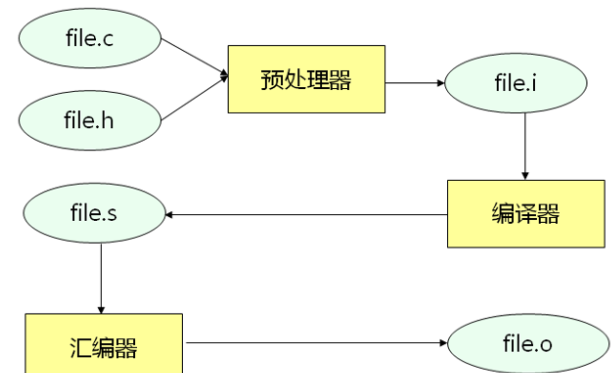

### 计算机性能指标

* 字:计算机的存储单位，不同机器可能不同，`X86`定义为`16`位，后面使用`32`位
  * 字长:计算机进行一次整数运算所能处理的二进制位数，即**机器字长**
    >题目中一般提供的是机器字长，对应的是字长
  * 指令字长：指令的长度（位数）
  * 存储字长：存储单元的位数
* 数据通路带宽：数据总线一次所能传送信息的位数，通常指外部总线的宽度，可能与内部总线的宽度（内部寄存器位数）不同
* 主存容量：主存储器所能存储信息的最大容量
* 运算速度
  * 吞吐量：系统单位时间内处理请求的数量
  * 响应时间：用户发送一个请求，到系统作出响应并获得所需结果的等待时间，包括`cpu`处理时间和等待时间（`IO`时间，访问时间，系统开销）
  * `cpu`时钟周期：`CPU`最小的时间单位，执行一个动作需要一个周期，即主频的倒数
  * 主频：CPU的时钟频率
  * `CPI`：执行一条指令所需的时钟周期数，不同指令的时钟周期数可能不同，一般取平均值
  * `CPU`执行时间：执行一个程序花费的时间，$CPI*IC（指令条数）*时钟周期$
  * `MIPS`：每秒执行多少百万条指令，公式为$指令条数/时间/10^6$，考虑CPI可写成$主频/CPI/10^6$
  * `MFLOPS`:每秒执行多少百万条浮点数运算，也可把M换成G（亿条$10^9$），T（千亿条$10^{12}$）

## 数据表示和运算

### 原、反、补、移码

* 原码：普通二进制表示
* 反码：正数不变，负数原码取反
* 补码：正数不变，负数反码加一
* 移码：移码是通过对补码添加偏置值，移码=补码+偏置值，通常**n位非符号位**取$2^n$为偏置值，因此移码即补码符号位取反，移码大，真值就大，可快速比较

---

* 进制转换：由于$十进制数=X进制数(a_1X^{n-1}+a_2X^{n-2}+...+a_n)$，X进制可乘以每位位权得到十进制数，十进制数可通过整数除X取余得到X进制数，小数通过乘X取整得到X进制数
  * 由于小数使用乘二取整的方式得到对应的二进制小数，有些小数无论提供的存储位数多大都无法得到精确的表示

### 加减法

* 原码加减法：符号位单独考虑，根据符号位和两个数的绝对值大小，确定最终符号位，两个数向列式一样计算，分加减，不易实现
* 补码加减法：符号位参与运算，如果为减法，则加负减数的补码
* 补码加减法电路实现：
  * 先考虑1位加法（**全加器**）：全加器通过相加的两个数（x和y）和低位进位c得到该位结果S和进位C，$C_{i+1}=X_iY_i+(X_i+Y_i)C_i，S=X_i\bigoplus Y_i\bigoplus C_i$
  * 将全加器串起来，高位接收低位进位，就可以得到**串行加法器**，由于负数是取反再加一，可以添加减位，将减位和减数每位异或，再把减位当成最低位的进位就得到**可控加减法电路**
  * 由于串行加法的设计使位数过大时，高位需要等待低位进位时间过长，可直接通过上方全加器的公式，直接推倒每一位的值，这样需要增加大量的布线，一般设计成4位或8位**并行加法器**，然后将其通过串行加法器的思路串起来，实现组内并行，组间串行

### 乘除法

* 原码乘法：结果符号根据两乘数符号确定，像列乘式一样，将乘法通过多次加法实现，根据一个乘数的一位为0还是1决定加0还是加另一个乘数的绝对值，在完成一位运算后结果进行逻辑移位（右移1位），相当于下一次加的数默认乘2
* 补码乘法booth算法：将补码乘法根据乘数的正负归纳，可以得到带符号的计算方法
  * 首先，在乘数的末尾增加一个**辅助位**，初始值为0，由于在乘数末尾增加了辅助位，被乘数和存放结果的寄存器中也保持统一增加了1位，用来进行**双符号位**
  * 根据辅助位和当前运算乘数的低位（存放在`MQ`中），得到本次运算应该加什么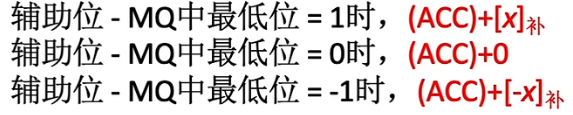
  * 每次进行完该位的加法后进行算数移位，将辅助位变成乘数的低位，在乘法最后还要根据乘数的符号位和辅助位，再进行一次加法得到结果（之后不移位）
* 补码乘法的实现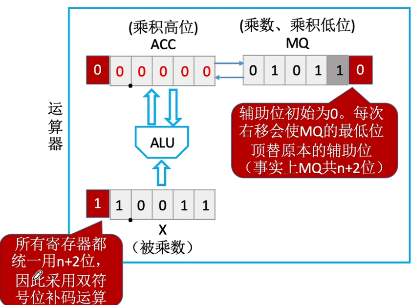
  * 在最开始的时候，被乘数存放在`X`中，乘数存放在`MQ`中，`ACC`置零，辅助位实际上在`MQ`中
  * 每次计算，根据规则，辅助位比最低位大加被乘数本身，辅助位比最低位小，加被乘数负补码，相同不加
  * 加完进行算数移位，使`ACC`的低位向`MQ`高位移动，`MQ`中乘数低位覆盖辅助位
  * 在最后，根据乘数符号位再进行加法（完成后不移位），最后结果高位存放在`ACC`中，拼上低位（`MQ`截去后两位【辅助位、乘数符号位】）
* 原码除法
  * 恢复余数法：参考数学除法，将除法变成减法，先将除数的第一个1开始的部分的位数作为本次的被除数需要考虑的位数，尝试能否上1，如果上1后为正，则保留，否则还原，然后添加被除数后1位参与运算
  * 不恢复余数法（加减交替）：由于恢复余数法在不能上1后要还原，即加上除数，加上1次除数，增加1位（相当于右移1位），在下一次又必可上1，即减去1次除数，可以直接在下一位上1，加一次除数
* 补码除法
  * 加减交替法：符号位也参与运算，上商根据除数和余数符号位决定，同号上1，左移一位减去除数；异号上0，左移一位加上除数；最后一步商恒为1（末位恒置1）
  * 比较：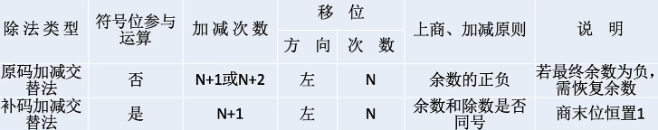
  * 实现：`MQ`存放商，`ACC`存放被除数，`X`存放除数，商默认为0，每位运算，`ACC`会根据符号位减去、加上`X`，并引导商变化，一位结束后`ACC`和`MQ`一起左移1位，在左移寄存器非符号位次后，商末位置1

### 算数移位和逻辑移位

* 算数移位：算数移位相当于对真值补0，补码右移补符号位，左移补0（反码都补符号位，原码都补0），左右移1位相当于乘除2
* 逻辑移位（简称移位）：无论如何都补0，相当于`>>>`和`<<`
* 循环移位：即对数进行循环逻辑移位，每移一位相当于将最高位用于补充最低位

### 浮点数

* 表示：类似科学计数法，把浮点数表示成$M*A^E$，`M`表示尾数，`E`表示阶码，`A`表示基数，一般基数默认为`2`，尾数经过规格化（使尾数真值第一位为一）
  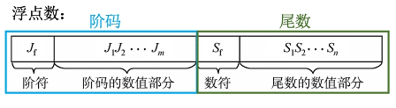
* `IEEE754`标准：浮点数被定义为如下：
  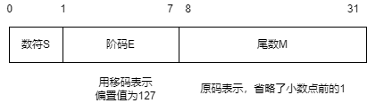
* 数符：表示浮点数正负
* 阶码：使用移码，偏置值为127，相当于原本128偏置值移码-1，也可理解成对应真值-1的正常移码，单精度阶码为8位，双精度为11位
  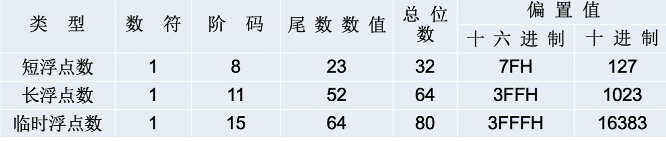
* 尾数：原码表示，省略第一个1，可多表示1位，尾数为$XXX$即对应$1.XXX$
* 对应的浮点数范围:$(-1)^s*1.M*2^{E-127}$，其中$E$范围$[-126，127]$，因此浮点数绝对值最大值为$2^{127}*(2-2^{-23})$，绝对值最小值为$2^{-126}$
* `IEEE754`中的保留值
  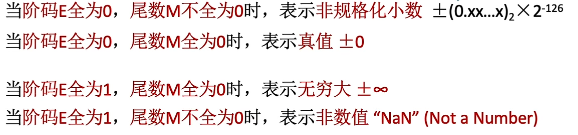
  >要注意的是，对于一个全0但尾数不为0，结果对应$0.M*2^{-126}$
* 浮点数加减法
  * 对阶：小阶向大阶对齐，小阶的尾数会右移
  * 尾数加减：对尾数进行加减
  * 规格化：对尾数进行规格化，使其变成规格化数，基数为`n`，规格化是使尾数`s`满足$2^n>=s>=1$（对于`IEEE754`，基数为2，即小数点前为1，且省略）
    * 对于原码规格化：使小数点后第$log_2n$位内值不全为0
    * 对于补码规格化：使小数点后第$log_2n$位内值不全为符号位值
  * 舍入：因为尾数有限，需要进行舍入多余部分，有多种情况，可以直接截断；舍去部分不为0末位加1；根据舍去最高位0舍1入，舍入完成后可能还需要规格化
  * 溢出判断：查看阶码是否超出表示范围

### 数据存储

* 存储方式：
  * 大端方式：先存放真值高位，再存放低位，人所思考的方式
  * 小端方式：先存放低位，再存放高位，方便机器运算
* 对齐方式：
  * 边界对齐：每个数据块存放的起始地址都是能够被数据块大小整除的地址，如：二字节块，在字节编制中只能以偶地址（能被2整除）作为首地址开头

### 数据转换

* 向大的数据范围转换过程中数据的存储值不会变化，只不过解释方法不同

### 运算器

* `ALU`的基本结构
  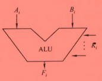
  * A和B为输入，k为信号，F为输出函数，同时ALU也会输出程序状态到PSW中，提供ZF（0标志），OF（溢出标志），CF（进位），SF（符号位）等
    * 根据两数相加得到的多1位的数字，第一位就是CF，如果两数符号位相同，结果符号位发生变化，OF为1

### 汉字表示

* 为了在电脑中显示汉字，我国在80年定义了GB2312-80标准，将汉字用区位码编码
  * 区位码：`94X94`的块，将汉字分到94个区中，每个区有94个位置，将区位编号，得到两字节地址
  * 为了防止和ASCII码不可见字符冲突，国标码在该基础上，增加`20H 20H`
  * 为了防止和英文字符翻译产生冲突，又增加`80H 80H`得到汉字内码
* 也就是说，**内码=区位码+A0H A0H**，GB系列标准和`Unicode`都属于汉字内码，增加了`A0H A0H`汉字内码每位都超过了ASCII的表示范围，达到了128以上

### 校验

* 奇偶校验：统计奇偶个数，当出现奇数位翻转时，能够发现，无纠错功能
  * 偶校验：增加偶校验位，该校验位的值为信息每一位异或的结果，方便实现，保证传送的信息有偶数个1
  * 奇校验：增加奇校验位，值与偶校验相反，保证传送的信息有奇数个1
* 海明码：能够观察到1或2位错并纠正1位错
  * 海明码首先需要增加k位校验位，$2^k > k + n + 1$，使k位能够表示1个正确和每位错误的情况
  * 将每个校验位放在$2^i（i=0，1，2，...）$的位置上
  * 海明码如果想要发现多位错误，需要在0000增加一个全偶校验位，如果该位核验结果未错误，后面的校验发现了错误，说明至少出现了2位错误，可以让对方重传
  * 校验方法：因为校验位放在了`0001`、`0010`这样的地方，校验位都只有一个1，每个校验位都对地址含有这个1的位置进行偶校验，例如：`0001`检验地址为`XXX1`的位置（校验位也参与偶校验），如果正确，校验的结果会是0，错误为1
  * 如果在数字中存在1位错误，那么错误的地址为对应位置偶校验的结果，如果没错，对应`0000`

## 存储器

### 存储器的分类

* 按存储介质分类
  * 磁存储器：以磁性材料作为存储介质，利用不同的磁化方向存储数据，成本低
  * 半导体存储器：利用MOS管或双极存储器存储数据，包括`SRAM`和`DRAM`、`EPROM`、闪存
  * 光存储器：利用光特性存储，包括`CD-ROM`、`DVD-ROM`
* 按存取方式分类
  * 随机存储器`RAM`：读取时间和位置无关，可以按地址随机读写
  * 顺序存储器`SAM`：只能顺序读写
  * 直接存储器`DAM`：有随机和顺序的特性，如：磁盘，分磁道和扇区，但是在扇区内要顺序寻道读写
* 按可改写性分类：只读存储器（`ROM`）和读写存储器
* 按保存性分类：
  * 易失型存储器：半导体`RAM`
  * 非易失型：半导体`ROM`、磁盘、光盘、闪存
* 举例:
  * `RAM`:`SRAM`有`cache`，`DRAM`有内存
  * `ROM`:闪存，`PROM`，`EPROM`，`SSD`，`U`盘
  * `DAM`:磁盘
  * `SAM`:磁带
* 存储器的性能指标:
  * **效率**:$cache访问时间/平均访问时间$
  * 存储速度:$数据传输率=数据的宽度/存储周期$
  >存储周期包括存储时间和恢复时间

### SRAM和DRAM

* `SRAM`的工作原理：6根`MOS`管构成一个存储单元，集成度低，价格昂贵，可以保存状态（触发器），不用刷新
* `SRAM`的存取方式：同时传送行列地址，需要行和列的片选线（双译码结构）
* `DRAM`的工作原理：1根`MOS`管和一个电容构成一个存储单元，价格低，电荷易失，需要刷新
* 存取方式：依次传送行列地址获得对应的数据
* `DRAM`刷新方式：
  * 集中刷新：对所有数据在刷新周期内选择一个连续的时间刷新
  * 分散刷新：将时间对半分，每个周期内刷新1行时间和读写保持时间相同，刷新1次很可能远低于刷新周期（丢失数据花费的时间）
  * 异步刷新：集中刷新和分散刷新的结合，一个刷新周期只刷新一次，每行刷新之间间隔相同
* **引脚判断**：对于一个半导体存储器，**数据线**，**控制线**，**地址线**，**片选线/通选线**是四种必要的线，接口需要为他们通过对应的引脚，除此之外，还有电源的两个引脚（在题目中一般不计算在内）
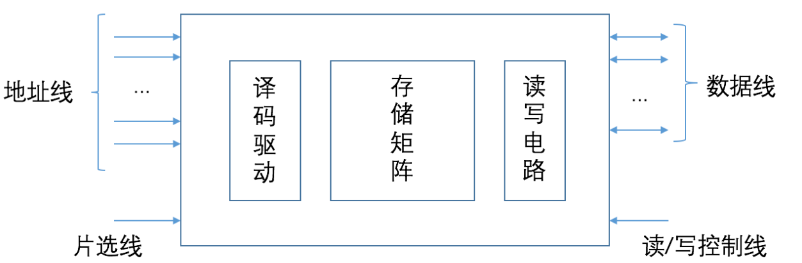
  * `SRAM`:
    1. 数据线：对应计算机存储的基本单位，例如：`1B`对应8位即8根数据线（引脚）
    2. 控制线：一般指读写控制线，可以一根也可以两根
    3. 片选线：指导选择的存储片，需要一根，地址线不能提供选择哪片存储芯片
    4. 地址线：需要同时传送，根数对应地址位数
  * `DRAM`：
    1. 数据线：同上
    2. 控制线：同上
    3. 行列通选线：由于分开送行列地址，因此使用行列通选线传递信号，他们是两条单独的线，分别控制行列地址寄存器存储传送的地址
    4. 片选线：可以用行通选代替，即可能不用额外添加片选线
    5. 地址线：分开传送地址，只要刚好能够表示对应行或列地址即可
* 引脚与`CPU`的连接
  * 地址线的连接：一般情况下，`CPU`的地址线包括低位地址引脚和高位产生片选的地址线
  * 数据线的连接：`CPU`的数据线数和存储芯片的线数可能不一致，相等时可直接相连，不等时，需要对存储芯片传来的数据扩位，使`CPU`和存储芯片数据位相等
  * 读写命令线的连接：如果是单线的话，高电平为读，低电平为写，双线的话，分别和允许读控制端，允许写控制端连接，都是低电平有效
  * 片选线的连接：选中哪个芯片完全靠存储芯片能否收到片选有效的信号，一般情况下，片选信号与`CPU`的辅存控制信号`MREQ`有关，`MREQ`为低，表示要求访存，`MREQ`为高，表示要求访问`I/O`
* **多模块存储器**
  * 单体多字:在一个存储单元中存储多个字，一次读出这些字，这显然提高了效率，但这些数据和指令必须连续存放，不然效果不明显
  * 多体并行:
    * 高位交叉编址:使用高位表示存储体号，在一个存储体中存储完成后，再存储下一个存储体，实际上并不能提高存储器吞吐率
    * 低位交叉编址:每个模块按模m交叉编址，m为存储体数目，为了实现流水线式访问，$m>=存取周期/总线传送周期$
    >存在存储体可并行和串行两种方式，并行方式可同时访问所有存储体，串行不行

### 只读存储器

* 掩膜式`ROM`：将数据存储在掩膜图形刻在芯片上，数据无法修改
* 可编程`ROM`：用户可一次写入数据，使用熔丝存储数据，连接状态的熔丝为0
* 可擦除可编程`ROM`（`EPROM`）：MOS管存储数据，通过光照浮置栅（隔绝）清除数据（光电导现象），可重复写入
* 电可擦除可编程`ROM`（`E2PROM`）：通过电擦除的可擦除可编程ROM
* 闪存：快速擦写的`ROM`，逻辑结构和`E2PROM`相似，通过使用写命令管理和擦除
* `SSD`:容易磨损，由多个闪存组成

### 存储器的扩展和性能提高方法

* 扩展方式：
  * 位扩展：通过增加地址相同的存储器，增加一个存储单元的位数
  * 字扩展（容量扩展）：通过增加新的地址，增加存储容量
  * 字位同时扩展：使用上面两种方法
* 并行存储系统
  * 双端口存储器：存储器有两个相互独立的端口，都可以读写数据
  * 单体多字存储器：将存储器分为多个存储模块，使用多通道技术共享地址总线，可以同时读取不同存储模块的相同地址
  * 多体交叉存储器：也由多个存储模块组成，对多个存储器一起编址，分高位交叉和低位交叉两种
    * 高位交叉存储方式：在每一个模块内使用连续编址，一个模块分配完地址后再轮到下一个模块，模块之间地址串在一起
    * 低位交叉存储方式：相邻的地址在不同的模块中，将地址顺序一个一个分配给每个模块
    * 一般高位交叉因为没有考虑空间局部性，基本上每次都访问同一块无法提升速度，而低位交叉每次访问地址都在不同块内，不用等待该存储块完成恢复（一般存取周期包括存取时间和恢复时间），就可以开始下一地址的存取，实现流水线的效果
    * 如果块数量设计合理，低位交叉可以连续存取，一般块存取时间按总线传送周期计算，如果存取n个字，时间完全利用（可连续存取），时间为$存取周期+（n-1）总线传送周期$

### 存储芯片的地址分配和片选

* `CPU`要对存储单元进行访问，需要选择存储芯片，即进行片选，然后根据地址码选择相应的存储单元，进行数据存取，即进行字选
* 片选信号的产生方法
  * 线选法：用除片内寻址外的地址线直接接到各存储器的片选端，当片选值为$0$时，就选中该芯片，这些片选值保证只有一个为$0$
  * 译码片选法：通过译码器产生片选信号，即传入对应片编号，产生选中该芯片的片选

### cache

* 程序的局部性原理:时间局部性（最近未来很可能用到现在用到的信息），空间局部性（最近未来很可能用到的信息和现在的信息存储空间上接近）
* `cache`的工作原理：
  * `CPU`读取数据，如果在`cache`中存在：则直接读取`cache`中的信息
  * `CPU`读取数据，如果在`cache`中不存在：则需要读取存储器中的信息，再将这块信息全部调入`cache`
* `cache`的映射方式：`cache`很小，不可能一一映射，有以下方式
  * **直接映射**：每个存储块只能存储在对应的`cache`行中，$cache行号=主存块号/cache行数$得到的整数（取模），主存地址结构为标记（标记存自哪块）+`Cache`行号+块内地址（一个存储块内的地址，在一个块内是变化的），`cache`只会存储标记，`cache`冲突性高
  * **全相联映射**：每个存储器地址中的数据可以存放在任意`cache`块中，`cache`冲突可能性低，但成本高，标记比较速度慢，主存地址结构为标记+块内地址
  * **组相联映射**：将`cache`分组，每个组合主存直接映射，组内行和直接映射的存储块全相联映射，主存地址结构为标记+组号+块内地址，内存块对应组号$cache组号=内存块号mod组数$
  >标记阵列:存储cache中标记项的表，每个标记项包括标记，有效位，脏位，替换控制位
* `cache`行存储结构：一个`cache`中不止存储了数据，还存储了以下信息
  * 有效位（`1bit`）：判断是否存储了数据，存储了为1
  * 脏位（`1bit`）：使用回写法存在，否则不存在，如果数据修改过为1，否则为0
  * 替换控制位：和替换算法有关
  * 标记位：存储块的位置，与主存容量有关
* `Cache`中主存块的替换算法
  * 随机算法：随机替换，无替换控制位
  * 先进先出算法：将最早调入的替换，使用堆栈算法，无替换控制位
  * 近期最少使用算法（`LRU`）：将最少使用的块替换，需要替换控制位，与每组路数有关，为$log_2组路数$（向上取整），如果使用4路组联需要2个替换控制位
    * 替换位使用：如果命中，比该行替换位数值小的加1，该行替换位清零，其余不变；如果没命中且有闲置行：新装入的置0，其余加1；如果没命中没闲置列，淘汰一个数值为全1的
  * 最不经常使用算法（`LFU`）：每行建立计数器，要替换时，把计数器最小的行替换
* `cache`写策略
  * 写命中：
    * 全写法：当修改命中行时，将`cache`和主存一起写入，可增加一级写缓冲，每次对`cache`修改，再提供修改信息给写缓存，由写缓存写入内存，解决CPU和主存速度不匹配时间浪费，但如果大量写可能造成缓冲溢出，使用这种方法替换行时不用写回主存
    * 回写法：当修改命中行时，只将新内容写入`cache`，如果要替换，再写回内存，需要增加1位脏位，脏位为1，需要写回
  * 写不命中：
    * 写分配法：每次修改主存数据，要把数据调入`cache`，在`cache`修改
    * 非写分配法：直接在主存修改，**不调入**`cache`
  * 全写和非写分配法合用，回写和写分配法合用
  * 现代计算机一般使用多级`cache`，近的低级`cache`使用回写和写分配法，远的使用全写和非写分配法，`cache`之间速度相同，避免缓存溢出

### 虚拟存储

* 虚拟存储器：主存和辅存共同构成了虚拟存储器，由硬件和系统软件共同管理工作，对应用程序员是透明的，虚拟存储将主存和辅存共同编址，用户编程涉及的地址称为虚地址，实际的存储地址称为实际地址，虚地址比实地址大很多
  * 虚地址在使用时，辅助硬件会找到虚地址和实地址的对应关系，判断该存储单元是否装入内存，如果没有需先装入该页或段，主存已满，还需要对应的**替换算法**交换；如果装入，通过**地址变换**，`CPU`直接访问主存指示的实际单元
  * 虚拟存储器使用类似`cache`的方法，将经常访问的数据存储备份在内存中，**使用全相联映射方式**，所有页可以放在主存任何位置上，通过页表/快表记录存储位置，**写回时使用回写法**
  * **实际地址**：在实际的主存中的地址称为实际地址
  * **虚拟地址**：在页式存储中虚拟地址分为两部分，前面的是虚拟页号，对应页表中的一个项，通过虚拟页号可找到内存物理页号，后面的是页内地址
* 对于物理地址和虚拟地址的转换
  * 物理地址一般可以分成两部分，物理块号和块内地址，而对于使用了页式存储的存储器而言，还可以划分成页号和页内地址
  * 虚拟地址是使用了虚拟存储的地址，地址空间比物理地址大，在页表或快表中实现虚拟地址和物理地址的转换
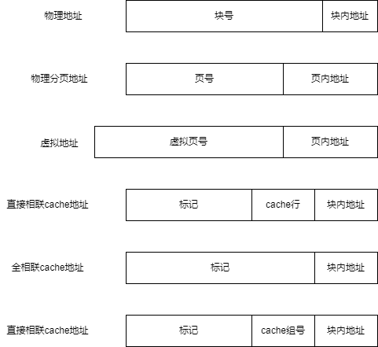

---

* **页式虚拟存储**：存储单元以页为单位，将所有地址分成大小相同的页，在主存中叫实页，虚拟存储中叫虚页，存储地址转换通过页表/快表实现
  * 页表：一般保存在内存中，记录着虚页调入主存中被安排的位置，表中记录以下数据
    * **有效位**（必须）：也称为装入位，判断是否装入内存，1为已调入
    * **物理页号**：标明在内存中哪个页中装入
    * **脏位**：是否被修改过，方便写回策略
    * **使用位**：一般结合替换算法，作为替换优先级凭据
    * **内存地址**：对应页的辅存实际地址，方便替换和写回
  * 页表的使用
    * 在使用虚拟地址时，转换机构会对虚拟地址进行处理，把虚拟页号和页内地址分离
    * 若装入了内存，将物理页号和页内地址分离得到实际内存地址
    * 若未装入内存，执行缺页算法调入内存，再得到实际内存地址
  * 快表 `TLB`
    * 由页表的工作过程得知，如果需要访问内存，需要**先**给出虚拟地址，访问页表，得到实际地址，**再**访问需要的地址，如果执行缺页操作，替换修改，还要更加费时间
    * **根据**程序的局部性原理，一段时间内程序将经常访问同一些页面，总是在内存查找实际地址浪费时间，因此产生了在`cache`中的快表
    * 在程序访问内存时，给出虚拟地址，会**先查找快表**，如果找到该项，直接访问数据，如果没有找到，访问页表（慢表`page`），并将数据地址**记录在快表**中
    * 快表一般采用**全相联或组相联的方式**和慢表连接，快表中有一个TLB标记字段组，记录取自哪个慢表项，在全相联中为虚页号，组相联为虚页号的高位部分
  * 具有`cache`、`TLB`、`page`的多级存储结构
    * 实际中可能使用的是多级存储结构，第一次给出数据地址后，不仅数据地址存储在`cache`中，数据本身也会存储在`cache`中
    * 需要注意的是，如果`cache`中有数据，那么该数据一定在主存中，即被慢表记录，如果`TLB`中有条目，也一定被慢表记录，`TLB`、`Page`、`cache`的缺失排列组合如下：

      |序号|TLB|Page|cache|说明|
      |---|---|---|---|---|
      |1|命中|命中|命中|信息在主存和`cache`中|
      |2|命中|命中|缺失|信息在主存中，可能不在`cache`中|
      |3|缺失|命中|命中|信息在主存和`cache`中，`TLB`缺失|
      |4|缺失|命中|缺失|信息在主存中，不在`cache`和`TLB`命中|
      |5|缺失|缺失|缺失|信息不在主存中|
      >如果Page缺失，其他表中都不应该出现命中

---

* **段式虚拟存储**：按照程序的逻辑结构划分各段，每段长度不定，段的分界和程序的分界对应，方便程序的共享、维护和编译，但长度可变易带来碎片无法利用
  * 段表查找方式：当进行虚拟地址访存时，给出的虚拟地址为段号和段内地址，在段表中找到段号对应的段首地址，再将段内地址当做偏移量相加得到对应物理地址

---

* **段页式虚拟存储**：将程序按逻辑结构分段，再将段分为固定大小的页，程序调入调出以页为单位，每个程序对应一个段表，每个段对应一个页表
  * 进行访存时，虚拟地址包含段号、段内页号、页内地址三部分，`CPU`访存时，根据段号得到段表地址，根据段表找到对应该段的页表地址，再根据页号得到页地址，与页内地址拼接形成实地址
  * 优点在于结合段和页的优点，缺点为查找开销大

### 外存

* 磁盘地址:由驱动器号，柱面(磁道)号，盘面号和扇区号组成
* 磁盘的性能指标:
  * 磁盘容量:有格式化和非格式化之分，格式化后容量更小
  * **平均存取时间**:由寻道时间，旋转延迟时间和传输时间三部分组成，其中寻道时间由题中给出，旋转时间如无说明，按旋转半圈时间计算，传输时间由题中给出或为单扇区扫过(旋转)时间
  * **数据传输率**:每秒旋转数为r，每条磁道容量N字节，有传输率$D_r=r*N$
* 磁盘阵列`RAID`:将多个独立的物理磁盘组成一个独立的逻辑盘，数据在多个物理盘是分割交叉存储，有`RAID1~RAID5`方案
  * `RAID0`:无冗余和校验
  * `RAID1`:镜像磁盘阵列
  * `RAID2`:使用海明码纠错
  * `RAID3`:位交叉奇偶校验
  * `RAID4`:块交叉奇偶校验
  * `RAID5`:无独立校验的奇偶校验
  >RAID主要通提供冗余和校验功能，且同时使用多个磁盘，提高了数据吞吐量，`RAID1`提供镜像存储，提高安全性，但存储容量减半

## 指令系统

### 指令格式和拓展

* 指令的格式根据操作数地址码数目划分
  * 零地址指令：只给出操作码，一般有空操作指令、停机指令、关中断指令或堆栈指令
  * 一地址指令：只有一个操作数，一般为单操作数运算（执行完后存回原地址）或隐含目的地址和操作数的指令（如：另一操作数由`ACC`提供，结果也存回`ACC`），$（A1）op （ACC）=（ACC）$
  * 二地址指令：先给出目标地址（也是第一个操作数地址）再给出另一个操作数地址，即$（A1）op（A2）=（A1）$
  * 三地址指令：全操作数地址和目的地址全给出，$（A1）op（A2）=（A3）$
  * 四地址指令：全操作数地址和目的地址全给出，还给出下一条指令地址A4，$（A1）op（A2）=（A3）$
* 指令的拓展
  * 对于三地址指令而言，减少1个操作码组合作为保留操作码，在二地址指令中就可以以三地址的保留操作码开头，将三地址多出来的一个地址作为拓展的操作码位数，在其中又会存在和三地址一样数目的操作码组合，在其中也可选择一个作为保留操作码，二地址就可以像三地址一样扩展指令数目，以此理论，少地址的指令依赖于多地址的指令的保留操作码扩展

### 寻址方式

* 指令长度和寻址方式有关，在指令中，每个地址会给出指令寻址方式字段
* 指令寻址方式
  * 顺序寻址：通过`PC`加一个指令字长，自动形成下一条指令地址
  * 跳跃寻址：通过转移类指令跳转，修改当前`PC`值，跳跃的地址分为绝对和相对、
* 数据寻址方式
  * 隐含寻址：指令只给出1个操作数的地址，另一个由`ACC`提供，最终结果存放在`ACC`中
  * 立即数寻址：直接给出操作数本身，不给地址
  * 直接寻址：给出指令在主存中的真实地址
  * 间接寻址：相对直接地址，给出的是储存操作数地址的地址，用于扩展寻址范围，给出的地址单元相当于数据单元的指针，储存操作数的地址，还可以使用多次间接寻址，形成地址链
  * 寄存器寻址：给出寄存器编号，访问寄存器取得数据，不访问主存，速度快
  * 寄存器间接寻址：给出寄存器编号，该寄存器中储存数据在主存存放的地址，通过地址访问主存取到数据
  * 相对寻址：在`（PC）`的基础上，使用偏移量A，数据地址为$（PC）+A$，一般执行这条指令前已经完成$（PC）+本条指令长度$操作
  * 基址寻址：根据基址寄存器`BR`存储的内容+提供的偏置值A得到主存地址，即$EA=（BR）+A$，基址寄存器不透明，面向操作系统，操作系统也可以选择使用特定的通用寄存器作为基址寄存器，扩大寻址范围，用户不用考虑数据在哪个扇区，利于多道批处理程序
  * 变址寻址：主存中的有效地址为变址寄存器`IX`和形式地址A之和，$EA=（IX）+A$，`IX`不是透明的，面向用户，`IX`位数大于A的位数，可扩大寻址范围，方便进行循环操作
  >变址寻址使用变址寄存器IX，每次执行要循环的指令时，IX的值变化，完成循环访问数组
  * 堆栈寻址：堆栈是专用寄存器中一块满足后进先出原则管理的存储区，该块读写的地址由特定的寄存器给出，该寄存器称为堆栈指针`（SP）`，堆栈也可以用软件实现，使用堆栈都隐含使用了`SP`，每次读写会自动修改`sp`的内容

寻址方式|有效地址计算方式|用途及特点|
|---|---|---|
立即寻址||通常用于给寄存器赋值|
直接寻址|$EA=A$|
隐含寻址||缩短指令字长
一次间接寻址|$EA=(A)$|扩大寻址范围，易于完成子程序返回
寄存器寻址|$EA=R_{i}$|指令字较短;指令执行速度较快
寄存器间接寻址|$EA=(R_{i})$|扩大寻址范围
基址寻址|$EA=A+(BR)$|扩大操作数寻址范围;适用于多道程序设计，常用于为程序或数据分配存储空间
变址寻址|$EA=A+(IX)$|主要用来处理数组问题
相对寻址|$EA=A+(PC)$|用于转移指令和程序浮动
|先间接寻址，再变址寻址|$EA=(A)+(IX)$|
先变址寻址，再间接寻址|$EA=(A+(IX))$|

### 机器级代码

* 汇编指令一般有两种格式，AT&T和Intel，区别如下：

  |方面|AT&T|Intel|
  |---|---|---|
  |字母|只能使用小写字母|对大小写不敏感|
  |格式|第一个为源操作数，第二个为目的操作数|第一个为目的操作数，第二个为源操作数|
  |描述|寄存器要用`%`前缀，立即数要用`$`前缀|无前缀区分|
  |内存地址|使用`()`表示内存寻址|使用`[]`表示内存寻址|
  |复杂寻址|使用`8(%edx，%eax，2)`表示$R[edx]+R[eax]*2+8$|使用`[edx+eax*2+8]`表示$R[edx]+R[eax]*2+8$|
  |指定数据长度方法|操作码后面跟字符， `b`表示1字节， `w`表示1字，`l`表示2字|操作码后面显式标明`byte ptr`、`word ptr`、`dword ptr`|

* 常用指令，其中`<reg>`表示寄存器，`<mem>`表示内存地址，`<con>`表示常数，使用**Intel**风格介绍，第一个为目的操作数，目的操作数只能为寄存器或内存
  * 数据传送指令：
    * **mov**：将寄存器内容或常数值复制到第一个操作数中
    * **push**：将操作数压入内存栈（栈地址增长方向和内存地址增长方向相反），压栈前将栈顶地址减小
    * **pop**：与`push`指令相反，执行出栈操作，增大栈顶地址
  * 算数和逻辑计算指令：
    * **add/sub**：将两个操作数相加减，保存到第一个操作数中
    * **inc/dec**：将目的容器数值自增自减1
    * **imul**：带符号的整数乘法，有两种格式，第一种为两个操作数，保存在第一个操作数中，第二种为三个操作数，二三操作数相乘，保存在一操作数中
    * **idiv**：带符号的单操作数整数除法，操作数作为除数，被除数保存在寄存器`edx`和`eax`拼接寄存器上（64位），计算完成后商在`eax`，余数在`edx`
    * **and/or/xor**：逻辑与或非，两个操作数做运算结果保存在第一个操作数中
    * **not**：位翻转，将操作数每位翻转
    * **neg**：将操作数取负
    * **shl/shr**：将第一个操作数左右逻辑位移第二操作数位
  * 控制流指令：
    * **jmp**：跳转到对应标签位置执行`jmp <label>`
    * **jcondition**：满足条件跳转，根据`CPU`状态字的一系列条件判断是否满足转移，包括许多`j_`型指令，如`je`表示`cmp`相等时跳转，`jge`表示相等或更大时跳转，`jne`表示不相等时跳转，`jl`表示更小时跳转
    * **cmp/test**：`cmp`比较两个操作数大小，即第一个操作数比第二个操作数大/小，`test`做与运算，设置`CPU`状态字
    * **call/ret**：实现子程序`label`标签调用跳转和返回

* 程序的机器级表示（类编译原理将程序解释成汇编语言）：
  * 过程调用程序：使用`call <函数名>`方式调用函数，使用ret返回
  * 选择语句：根据标志位（条件码）进行跳转实现条件选择，常用的标志位有`ZF`零标志，`SF`符号标志，`OF`溢出标志，`CF`进位标志，配合跳转指令的是`cmp`比较指令
  * 循环语句：使用向前跳转的方式形成循环，和选择语句构建思路差别不大

### CISC和RISC介绍

* `CISC`：复杂指令系统，指令集庞大，将大多数要用到的方法都设计成指令，一般有200条以上的指令
  * 指令长度一般不固定，指令的执行频度相差大
  * 可以不受限制地访问内存
  * 每条指令的执行周期差异大，大部分指令无法在一个时钟周期完成
  * 控制器采用微程序控制器设计，指令过于复杂，无法使用硬布线方式设计
* `RISC`：简单指令系统，指令集精简，尽量使用寄存器操作指令
  * 指令长度固定，寻址方式和指令格式少，一般少于100条指令
  * 只有`Load/Store`指令能够访存，有相当多的寄存器
  * 一定要使用流水线技术，大部分指令在一个周期内能够完成
  * 以硬布线为主，不用或少用微程序控制器
  * 重视编译优化，减少代码时间

## CPU

### CPU主要结构

* `CPU`主要由运算器和控制器组成
* 运算器：接收控制器送来的指令，对数据进行加工处理
  * 算术逻辑单元`ALU`：进行算数逻辑运算
  * 暂存寄存器：暂存主存读取的数据，该数据不能放在通用寄存器中，对程序员透明
  * 累加寄存器`ACC`：暂时存放`ALU`运算的结果信息，可以作为加法器的输入端
  * 通用寄存器组：用于存放操作数和各种地址信息
  * 程序状态字寄存器：保留各种运算产生的状态信息
  * 移位器：对操作数和运算结果进行移位操作
  * 计数器：控制乘除操作步数
* 控制器：指挥全机协调工作
  * 程序计数器`PC`：指出下一条指令地址
    * **pc中的值和指令的关系**：
    * 如果使用定长指令（RISC）对齐存放，由于指令定长，每次寻找下一条指令，只要增加固定长度的位，因此pc中存放的是逻辑地址，每次取指`pc+1`，对应每一个存放指令位置，转换成物理地址要乘指令长度
    * 如果使用非定长指令（CISC），由于指令长度未知，pc中存放的就是物理地址（和MAR一致），每次取指`pc+此条指令长度`
  * 指令寄存器`IR`：保存着正在执行的指令，有自增功能
  * 指令译码器：对操作码`OP`译码
  * 存储器地址寄存器（`MAR`）：存放要访问的数据地址，对程序员透明
  * 存储器数据寄存器（`MDR`）：存放向主存写入或读出的数据，对程序员透明
  * 时序系统：产生时序信号，由统一时钟分频得到
  * 微程序信号发生器：根据`IR`中的内容和`PSW`的内容及时序信号，产生对整个计算机的各种控制信号
* **透明性**
  * 对所有用户可见：
    * `PSW`、`PC`、通用寄存器
  * 对用户透明：辅助`CPU`工作
    * `MAR`、`MDR`、`IR`、`Cache`、微程序结构和功能
  * 汇编程序员可见：`PC`、`ACC`、`XR`、`MDR`、基址指针寄存器、目标变址寄存器、指令指针寄存器、标志寄存器
  * 系统程序员可见：虚拟存储器
  * 应用程序员可见：虚拟寄存器、暂存寄存器

### 指令执行过程和周期

* 一个指令可能有多个周期，根据指令的执行阶段分成不同周期，指令周期一般分为取指周期、间址（寻址）周期、执行周期、中断周期，他们被称为机器周期，每个机器周期可能包含多个时钟周期，控制器每个时钟周期开始时，分配控制信号
  * 取指周期：从`PC`中取出指令地址，取出指令后存放在`IR`中
  * 间址周期：**取出操作数的有效地址**
  * 执行周期：取出操作数，根据`IR`的操作码通过`ALU`操作产生结果，没有特定的数据流向
  * 中断周期：处理中断请求，假设断点要存入堆栈中，而且先修改`sp`指针再存入数据，那么这个过程就为`CU`控制`sp`指针修改，将此时PC中的地址存放在`sp`中，再把中断服务程序的入口地址给`PC`
  >一个机器周期是完成一个操作所需时间，一般以存取时间为准(存取时间最长)，因此，有的指令需要多个机器周期完成取指操作
* 指令执行方案：
  * 单指令周期：所有指令都使用相等的指令周期，因此周期必须为$MAX（指令执行的时间）$，所有指令串行执行，执行完一个指令再开始下一个指令
  * 多指令周期：对不同类型的指令选用不同的执行步骤，可以使用不同的时钟周期完成不同指令的执行，指令依旧串行执行
  * 流水线方案：指令之间可以并行的解决方案，力争在每个时钟周期内完成一条指令的执行过程，在每个周期启动一条指令，多条指令同时运行，每个指令在各自不同的执行步骤中

### 数据通路

* 数据在各功能部件之间传送的路径称为数据通路，数据通路的功能是实现`CPU`内部的运算器与寄存器及寄存器之间的数据交换
  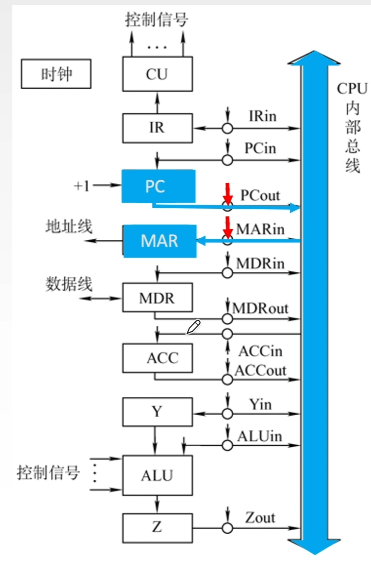
  >数据通路包括指令执行过程中，数据能够经过的所有线路和部件，注意不包括控制器，但包括中断逻辑电路，时序逻辑电路
* 数据通路的基本结构
  * `CPU`内部单总线方式：将所有寄存器的输入端和输出端都连接到一条公共通路上，这种结构简单，但数据传输存在冲突可能大
  * `CPU`内部多总线方式：为了减少冲突，可使用多总线结构，可以同时在多个总线上传输数据，提高效率
  * 专用数据通路方式：根据数据和地址流动方向连接线路，避免共享总线，性能高，但硬件量大
* 总线数据传送：
  * 寄存器间：将对应的`out`和`in`信号有效，将数据传送成功
  * 主存和`CPU`间：将`MAR`的`in`信号和对应存放地址的寄存器的`out`信号有效，`CU`发出读命令，再让`MDR`的`in`信号有效，最后如果为指令让`MDR`的`out`信号和`IR`的in信号有效，把指令放到指令寄存器IR中
  * 执行运算：先需要通过寄存器间或主存和`CPU`间传送数据取数到`MDR`（从`MDR`再存放在寄存器中）或一个寄存器，`CU`发出运算信号，将结果暂存到寄存器`Z`，最后可能会把`Z`中内容传递给`ACC`或其他寄存器，或者存放回主存中

### 控制器的功能和工作原理

* 控制器是计算机系统的指挥中心，主要功能有：
  * 取指令并指出下一条指令位置
  * 对指令译码产生对应的控制信号
  * 指挥控制`CPU`、主存、输入输出设备直接的数据流动
* 根据控制器产生信号的方式不同分为微程序控制器和硬布线控制器
* **硬布线控制器**：基本原理是根据指令的要求，按时间顺序发送一系列微操作控制信号，由复杂的门电路和触发器构成
  * `CU`根据指令译码情况，根据节拍控制和标志，在一个时钟脉冲发送一个操作命令
  * 硬布线的时序系统：在执行程序的过程中，对于不同的指令需要不同的微操作指令，一条指令工作周期分为三部分，取指、间址、执行
  * CPU的控制方式：在CU控制一条指令的执行过程中，实际上控制的是微操作序列（一条机器指令可以分解成一个微操作序列，微操作是计算机无法再分解的基本操作）的运行过程，微操作的长短和每条指令执行时间因此不同，有三种控制方式
    * 同步控制方式：系统建立一个统一的时钟，所有的控制信号来自于这个时钟，通常以最繁琐的时间最长的微操作时间作为时钟周期，采取一致的时间周期执行指令，控制简单但运行速度慢
    * 异步控制方式：不存在标准的时间周期，每个部件以自己固有的速度工作，通过应答方式联络，运行快但电路复杂
    * 联合控制方式，对指令采取大部分同步控制，小部分异步控制，折中方案
  * 硬布线控制器的设计
    * 列出所有微操作命令的时间表，观察这些指令在不同周期的使用情况和状态变化
    * 根据时间表，进行控制信号综合和微操作的分析归类，简化各微操作的逻辑表达式
    * 根据逻辑表达式画出所有微操作的电路图
* **微程序控制器**：微程序控制器采用存储逻辑实现，将微操作信号代码化，使每个机器指令转换为微程序存储在控制存储器中，信号由微指令产生
  * 思路：将每条机器指令编写成一个微程序，每个微程序包含若干微指令（微命令的集合），每条微指令对应一个或几个微操作，这些微指令存储在存储器中，通过寻址机器指令的办法（类似地址寄存器）寻址微指令
    * **微命令**是控制器发送的执行微操作的各种控制信号，微操作是微命令的执行过程，有的微命令可相容，有的互斥
  * 微程序控制器的**工作部件**
    * 控制存储器（`CM`）：存放指令对应的微程序，由ROM构成
    * 微指令寄存器（`CMDR`）:存放从CM中取出的指令
    * 微地址形成部件：产生初始微地址和后续微地址，保证微指令连续运行
    * 微地址寄存器（`CMAR`）：接收微地址形成部件传送过来的地址，为读取做准备
  * 工作过程
    * 执行取微指令的公共操作，将取指微程序的入口地址送入CMAR，并读出对应的微指令送入`CMDR`，当取指微程序完成后，机器指令已经存放到IR中
    * 由机器指令的操作码通过微地址形成部件形成机器指令的微程序入口地址，并送入`CMAR`
    * 从`CM`中逐条读出并执行微指令
    * 执行完成一条机器指令后，回到第一步，进行下一条指令取指
  * 微程序和机器指令对应关系：每个机器指令一般对应一个微程序，而取指操作都是相同的，因此将取指的微命令统一编成一个微程序，此外，间址和中断页可以编辑成微程序，控制器中储存的微程序数目至少为$机器指令数+1$
  * 微程序的编码方式（控制方式）：指的是如何对微指令的控制字段进行编码
    * **直接编码**（直接控制）：无需译码，微指令的控制字段每一个位都代表一个微命令，设计微指令时，使用与否，设置0和1，速度快，但微指令长度过长
    * **字段直接编码**：将互斥微命令用多位排列组合表示，为微命令字段因此被分成多段，每段独立编码，通过译码电路分析译码，每段微命令不宜太多，会增加电路复杂性和译码时间，这种编码方式可缩短微指令的位数
    * **字段间接编码**：一个字段中的微命令需要另一个字段中的微命令解释，不是靠直接译码发出微命令，可进一步缩短字长，但降低并行能力
  * **微指令的后继地址生成方式**：指出下一条指令位置
    * 直接由微指令的下一条地址字段指出
    * 根据机器指令的操作码经过微地址生成器生成
    * 增量计数法，直接将$（CMAR）+1$
    * 通过网络生成
    * 由硬件直接产生
  * **微指令的格式**
    * 水平微指令：一条微指令对应几种并行的基本操作，字段每一位对应一个控制信号（微命令），从编码方式上来说，直接、字段直接、间接、甚至他们混合**都是**水平微指令
    * 垂直微指令：采用机器指令的方式使用微操作码、目的地址和源地址，简单规整，一条微指令短但用来解释微程序需要的空间更长，但运行效率低
  * 设计步骤
    * 写出对应机器指令的微操作指令和节拍安排，注意在执行完成一条微指令时，要将该微指令->微地址形成部件->`CMAR`，让`CMAR`获得下一条微指令地址
    * 确定微指令的格式，包括编码方式、后继微地址形成方式和指令字长等
    * 编写指令码点，根据操作字段每位代表的微命令编写
  * 其他微程序设计思路
    * 动态微程序设计：计算机能够根据用户的要求改变微程序，依靠可写控制寄存器实现，一般使用可擦除只读存储器（`EPROM`）
    * 毫微程序设计：硬件不是直接由微程序控制，而是由毫微存储器中的毫微程序解释控制的

* 硬布线和微程序控制器的应用场景
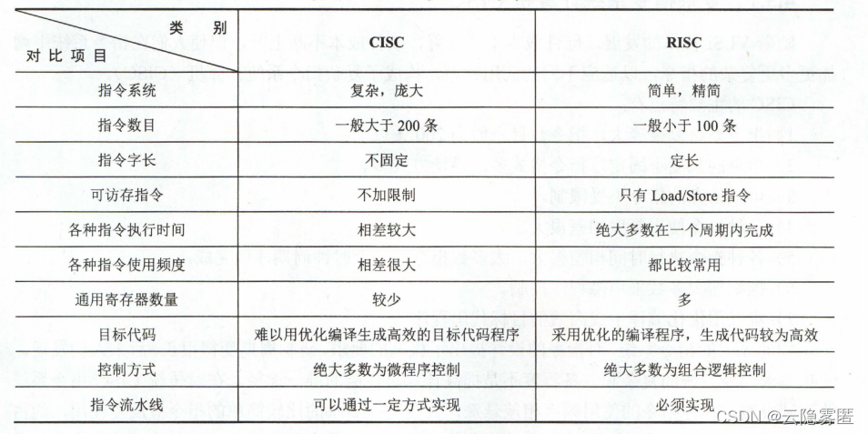

### 异常和中断机制

* **异常**：由`CPU`内部产生的意外事件，分为硬中断，由连线产生的异常（总线错误、存储器校验问题等），和程序性异常（软中断），内部执行指令产生的异常（除0、溢出、端点、缺页等），可按异常发生原因和返回方式不同划分
  * 故障`Fault`：指令启动后，在执行结束前被检测到的异常事件
  * 自陷`Trap`：预先安排好的一种异常事件，当执行到自陷指令后，CPU会根据不同的自陷进行处理，然后返回下一条指令执行（转移型自陷除外）
  * 终止`Abort`：执行指令的过程中出现了硬件故障，无法执行下去，不是指令本身产生的问题，是随机出现的，只能调用中断服务重启系统

  >故障和自陷属于软中断，终止和外中断（处理外部事件的一种机制）属于硬件中断

* **中断**：来自计算机外部，与指令无关的事件引起的中断，外部`I/O`设备通过特定信号线发出的中断请求，CPU每执行完一条指令就会检查一遍中断信号，如果收到，就会进入中断响应周期
  * 可屏蔽中断：通过可屏蔽中断请求线`INTR`向`CPU`发送中断请求，`CPU`可以在中断控制器中设置屏蔽字屏蔽它
  * 不可屏蔽中断：通过专门的不可屏蔽信号线`NMI`发送中断请求，通常是一些紧急的事件，如断电或非常紧急的故障，让`CPU`快速处理紧急事件
* **中断和异常的区别**：
  * 异常事件是由特定的指令在执行过程中产生的（如缺页、溢出），中断不和任何指令关联，不阻止任何指令完成
  * 异常由`CPU`自己检测，不必通过信号通知，中断必须通过中断请求线获取，才能知道哪个部件发送了何种中断
* **响应过程**：由硬件直接自动实现，称为中断隐指令（不是一条指令系统中的指令）
  * 关中断：将中断允许触发器置0关闭接收中断信号，防止被新的中断打断，异常和不可屏蔽中断不受影响
  * 保存断点和程序状态：将程序的断点地址送到特定的栈或寄存器中，保存程序状态寄存器`PSWR`中的内容，方便恢复到程序运行的状态
  * 识别异常和中断转到相应的处理程序：通过软件或硬件识别方式识别和处理异常和中断源，直到服务程序中断返回（通常情况下，中断或异常的具体处理由操作系统完成）
    * 软件识别方式：设置异常寄存器，系统统一的异常或中断识别程序，按优先级从上到下查询异常和中断类型，转到对应的处理程序
    * 硬件识别方式：将中断服务程序入口地址作为中断向量，将所有中断和异常编号处理，根据中断编号查询中断向量表得到对应的中断服务程序入口地址
  >中断或异常处理完毕之后，CPU执行中断或异常返回指令，回到被打断的用户程序指令或下一条指令执行
* 中断向量：中断识别分中断向量和非中断向量两种，非中断向量即软件识别方式
  * 使用中断向量：每个中断都有一个唯一的类型号，每个类型号都对应一个中断服务程序，中断服务程序的入口地址称为中断向量，系统把全部中断向量集中存放在存储器的某个区域内，该存储区称为**中断向量表**，`CPU`响应中断后根据中断类型号找到对应的中断向量的地址，得到中断入口服务程序入口地址，转而执行对应的中断服务程序
* 中断中硬件和操作系统的努力
  * 硬件：即中断隐指令的工作，保存`PC`和`PSW`中的内容，关中断
  * 操作系统：保存通用寄存器

### 指令流水线

* 指令流水线：一条指令分成多个阶段，每个阶段由相应的功能部件完成，如果各个阶段视为相应的流水段，指令的执行过程构成了指令流水线，把第`k+1`条指令的取指阶段提前到第`k`条指令的执行阶段
* 假设指令的执行过程分为：
  * 取址`IF`：取指令
  * 译码`ID`：指令译码，从寄存器取操作数
  * 执行`EX`：执行运算或计算地址
  * 访存`MEM`：对存储器读写操作
  * 写回`WB`：将指令执行结果写回寄存器堆
* 为了实现指令流水线，指令集应该有以下特征：
  * 指令长度应该一致，有利于取指令和译码
  * 指令格式应该规整一致，保证源寄存器位置相同，利于未译码取数
  * 采用`Load/Store`指令，其他指令无法访存，减少其他指令操作步骤，执行步骤规整
  * 数据和指令使用对齐存放，减少访存次数
* 流水线的冒险和处理：在流水线中因为一些情况使流水线无法正确执行后续指令而引起阻塞或停顿叫冒险
  * 结构冒险：由于多条指令在同时争用同一资源，是由于硬件资源竞争产生的冲突
    * 可以通过停止一条指令和后续指令一个周期
    * 也可以单独设计指令和数据存储器，使取数和取指令在不同的存储器进行，避免存储器资源冲突
  * 数据冒险：下一条指令用到当前指令的计算结果，两条指令发生冲突，由于存数在最后一步，而运算在第三步，可能出现读写旧数据，一般有写后读(`RAW`)、读后写(`WAR`)、写后写(`WAW`)三类，解决办法有：
    * 使后续指令都暂停一个或几个周期，等问题消失后再继续执行，分为硬件阻塞（`stall`）和软件插入`NOP`指令两种
    * **数据旁路技术**，设置专门通路，直接把上一条的结果，作为这一次的输入
    * 通过编译器优化指令执行顺序，很困难
  * 控制冒险：指令通常顺序执行，但是存在一些指令修改执行顺序（PC中的值），从而引起控制冒险
    * **对转移指令进行分支预测**，尽早转移目标地址，有静态预测（继续执行）和动态预测（根据程序执行的历史情况动态预测调整）
    * 预取两个方向上的目标指令
    * 加快和提前形成条件码
* 流水线的性能指标
  * **流水线的吞吐率**TP：单位时间内内完成的任务数量或输出结果的数量，公式为$TP=n/T_k$，其中$T_K=（K+n-1）t$为k段流水线处理完n个任务的总时间，t为时钟周期，当任务数n趋于无穷时，得$TP_{MAX}=1/t$
  * **流水线的加速比**S：完成同样的任务，不使用和使用流水线的时间之比，$S=T_0/T_K=（knt）/[（k+n-1）t]=（kn）/（k+n-1）$，其中$T_0$为不使用流水线的时间，也就是串行时间，$T_K$为使用流水线的时间，当任务数n趋于无穷时，得$S_{MAX}=k$
  * **流水线效率**：$S/K$，其中S为加速比，K为流水线段数，当任务趋于无穷时，效率为1
* 高级流水线技术
  * 超标量流水线技术：每个时钟周期内并发执行多条独立指令，以并行的方式将多条指令编译执行，通过编译优化**把不互斥的指令一起执行**
  >超标量流水线技术不是对CPU中的部件同时使用，而是不互斥指令同时执行
  * 超长指令字技术：通过编译程序挖掘出指令可能的并行性，将可并行的指令**合成一条具有多个操作码**的超长指令字
  * 超流水线技术：**提高流水线主频**（降低时钟周期），每个时钟周期还是只执行一条指令，但每周期发射的指令数增加，流水线级数越大，开销越大，并不是级数越多越好

## 总线

### 总线的结构和标准

* 总线的分类
  * **片内总线**：芯片内部的总线
  * **系统总线**：计算机系统各功能部件间的总线，包括**数据、地址、控制总线**
  * **I/O总线**：用于连接低速`I/O`设备，将低速的设备与高速总线分离，提高总线系统性能
  * **通信总线**：计算机系统之间通信的总线
* 系统总线的结构
  * **单总线结构**：将`CPU`、主存、`I/O`接口都挂在同一根总线上，运行设备之间都可以进行数据交换，结构简单，易于添加设备，但带宽负载大，不支持并发传送数据
  * **双总线结构**：系统存在两条总线，主存总线负责`CPU`、主存和`I/O`总线通道之间传送数据，另一条`I/O`总线负责外部设备和通道间传送数据，实现了低速和高速设备的分离，但需要通道进行硬件补充
  * **三总线结构**：使用`CPU`、主存、`I/O`接口三条总线相互连接，`CPU`和主存通过主存总线连接、`CPU`和`I/O`接口通过`I/O`总线连接，主存和`I/O`设备通过`DMA`总线连接，提高了`I/O`设备性能，使其更快接收命令，但系统工作效率低
* **总线突发传送**：发送一个地址，得到该地址和之后一段的所有数据，能够节约时间
* 常见的总线标准
  * `ISA`：工业标准体系的结构，最早出现在微型计算机上的总线
  * `EISA`：配合32位`CPU`设计的扩展`ISA`总线
  * `VESA`：传送图形数据的32位总线
  * `PCI`：外部设备互联总线，是与时钟频率无关的高速外围总线
  * `AGP`：加速图形接口，视频接口标准，是一种局部总线
  * `PCI-E`：最新的接口标准，取代`PCI`和`AGP`
* 总线标准分类
  * 并行串行
    * 并行：PCI、EISA、ISA
    * 串行：USB
  * 功能
    * 系统总线标准：ISA、EISA、VESA、PCI、PCI—Express等
    * 设备总线标准：IDE、AGP、RS一232C、USB、SATA、SCSI、PCMCIA等
    * 局部总线标准：在ISA总线和CPU总线之间增加的一级总线或管理层，如PCI、PCI-E、VESA、AGP等，可以节省系统的总带宽

### 总线的定时方式和周期

* 总线定时方式：总线定时是指总线在双方交换数据过程中需要时间上配合关系的控制，实质是一种协议规则
  * 同步定时方式：系统采用一个统一的时钟信号协调发送和接收双方的传送定时关系，每个固件发送和接收一次都在一个总线传送周期中，传送速度快，实现简单，但不能及时对通信进行有效性检验，可靠性差
  >同步定时方式常用于速度相差不大的设备间传送数据，但不绝对
  * 异步定时方式：没有统一的时钟，靠双方握手信号实现控制，按需分配传输，周期可变，灵活但速度比同步定时慢
    * 握手信号间有三种情况：不互锁：双方请求和回答之间不互锁，经过一段时间都可以取消请求和回答信号，半互锁：主设备发送请求信号后一定要接收到回答信号，才能撤销请求，全互锁：主设备请求信号后要接收到回答信号才能撤销，回答信号要得知请求信号撤销后才能撤销
  >异步定时方式常用于速度相差很大的设备间传送数据，但不绝对

### 总线仲裁

* 在⼀个多主控设备的总线中，每个主控设备都能启动数据传送。因此必须提供⼀种机制来决定在某个时刻由哪个设备拥有总线使⽤权的过程称为总线仲裁。
* 仲裁⽅式可分为集中仲裁方式和分布式仲裁方式。

  * **集中仲裁方式**：集中仲裁将所有的总线请求集中起来，利⽤⼀个特定的裁决算法进⾏裁决，基本由`CPU`进⾏处理。
    * 集中仲裁方式有链式查询方式、计数器定时查询方式和独立请求方式3种。
    * **链式查询方式**：总线上所有的部件共用一根总线请求线，当有部件请求使用总线时，需经此线发总线请求信号到总线控制器。由总线控制器检查总线是否忙，若总线不忙，则立即发总线响应信号，经总线响应线`BG`串行地从一个部件传送到下一个部件，依次查询。若响应信号到达的部件无总线请求，则该信号立即传送到下一个部件；若响应信号到达的部件有总线请求，则信号被截住，不再传下去。
    >在链式查询中离总线控制器越近的部件，其优先级越高：离总线控制器越远的部件，其优先级越低。

    * **计数器定时查询**：采用一个计数器控制总线使用权，相对链式查询方式多了一组设备地址线，少了一根总线响应线 `BG`。它仍共用一根总线请求线，当总线控制器收到总线请求信号，判断总线空闲时，计数器开始计数 计数值通过设备地址线发向各个部件 当地址线上的计数值与请求使用总线设备的地址一致时，该设备获得总线控制权。同时，中止计数器的计数及查询。
    * **独立请求方式**：每⼀个设备均有⼀对总线请求`BRi`和总线允许线`BGi`，当总线上部件需要使⽤总线时，经过各⾃总线请求发送总线请求信号在总线控制器排队，当总线控制器按⼀定优先次序决定批准某个部件使⽤时，则给该部件发送总线响应信号，该部件获得控制权。

  * 分布仲裁方式：分布仲裁⽅式不需要中央仲裁器，每个潜在的主模块都有⾃⼰的仲裁号和仲裁器。当它们有总线请求时，就会把它们各⾃唯⼀的仲裁号发送到共享的仲裁总线上，每个仲裁器从仲裁总线上得到的仲裁号与⾃⼰的仲裁号⽐较。若仲裁总线上的仲裁号优先级⾼，则它的总线请求不予响应，并撤销它的仲裁号。最后，获胜者的仲裁号保留在仲裁总线上。

## 输入输出

### 输入输出接口

* 输入输出接口是主机和外设之间的交换界面，通过接口实现主机和外设之间的信息交换
* 接口功能：
  * 进行地址译码和设备选择：CPU送来选择哪个外设的地址码，必须译码产生指定信息
  * 实现主机和外设间联络控制：协调不同速度的设备间的信息交换
  * 实现数据缓冲：消除速度差异，进行速度暂存，避免速度不一致丢失数据
  * 信号格式转换：外设和主机可能存在电平和数据格式差异，接口应提供相应转换
  * 传送控制命令和状态信息：能够使主机和外设进行信号交互
* 接口结构


* `I/O`端口：接口电路中可以被`CPU`直接访问的寄存器，包括数据端口（读写），控制端口（写），状态端口（读），若干端口和控制逻辑电路**一起组成**接口
* `I/O`端口编址方式：
  * 统一编址：把``I/O``端口当做存储器的单元进行地址分配（使用同一套地址线），用**统一的访存指令**可以访问`I/O`接口
    * **优点**：不需要专门的输入/输出指令，使`CPU`访问`I/O`的操作灵活方便，使端口有较大的编址空间
    * **缺点**：端口占用了存储器地址，使内存容量变小;利用存储器编址进行数据输入/输出操作，执行速度较慢
  * **独立编址**：`I/O`端口地址与存储器地址无关，独立编址`CPU`需要设置**专门的输入/输出指令**访问端口，又称`I/O`映射方式
    * **优点**：输入/输出指令与存储器指令有明显区别程序编制清晰，便于理解
    * **缺点**：输入/输出指令少，一般只能对端口进行传送操作，尤其需要`CPU`提供存储器读/写、`I/O`设备读/写两组控制信号，增加了控制的复杂性。
  >要注意区分I/O端口和I/O接口，I/O端口是指接口中可被CPU访问的寄存器，I/O接口是若干端口和控制电路组成的

### I/O控制方式

* 输入输出系统实现数据传送有不同的方式，在代价性能方面各不相同
  * 程序查询方式：信息交换的控制完全由`CPU`执行程序实现，在这种方式的接口中设置一个数据缓冲存储器（数据端口）和一个设备寄存器（状态端口），进行`I/O`操作时，先发出询问信号，读取设备状态并以此决定是否现在传送，如果需要等待将重新询问，直到成功传送
    * 这种情况下，一旦启动`I/O`就只能等待传送结束再执行原先运行的程序，设计简单但大量时间来查询和等待，且无法并行和多个外设交换数据，效率低
  * 程序中断方式：在计算机执行现行程序的过程中，出现急需处理的异常或请求，CPU只能暂时终止执行，进行处理，完毕后再继续执行原程序，在`I/O`控制方面，`CPU`在程序的安排下在某一时刻启动外设，然后继续执行原程序，外设准备完成后，向`CPU`发送中断请求，在**可以响应中断**的前提下，`CPU`转去执行中断服务程序为外设服务，数据传送完成后再回到原程序
    * 工作流程：
      * 中断请求：中断源向`CPU`发送中断请求，发送不可屏蔽请求和可屏蔽请求
      * 中断响应判优：当多个中断请求同时发送时，要进行中断优先级判断，一般为不可屏蔽中断>硬件故障>软件中断>可屏蔽中断，且输入优于输出设备，高速优先于低速设备，`DMA`中断优于`I/O`中断
      * 响应中断：满足条件下，响应中断请求，经过一些[特定操作](#异常和中断机制)，执行对应中断服务程序
      * 恢复现场和屏蔽字、开中断、程序返回
    * 多重程序中断和屏蔽技术
      * 若中断程序运行过程中对新的高优先级中断不理会称为单重中断
      * 若系统暂停执行中断程序，处理新的中断请求称为多重中断，需要满足以下功能：在中断服务程序中插入开中断指令、优先级别高的中断可以中断低级别的中断
      >多重中断实际上是执行了多次中断程序，在现代计算机中，屏蔽是通过屏蔽触发器完成的，每个中断都有一个对应的屏蔽触发器，1表示屏蔽该中断，0表示可以申请，所有屏蔽触发器一起构成屏蔽字寄存器，其中的内容被称为屏蔽器
  * `DMA`方式：完全由硬件进行信息传送的控制方式，在传送准备阶段，`CPU`与外设并行工作，直接在**外设和内存之间**开辟通道，传送不经过`CPU`
    * 特点
      * 基本单位是数据块
      * 主存能被外设访问，不仅和`CPU`联系
      * 传送时，地址确定和传送计数都由硬件实现
      * 主存中需要缓存区，及时供给和接收数据
      * 传送速度快，在传送前后需要进行预处理和中断处理
    * DMA接口的组成和信号
      * `AR`：地址寄存器，用来表识数据在主存当中存放或者写入的地址。
      * `WC`：计数器，完成传输数据量的计数。使用补码存放负N。
      * `BR`：数据缓冲器，外部设备输入的数据或者是存储单元当中输出的数据要暂时存储到接口的数据缓冲器当中。
      * `DAR`：设备地址寄存器，供设备选择电路使用。
      * `DMA`控制逻辑：控制接口内部的工作，控制在给定的时序给出给定的信号。
      * `DREQ`：设备请求信号。
      * `DACK`：对设备给出的应答信号。
      * `HRQ`：总线使用请求信号。
      * `HLDA`：CPU向DMA发出的应答信号。
      * 中断机构：向CPU发出中断信号，用于数据传输完之后对后续工作进行处理，$WC=0$时会向中断机构发出信号。

      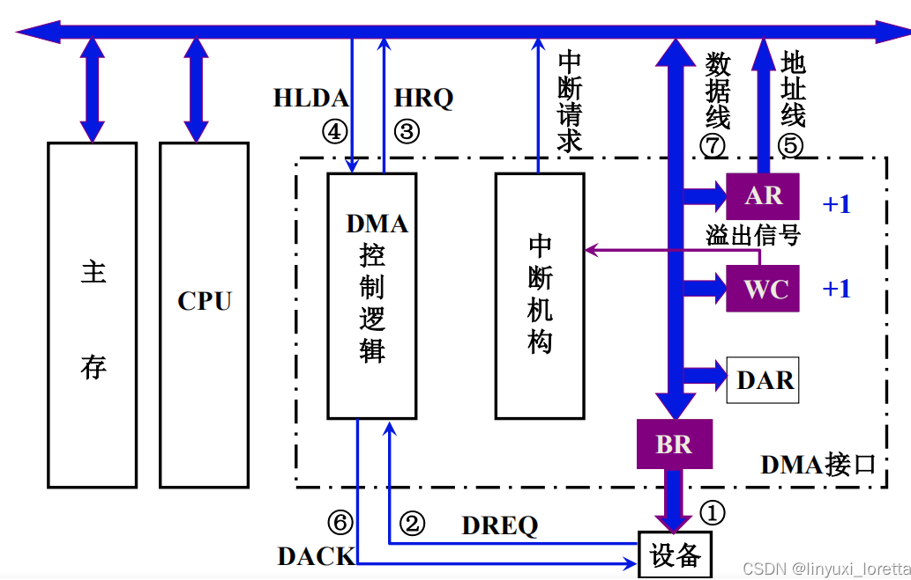

    * `DMA`和`CPU`的访存访存冲突解决办法：`I/O`访存一般高于CPU访存，因为`I/O`访存不立即可能丢失数据
      * 停止`CPU`访存：`DMA`控制器向`CPU`发出停止信号，使`CPU`直到`DMA`访问结束后再访问
      * 周期挪用：如果`CPU`正在访存，等待一个访存周期结束让出，如果同时申请，`DMA`优先
      * `DMA`和`CPU`交替访存，适用于CPU工作周期比访存周期长的情况，在一个工作周期内可以存取一次，还有剩余时间
    * `DMA`传送过程
      * 预处理：`CPU`发出几条`I/O`指令，测试设备状态，向`DMA`控制器提供相应参数，然后`CPU`继续执行原程序，`I/O`准备完成后，`DMA`控制器会接收到外设`DMA`请求，`DMA`会反馈给`CPU`
      * 数据传送：`DMA`以一个基本单位数据块进行传送，完全由`DMA`控制器控制，循环输入输出
      * 后处理：向`CPU`发出中断请求，`CPU`对数据检验和错误判断，并决定是否继续传送其他数据
    * 注意
      * `DMA`请求优先级高于中断请求
      * 中断方式能够处理异常，`DMA`只能传送数据块
      * 中断方式靠程序传送，需要保护和恢复现场，`DMA`靠硬件传送，除预处理和后处理，不占用`CPU`
      * `DMA`传送过程不需干预，更适合高速设备传送数据
* **三种控制方式CPU处理时间占比计算**：占用时间/全部时间
  * 程序查询方式：由于每次传输数据是传送到数据寄存器中，如果未在下一次传输时收取数据，数据会丢失，因此可计算传送寄存器数据间隔（传送间隔计算）
    * 占用时间：每秒查询次数*每次查询时间或周期
    * 全部时间：1秒或`CPU`时钟频率
  * 程序中断方式：每传输一个字就产生一次中断，通过时间占比，可以判断是否适合使用程序中断方式
    * 每传输一个字占用时间：CPU处理时间或周期
    * 传输一个字花费时间：根据传输速率得到的传输花费总时间或周期
  * DMA方式：只有预处理和每传输一段的后处理需要CPU处理，一般题目预处理忽略
    * 每传输一次后处理的时间：CPU处理的时间或周期
    * 传输一次花费的时间：根据传输速率和传输的数据得到的总时间或周期
