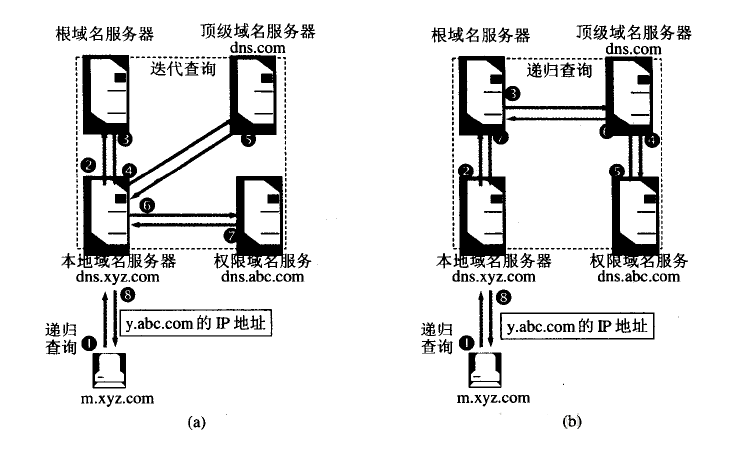

# 2

## 计算机网络体系结构

### 概述

* 计算机网络概念
  * 广义:只要能实现远程信息处理的系统或者进一步能够达到资源共享的系统,都是计算机网络,是计算机网络发展的初级阶段
  * 资源共享:以能够实现相互共享资源的方式互联起来的自治计算机网络系统的集合,符号目前计算机网络的基本特征
  * 用户透明性:存在一个能为用户自动管理资源的物理操作系统,对用户透明,无需了解网络的存在和资源的位置信息,定义了一个分布式的网络,是计算机网络未来的发展目标
* 计算机网络的组成
  * 组成部分:由硬件,软件,协议三大部分组成,协议是计算机网络的核心
  * 工作方式:可分为边缘部分和核心部分,边缘部分由直接供用户使用的主机组成,用来进行通信和资源共享,核心部分由大量网络和连接这些网络的路由器组成,为边缘部分提供连通性和交换服务
  * 功能组成:由通信子网和资源子网组成,通信子网由各种传输介质,通信设备和相应的网络协议组成,实现联网计算机间的数据通信,资源子网是实现资源共享功能的数据及其软件的集合,向网络用户提供共享其他计算机上的硬件资源,软件资源和数据资源的服务
* 计算机网络的功能:
  * 数据通信
  * 资源共享
  * 分布式处理
  * 推广可靠性:计算机网络中的各台计算机互为替代机
  * 负载均衡:将工作任务均衡地分配给计算机网络中的各台计算机
* 计算机网络分类
  * 按作用域从大到小分有,WAN(广域网`几十到几千千米`),MAN(城域网`5~50km`),LAN(局域网`几十到几千米`),PAN(个人区域网`10m`),但现在局域网也能很大
  >传统上,局域网使用广播技术,广域网使用交换技术(广域网卫星和无线网络使用广播技术)
  * 按传输技术分为
    * 广播式网络:使用广播技术,所有在网络中的用户都能收听该分组
    * 点对点网络:通过中间结点点对点接收存储转发,直至目标结点,点对点网络一般使用**分组存储转发技术**和**路由选择机制**(与广播网络的重要区别)
  * 按使用者分为专用和公用
  * 按拓扑结构划分
    * 总线型:通过单根传输线把计算机连接起来,缺点是通信效率不高,总线任意一处对故障敏感
    * 星形网络:每个终端以单独线路与中央设备相连,缺点是成本高,中央设备对故障敏感
    * 环形网络:所有计算机接口设备连接成一个环,可以是单环或双环,环中信号单向传输
    * 网状网络:,每个结点至少有两条路径与其他结点相连,有规则型和非规则型两种,有多少可靠性高,缺点是控制复杂,线路成本高
  * 按接入方法分:
    1. 弱电接入:光纤接入或其他弱电接入
    2. 强电接入:通过电线通信
    3. 可见光接入:通过高频闪光灯传送信号
    4. 无线接入
* **数据交换技术**(信源到信宿)
  * 电路交换:建立连接,通信,释放连接,使用专用通信线路,独占突发性高,易瘫痪
  * 报文交换:使用电报交换到相邻结点,再查找转发表,转发到下一个结点
  * 分组交换:对目的主机发送信息,将数据分成较小的固定长度的块,以存储转发方式运输,灵活可靠,目前广泛使用
* **计算机网络的性能指标**
  1. 带宽:原指信号具有的频带宽度,单位`HZ`,现在模拟信号指信道可接收的频带宽度,数据信号指传送数据的能力,单位`b/s`或`B/s`,$1 B/s = 8 b/s$
  2. 时延:数据从发送端到接收端所需时间,分为
     1. 发送时延:主机将数据发送到链路的时间,即从第一个比特算起到最后一个比特发送完毕所需时间,也称为传输时延,$发送时延=分组长度/信道宽度$
     2. 传播时延:在信道上传送花费的时间,即一个比特传输到另一端所需时间,$传输时延=信道宽度/电磁波在信道上的传播速率$
     3. 处理时延:主机或路由收到信号的为了存储转发的必要处理时间
     4. 排队时延:在路由器排队等待处理的时间
      >一般在做题时,排队时延和处理时延忽略不计
      >对于高速链路通过的是数据的发送频率而非传播速率,减少的是发送时延
  3. 时延带宽积:指发送端发送第一个比特即将到达终点时,发送端发出了多少个比特,因此又称为以比特为单位的链路长度,即$时延带宽积=传播时延*信道带宽$
  4. 往返时延:指从发送端发送一个分组到发送端接收到接收端发送的确认总共经历的时延
  5. 吞吐量:指单位时间内通过某网络接口或信道的数据量
  6. 速率:网络中的速率是数字信道上传输数据的速率,也称数据传输速率,通常把最高的传输速率称为带宽
  7. 信道利用率:指出某一信道有百分之多少的时间有数据通过,即$信道利用率=有数据通过的时间/(有+无)的总时间$

### 计算机协议,服务和接口

* 协议:是控制两个同层次的对等实体进行通信的规则的集合,由语法,语义,同步三部分组成,语法规定传输数据的格式,语义规定要完成的功能,同步规定了执行操作条件和实现关系等,即事件实现顺序的说明
* 接口:是同一结点内相邻两层间交换信息的连接点,每层为紧邻层次之间定义接口,同一结点的相邻两层实体通过服务访问点(`SAP`)进行交互,`SAP`实际上是一个逻辑接口
* 服务:是指下层为上层提供的功能调用,我垂直的,在协议的控制下,本层为上一层提供服务,但要实现,还需要使用下层所提供的服务,上层使用下层需要交换一些命令,这些命令在`OSI`参考模型中称为服务原语,有请求,指示,响应,证实四类
  >本层服务用户看不见下面的协议,协议是水平的,服务是垂直的
  * 面向连接服务和无连接服务:面向连接服务在通信前需要建立连接,分配相应的资源,无连接服务是尽最大可能交付,不需要建立连接,需要发送数据时直接发送
  * 有应答服务和无应答服务:有应答是指在收到数据后向发送方发出相应的应答,应答由传输系统内部自动实现,不由用户实现,无应答是指该层不提供自动应答,若需要则由高层实现

### 模型

* ISO/OSI参考模型(从上到下,层号从大到小,物理层号为1)
  * 应用层:网络服务与用户的一个接口(人机交互窗口)
  * 表示层:数据的表示,安全,压缩(把人的语言翻译成计算机的语言)
  * 会话层:建立不同机器上用户之间的会话链接的关系
  * 传输层:定义传输数据的协议端口号,以及流控和差错校验
  * 网络层:进行逻辑地址(IP地址)实现不同网络之间路径选择
  * 数据链路层:建立逻辑链接,进行硬件地址寻址(MAC地址),差错校验等功能
  * 物理层:建立,维护,断开物理连接

* TCP/IP模型
  * 网络接口层:OSI模型中的类似物理层和数据链路层,从主机接收分组,并发送到对应的物理网络上
  * 网际层:与OSI模型中的网络层相似,将分组发给任何网络,并为之独立选择路由,不保证各分组有序到达,如果需要有序交付由高层负责
  * 传输层:功能和OSI模型中的传输层相似,即使得发送端和目的端的主机上的实体对等进行会话,主要使用`TCP`和`UDP`协议
  * 应用层:包含所有高层协议
* 两种模型比较:
  * 相同点:都采用了协议栈和分层的体系结构,分层的功能大体相似,都可以解决网络互联
  * 不同点:1️⃣OSI设计模型完全参考协议,服务,接口的概念,但TCP/IP模型没有明确区分;2️⃣OSI发明时,还没有太多经验,没有偏向于协议,不知道哪些功能放在那一层比较好,但TCP/IP模型只是对协议的描述,不会出现不匹配的问题;3️⃣OSI模型未考虑到IP协议的重要性,在后来只能增加一个网络子层,完成IP协议的功能;5️⃣**OSI模型在网络层提供面向连接和无连接通信,传输层只提供面向连接通信,TCP/IP模型在网际层只提供无连接通信,但在传输层提供面向连接和无连接通信**;6️⃣OSI模型太过于追求完美,效率低下,未能达到预期目标

### 网络历史和标准化(了解)

* **网络的三大类**:电信网络,有线电视网络,计算机网络,最早的时候三网各司其职,后来发展最快并起核心作用的是计算机网络,现在理论上来说其中一种网络就能完成工作,实现**三网融合**,但这涉及到管辖权问题
* **Internet的中文译名**:该名词中文译名不统一,有因特网和互联网两种,前者来自于全国科学技术名词命名委员会,但未被广泛采用;后者成为流行最广的译名,国内现在几乎都毫无例外地使用这个译名
* **网络发展的三阶段**
   1. 从单个ARPANET到互联网:阿帕网是美国国防部1968年创建的分组交换网,所有的主机都与一台结点交换机直接连接
   2. 建成三级结构的互联网:人们认识到使用一个单独的网络无法满足所有的通信需求,1985年美国政府建立了主干网,地区网,校园网(或企业网)形成的大型网络
   3. 全球范围多层次ISP结构互联网:在有大量用户的今天,政府资助的互联网被若干个商用的互联网提供商(`ISP`)的商用的互联网主干网所替代,由互联网提供商申请IP地址,有偿租借给别人,在主干网之间使用互联网交换结点(IXP)进行交换分组
* **一种互联网发展的线索**
   1. 以单机为中心,连接多个终端(例如:POS机)----雏形
   2. 由若干个电脑组成的对等网络(互相通信,数据传输)----最简单的网络
   3. C/S模式(client客户端/server服务器)网络

---

* **互联网的标准化工作(开放,免费)**
  * 互联网的技术标准以请求评论(`RFC`)的形式发布,任何用户都能发布建议和意见
  * 制定标准的三阶段:
    1. 互联网草案:由技术人员书写,只有六个月有效期,在这段时间进行自我修改,不算是RFC文档
    2. 建议标准:修改过后,放到网上,供大家阅读,提出意见
    3. 互联网标准:正式定稿,按次序给标准编号,一个标准可能对应多个RFC文档
* **RFC文档的分类**
  1. 历史的RFC:随着新技术的发展,被淘汰的RFC文档
  2. 实验的RFC:未被大众使用,处于实验阶段,未来可能会成为建议标准
  3. 提供信息的RFC:与互联网有关的历史的或指导的信息
  4. 建议标准
  5. 互联网标准
* **计算机的体系结构**
  * 分层:下层为上层提供服务,层与层之间只提供接口
  * 目前计算机根据TCP/IP标准和OSI开放互联参考模型结合,使用五层模型:应用层,运输层,网络层,数据链路层,物理层
  * 层与层之间用网络协议规范,网络协议也称协议,是为进行网络中的数据交换而建立的规则,标准或约定
  * 计算机的体系结构的定义:计算机网络各层及其协议的集合
  * 其他名词解释
    * 实体:任何可发送或接受信息的硬件或软件进程
    * 协议单元(PDU):在对等层次之间传送的数据的数据单位
    * 服务数据单元(SDU):在层与层之间传递的数据的数据单位

## 物理层

### 基本概念

* 物理层的作用和功能:发送和接收信号流,负责将比特流调制到载播上面
* 特性:机械特性,电气特性,功能特性,规格特性
* **术语**:
  * 数据:使用特定方法表示的信息
  * 信号:数据的电气或电磁表示
  * 码元:M进制的基本单元(二进制为0和1)
  * 信道:用来表示某一方向传送信息的媒体
  * 通信交互方式
    * 单工通信:只有一个方向通信
    * 半双工通信:双方都可发送信息,但不能同时
    * 全双工通信:双方能同时发送信息
  * 速率:也称数据率,指的是数据传输速率,表示单位时间内传输的数据量
    * 码元传输速率:又称为波特率,单位时间内数字通信系统传输的码元个数,单位波特,1波特表示1秒传输的码元数目为1
    * 信息传输速率:表示单位时间内数字通信系统传输的二进制码元数目,单位是比特每秒$b/s$
    >二者有不同,一个码元可能表示n个比特的信息量,n*码元传输速率=信息传输速率
* **奈式准则**(奈克斯特定理):在理想低通(没有噪音,带宽有限)的信道中,为了避免码间串扰,极限码元传送速率为`2W`,其中`W`是理想低通信道的带宽,对于一个`V`进制码元,有$理想情况下低通信道传输速率=2Wlog_2V$,单位是`b/s`
  * 任何信道中,码元传输速率是有限的
  * 信道频带越宽,就可以以更高的速率进行码元的有效传输
  * 奈式准则未给出关于一个码元能够对应二进制位的限制
* **香农定理**:带宽受限且有高斯白噪声干扰的信道的极限传输速率,当用此速率进行传输时,一可以做到不产生误差,$信道极限传输速率=Wlog_2(1+S/N)$,其中`W`为信道带宽,`S`为信道传输信号的平均功率,`N`为信道内部的高斯噪声功率,`S/N`为信噪比,信噪比以`dB`为单位时,$信噪比=10log_{10}(S/N)$,即当`S/N`=1000时,信噪比为30dB
  * 带宽和信噪比越大,信息的极限传输速率越高
  * 对一定的传输速率和信噪比,信息传输速率的上限是确定的
  * 只要低于极限传输速率,就能够找到一种方法来实现无差别传输
  * 香农定理得到的是极限传输速率,实际信道的传输速率比它要低不少
  >香农定理从侧面表明了码元对应的二进制位数是有限的,同时在香农定理中未限制使用的进制,如果题中限定了使用的进制,最大传输速率应该同时满足香农定理和奈式准则
* **编码与调制**:把数据变换为模拟信号的过程称为调制,把数据变换为数字信号的过程称为编码
  * 数字数据编码为数字信号
  
    * 归零编码:高电平为1,低电平为0,在时钟周期中间实现跳变归0,接收方根据跳变同步时间基准,为通信提供了自同步机制,但归零需要占用一定的带宽,传输效率受到影响
    * 非归零编码:高电平为1,低电平为0,但不进行归零,无法传递时钟信号,双方难以同步,因此想要高速传输,需要带有时钟线
    * 反向归零编码:使用信号的翻转(此信号和前一信号不同)代表0,不变(此信号和前一信号相同)代表1,既能传输时钟信号,又能尽量不损失带宽
    * **曼彻斯特编码**:将一个码元分成两个相等的时间间隔,前一个间隔为码元自身(高电平为1,低电平为0),后一个间隔发生翻转,位于中间的跳变可以当做时钟信号,同时也可以作为数据信号,码元所占的频带宽度是之前基带宽度的两倍
    >曼彻斯特编码是以太网使用的编码方式
    * 反向曼彻斯特编码:若码元为1,接续前一信号(前半个码元的电平和上一个码元后半个码元电平相同),若为0,与前一码元信号相同(前半个码元电平和前一个码元的后半个码元电平相反)
    >反向曼彻斯特编码常用于局域网传输
    * 4B/5B编码:将欲发送的数据流每四个为一组,按照4B/5B编码规则转换成相应的5位码,其中16种对应16种4位码,其他为控制码或保留
  * 数字数据调制为模拟信号:
  
    * 幅移键控(ASK):通过改变载波信号的振幅表示1和0,频率和相位都不改变
    * 频移键控(FSK):通过改变载波信号的频率表示1和0,振幅和相位都不改变
    * 相移键控(PSK):通过改变载波信号的相位表示1和0,振幅和频率都不改变
    * 正交振幅调制(QAM):在频率相同的前提下,将ASK和PSK结合起来,形成叠加信号,设波特率为`B`,采用`m`个相位,每个相位有`n`种振幅,则该技术的数据传输速率R为$R=Blog_2(mn)$,单位为`b/s`,k相位指`k`个相位,`k`种振幅
  * 模拟数据编码为数字信号:主要包括三个步骤,采样,量化,编码
    * 采样:对模拟信号进行周期性扫描,把时间上连续的信号变成时间上离散的信号
      * 采样定理,假设原始信号在的最大频率为f,那么采样频率必须**大于等于**最大频率f的两倍,才能保证采样后数字信号完整保留原始模拟信号的信息
    * 量化:把采样取得的电平幅值按照一定的分级标度转化为对应的数字值并取整数
    * 编码:是把量化结果转换为与之对应的二进制编码
  * 模拟数据调制为模型信号:为了实现传输的有效性,可能需要较高的频率,指针调制方式还可以实现频分复用,充分利用带宽资源

---

* **交换方式**
* **电路交换**:在数据传输期间,源结点与目的结点之间有一条由中间结点构成的专用物理连接线路,在数据传输结束之前,这条线路一直保持,
  * 电路交换方式经历的步骤:建立连接(电路建立) -> 通信(数据传输) -> 释放连接(拆除电路)
  * 特点:独占资源,用户始终占用端到端的固定传输带宽,适用于远程批处理信息传输或系统间实时性要求高的大量数据传输的情况,
  * 优点:
    * 传输时延小
    * 数据顺序传输,无失序
    * 实时性强
    * 全双工通路,通信双方没有物理线路冲突
    * 适用于模拟信号和数字信号
  * 缺点
    * 通信建立时间比较长,
    * 线路独占,即使通信线路空闲,也不能供其他用户使用,信道使用效率低,
    * 灵活性差,双方连接通路中的任何一点出了故障,必须重新拨号建立新连接,不适应突发性通信,
    * 无数据存储能力,难以平滑通信量,
    * 电路交换时,数据直达,不同类型,不同规格,不同速率的终端很难相互进行通信
    * 无法发现和纠正传输差错,
* **报文交换**(存储转发的交换方式):报文是网络中交换与传输的数据单元,即站点一次性要发送的数据块,报文包含了将要发送的完整的数据信息,其长短不一致,长度不限且可变
  * 特点:无需在两个站点之间建立一条专用通路,其数据传输的单位是报文,传送过程采用存储转发方式,如果线路比较繁忙,交换机可以暂存数据等线路不繁忙时传输数据
  * 优点:
    * 无需建立连接,无建立连接时延,用户可随时发送报文
    * 动态分配线路,动态选择报文通过的最佳路径,可以平滑通信量
    * 提高线路可靠性,某条传输路径发生故障,可重新通过路由表选择另一条路径传输
    * 提高线路利用率,通信双方在不同的时间一段一段地部分占有这条物理通道,多个报文可共享信道
    * 提供多目标服务,一个报文可同时发往多个目的地址
    * 在存储转发中容易实现代码转换和速率匹配,这样就便于类型,规格和速度不同的计算机之间进行通信
  * 缺点:
    * 实时性差,不适合传送实时或交互式业务的数据,数据进入交换结点后要经历存储转发过程,从而引起转发时延
    * 只适用于数字信号
    * 由于报文长度没有限制,而每个中间结点都要完整地接收传来的整个报文,当输出线路不空闲时,还可能要存储几个完整报文等待转发,要求网络中每个结点有较大的缓冲区,为了降低成本,减少结点的缓冲存储器的容量,有时要把等待转发的报文存在磁盘上,进一步增加了传送时延
    * 分组交换(存储转发的交换方式)
* **分组交换**:大多数计算机网络都不能连续地传送任意长的数据,所以实际上网络系统把数据分割成小块然后逐块地发送,这种小块就称作分组(packet)
  * 特点:分组交换与报文交换的工作方式基本相同,都采用存储转发方式,形式上的主要差别在于:分组交换网中要限制所传输的数据单位的长度,一般选128B,发送结点首先对从终端设备送来的数据报文进行接收,存储,而后将报文划分成一定长度的分组,并以分组为单位进行传输和交换,接收结点将收到的分组组装成信息或报文
  * 优点:
    * 无建立时延,无需为通信双方预先建立一条专用通信线路,用户可随时发送分组
    * 线路利用率高,通信双方在不同的时间一段一段地部分占有这条物理通道,多个分组可共享信道
    * 简化了存储管理,因为分组的长度固定,相应的缓冲区的大小也固定,在交换结点中存储器的管理通常被简化为对缓冲区的管理,相对比较容易
    * 加速传输,后一个分组的存储可以和前一个分组的转发并行操作,传输一个分组比一份报文所需缓冲区小,减少等待发送时间
    * 减少出错几率和重发数据量,提高可靠性,减少传输时延
    * 分组短小,适用于计算机之间突发式数据通信
  * 缺点:
    * 每个分组都要加控制信息,一定程度上降低了通信效率,增加了处理的时间
    * 尽管分组交换比报文交换的传输时延少,但仍存在存储转发时延,而且其结点交换机必须具有更强的处理能力
    * 当分组交换采用数据报服务时,可能出现失序,丢失或重复分组,分组到达目的结点时,要对分组按编号进行排序等工作,增加了麻烦,若采用虚电路服务,虽无失序问题,但有呼叫建立,数据传输和虚电路释放三个过程
* 三种传输方式的选择:
  * 传送数据量大,且传送时间远大于呼叫时,选择电路交换,电路交换传输时延最小
  * 当端到端的通路有很多段的链路组成时,采用分组交换传送数据较为合适
  * 从信道利用率上看,报文交换和分组交换优于电路交换,其中分组交换比报文交换的时延小,尤其适合于计算机之间的突发式的数据通信

* **分组交换还有两种交换方式**:
* **数据报方式**:就是按照本来的分组交换方式传输数据
  * 数据报方式为网络层提供无连接服务,发送方可随时发送分组,网络中的结点可随时接收分组
  * 同一报文的不同分组达到且的结点时可能发生乱序,重复与丢失
  * 每个分组在传输过程中都必须携带源地址和目的地址,以及分组号,为每个分组独立选择路由,转发路径可能不同,分组不一定顺序到达目的结点
  * 分组在交换结点存储转发时,需要排队等候处理,这会带来一定的时延,当通过交换结点的通信量较大或网络发生拥塞时,这种时延会大大增加,交换结点还可根据情况丢弃部分分组
  * 网络具有冗余路径,当某一交换结点或一段链路出现故障时,可相应地更新转发表,寻找另一条路径转发分组,对故障的适应能力强,适用于突发性通信,不适于长报文,会话式通信
* **虚电路方式**:结合电路交换方式和数据报交换方式的优点
  * 虚电路:一条源主机到目的主机类似于电路的路径(逻辑连接),路径上所有结点都要维持这条虚电路的建立,都维持一张虚电路表,每一项记录了一个打开的虚电路的信息
  * 虚电路建立方式:建立连接 -> 数据传输 -> 释放连接(与电路交换方式相同)
  * 注意:
    * 源主机发送“呼叫请求”分组并收到“呼叫应答”分组后才算建立连接
    * 每个分组必须携带虚电路号,分组号,检验和等控制信息
  * 特点:
    * 虚电路方式为网络层提供连接服务,源结点与目的结点之间建立一条逻辑连接,而非实际物理连接,**建立和拆除需要时间开销,但长时间传送效率高**
    * 一次通信的所有分组都通过虚电路顺序传送,**分组不需携带**源地址,目的地址等信息,它包含虚电路号,相对数据报方式**开销小**,同一报文的不同分组到达目的结点时不会乱序,重复或丢失
    * 分组通过虚电路上的每个结点时,结点只进行差错检测,不需进行路由选择,(通路在虚电路上已经确认)
    * 每个结点可能与多个结点之间建立多条虚电路,每条虚电路支持特定的两个端系统之间的数据传输,可以对两个数据端点的流量进行控制,两个端系统之间也可以有多条虚电路为不同的进程服务
    * 连接建立,就确定了传输路径,当网络中的某个结点或某条链路出故障而彻底失效时,则**所有经过该结点或该链路的虚电路将遭到破坏**

### 物理层之下的传输媒体(传输介质)

* 传输媒体可分为导引型(有线)和非导引型(无线)两种
* 导引型(有线):
  * 双绞线:把两根铜缆并排放在一起,然后用规则的方法绞合,减少串行干扰
  * 同轴光缆:由内导体,绝缘层,网状编织屏蔽层和塑料外层构成,一般用于广电网络(宽带同轴)或局域网(基带同轴)
  * 光纤:由纤芯和包层构成,利用光(紫外线)的全反射传播信号,分为单模和多模,多模直径大,损耗大,现一般使用单模
* 非导引型(无线):
  * 微波接力通信,红外通信,激光通信,卫星通信
* 物理接口的特性
  * 机械特性:指明接口所用接线器的形状尺寸等
  * 电气特性:接口电缆的电压范围
  * 功能特性:指明某条线上贸易电压的意义
  * 过程特性:指明不同功能的各种可能性出现的顺序
* **信道复用技术**:多用户使用同一信道通信,分为:
  1. 频分复用FDM
  2. 时分复用TDM
  3. 波分复用WDM
  4. 码分复用CDM:多用户同一时间同一频率同一信道通信
* CDMA码分多址技术:为每个用户分配m个码片(将一个码元分成m个码片信号段),并且每个发送站分配到的码片相互正交,
  * 任何一个码片向量的内化积`S·S=1`与其它的都为0
  * 对需要发送的信号做处理,用给定的码片代替1,翻转代替0,使其保证与本身码片的内化积为1与其它为0
  * 每个用户只接受传递过来内化积不为0的信号

### 物理层设备

* 中继器:主要功能是把信号整形并放大再转发出去,理论上中继器可以无限延长网络,但是因为网络延迟,在网络中的中继器个数一般遵循`10BASE5`规范,4个中继器串联的网络中只有3个段可以挂接计算机,与放大器相比,放大器放大的是模拟信号,中继器放大的是数字信号
  >并没有存储转发功能,因此只能连接同一个协议和速率的网段
* 集线器(`hub`):实质上是一个多端口的中继器,只有信号放大和转发作用,转发给在除输入端口外的其他端口,目的是扩大传输范围,但不具备定向传送能力,**多个设备同时发送数据时会产生冲突**

## 数据链路层

### 数据链路层功能

* 为网络层提供服务:将源机器来自网络层的消息传输到目的主机的网络层
  * 无确定的无连接服务
  * 有确定的无连接服务
  * 有确定的面向连接服务
  >有连接就一定要有确认,不存在无确定的面向连接服务
* 链路管理:数据链路层的连接,维持释放管程称为链路管理,主要用于面向连接的服务
  * 链路两端的结点进行通信,必须先确认对方处于就绪状态,并交换一些必要的信息对帧序列初始化,然后才能建立连接,在传输过程中要维持连接,在传输完毕后要释放连接结束,多个站点共享同一物理信道的情况下站点的分配和管理属于链路管理的内容
* 帧定界,帧同步和透明传输:传输信息时,将分组封装成帧,以帧的格式分别发送,在一段数据添加首部和尾部,就构成了帧
  * 首部和尾部添加了很多控制信息,来标识帧的开始和结束(界限),如:根据`HDLC`协议,开始和结束符为`01111110`
  * 如果在数据中恰好出现与帧定界符相同的比特组合,就需要使用有效措施(透明传输)解决该问题
* 流量控制:目的是让发送方能够知道接收方能不能跟上自己
  * 流量控制不是数据链路层特有的功能,许多高层协议都支持此功能
  * 对数据链路层而言,控制的是相邻两个结点直接的数据链路的流量,而对于运输层而言,控制的是从源结点到目的结点之间的流量
* 差错控制:由于信道噪声等各种原因,帧在传输过程中可能会出现错误,使用某种方法知道接收方是否正确接收到其发送的数据的方法称为差错控制
  * 位错:通常使用循环冗余检验方式发现位错,通过自动重传请求(`ARQ`)的方式实现重传
  * 帧错:在数据链路层引入定时器和编号机制,保证每一帧有且仅有一次地正确交付给目的结点

### 组帧

* 数据链路层组帧是为了在发生错误时,只需重发出错的帧,不用重发所有数据,从而提高效率
  >增加首部和尾部的原因是在网络中信息以帧为最小单位传输,所以接收端要正确地接收帧,需要弄清楚该帧在一串比特流中从哪里开始到哪里结束(定界)
* 字符计数法:在帧头部使用一个计数字段来标明帧字符数,从而确认帧结束位置,如果计数字段出错,就失去同步,造成灾难性后果
* 字符填充的首尾定界符法:使用特定字段表示帧的开始`SOH`和结束`EOT`,在中间数据的特殊字符前添加转移字符`ESC`加一区分
  * 有两种转译情况,数据中出现开始/结束符前加`ESC`;数据中出现`ESC`,前加`ESC`
* 零比特填充的首尾标志法:允许帧使用任意位数的比特,它使用一个特定的比特模式,表示开始结束`01111110`,为了防止出现误判,发送方在程序5个连续的1时,在后面添加一个0,接收方在接收到5个1后删除后面的0
  >零比特填充使用硬件实现,效率优于字符填充法
* 违规编码法:对于曼彻斯特编码,全高电平和全低电平对出现在数据比特中是违规的,可以借用这些违规编码序列界定开始和结束,局域网802标准使用此方法

### 比特差错控制

* 差错控制:实际上,在传输过程中,通信链路不是理想的,可能会产生差错,其中1变成0或0变成1是一种差错,称为比特差错
  * 通常使用编码技术进行差错控制,主要有两类,自动重传请求`ARQ`(发现差错要求重传)和前向纠错`FEC`(接收端能够发现差错位置,加以纠正),因此也就对应分为检错编码和纠错编码
* 检错编码:采用冗余编码技术,在发送的数据中添加冗余位,构成符合某些规则的码字后发送
  * 奇偶校验:统计奇偶个数,当出现奇数位翻转时,能够发现,无纠错功能
    * 偶校验:增加偶校验位,该校验位的值为信息每一位异或的结果,方便实现,保证传送的信息有偶数个1
    * 奇校验:增加奇校验位,值与偶校验相反,保证传送的信息有奇数个1
  * 循环冗余码
    * 循环冗余校验码由信息码`n`位和校验码`k`位构成,`k`位校验位拼接在`n`位数据位后面,`n+k`为循环冗余校验码的字长,又称这个校验码`(n+k,n)`码
    * `n`位信息位可以表示成为一个报文多项式M(x),最高幂次是$x^{n-1}$,约定的生成多项式$G(x)$是一个$k+1$位的二进制数,最高幂次是$x^k$,将M(x)乘以$x^k$,即左移k位后,除以$G(x)$,得到的`k`位余数就是校验位
    * 计算冗余码时,先在信息码后面添加`k`个0,再进行除法,这里的除法运算是模2除法,即当部分余数首位是1时商取1,反之商取0,然后每一位的减法运算是按位异或,不产生借位
* 纠错编码
  * 海明码:能够观察到1或2位错并纠正1位错
    * 海明码首先需要增加k位校验位,$2^k > k + n + 1$,使k位能够表示1个正确和每位错误的情况
    * 将每个校验位放在$2^i(i=0,1,2,...)$的位置上
    * 海明码如果想要发现多位错误,需要在0000增加一个全偶校验位,如果该位核验结果未错误,后面的校验发现了错误,说明至少出现了2位错误,可以让对方重传
    * 校验方法:因为校验位放在了`0001`,`0010`这样的地方,校验位都只有一个1,每个校验位都对地址含有这个1的位置进行偶校验,例如:`0001`检验地址为`XXX1`的位置(校验位也参与偶校验),如果正确,校验的结果会是0,错误为1
    * 如果在数字中存在1位错误,那么错误的地址为对应位置偶校验的结果,如果没错,对应`0000`

### 流量控制和可靠传输

* 流量控制的基本方法是由接收控制方发送数据的速率,常见的方式有停止等待协议和滑动窗口协议
* 停止等待基本原理:发送方每发送一帧,都要等待接收方的应答信号,之后才能发送下一帧,如果接收方不反馈应答信号,发送方必须一直等待,每次只允许发送一帧,传输效率低
* 滑动窗口基本原理:发送方维持一组连续的允许发送的帧的序号,称为发送窗口,同时接收方维持一组连续的允许接收的帧的序号,称为接收窗口,发送窗口用来对发送方进行流量控制,而发送窗口的大小,代表在没接收到确认信息的情况下还能够发送的数据帧数目,接收方设置接收窗口的目的是控制能够接收哪些数据帧,在接收方,只有收到的数据帧的序号落入接收窗口时,才允许将数据帧收下
  * 发送方每收到一个确认帧,就将发送窗口向前移动一个帧的位置,当发送窗口没有可发送的帧时,就会停止发送
  * 接收端接收到数据后,将窗口向前移动一个位置,并发回确认帧(只有接收窗口向前滑动时,发送窗口才会移动)
    * 停止等待协议:发送窗口=1,接收窗口=1
    * 后退N帧协议:发送窗口>1,接收窗口=1
    * 选择重传协议:发送窗口>1,接收窗口>1
  >数据链路层中窗口大小是固定的,与传输层不同
* 可靠传输机制:数据链路层的可靠重传机制使用确认和超时空重传完成
  * 确认是一种无数据的控制帧,能够让发送方知道哪些帧被正确接收
  * 自动重传ARQ通过接收方请求重传出错的数据帧来恢复出错的帧,可以和滑动窗口技术结合,当窗口足够大时,也称为连续ARQ协议
  >现有的实际网络的数据链路层已经很少采用可靠传输
* **单帧滑动窗口与停止等待协议**
  * 在停止等待协议中,源站发送单个帧之后,就必须等待确认,在目的站的回答到达源站前不能再发送其他帧,停止等待除了发生数据帧丢失外还可能出现两种差错
    * **数据帧被破坏**:通过前面的差错检测技术检出后,简单地丢弃,为了应对这种情况,在源站设置计时器,当一个帧发生后,如果未在计时器满时收到确认,就出现发送相同帧,直到收到正确的确认帧为止
    * **确认帧被破坏**:接收方接收到正确的数据,但发送方收不到确认帧,因此发送方会重传该帧,接收方收到后会丢弃该帧,并**重传一个确认帧**
  * 由于使用的是单帧窗口,因此确认时,交替使用0和1表示帧序号,即使用`ACK0`和`ACK1`确认
  * 此外,为了满足超时重传和判定重复帧的需要,必须设置帧缓冲区,当发送方发送完数据帧时,必须在其发送缓存中保留此数据帧的副本,这样才能在出错时重传,只有收到确认帧时才清除该副本
* **多帧滑动窗口和后退N帧协议**(`GBN`)
  * 在后退N帧中,发送方无需再收到确认帧后再发送下一帧,可以连续发送,当接收方检测出失序的信息帧后,要求发送方重发最后一个正确接收的帧之后所有微确认的帧;或者在发送了N个帧之后,发现N个帧的前一个帧在计数器超时后仍未收到确认信息,就判定为出错或丢失,换句话说接收方只顺序接收帧
  * 由于一次发送多帧,在确认时需要指明确认的帧的序号,为了减少开销,也允许在连续发送多帧后发送确认帧确认最后一个收到的正确的帧,即用`ACKn`确认前n帧并表明下次希望收到`n+1`帧
  * 后退N帧协议的接收窗口大小为1,保证按序接收数据帧,若采用n比特对帧编号,则其发送窗口的尺寸$W_T$应该满足$1<=W_T<=2^n-1$,即保证每时刻在传输信道中每一帧编号不重复
  >后退n帧因为连续发送提高了信道利用率,但由于出错重发之后的所有帧,传送效率低,信道质量差时,不一定优于单帧滑动窗口
* **多帧滑动窗口和选择重传协议**(`SR`)
  * 为进一步提高信道利用率,可设法指传输出现差错的帧或计时超时的数据帧
  * 传送方为每个发送缓冲区对应一个计时器,当计时器超时时,缓冲区的帧就会重传
  * 一旦接收方觉得一帧出现问题,会发送一个否定帧`NAK`给对方,要求对方对指定的帧进行重传
  * 接收窗口$W_T$和发送窗口$W_R$都大于1,且大小相同,如果使用$n$位比特进行编号,需要满足$W_T=W_R<=2^{n-1}$
* 相关计算
  * **信道利用率**:信道的效率,指在一个发送周期内,有效发送数据所需要的数据占整个发送周期的比率,即有当数据传输速率为$C$,发送$L$比特,总共发送周期为$T$,有信道的利用率为$(L/C)/T$
  >如果说的是单设备的信道利用率,一个使用该设备的传输时间/信道总传输时间,信道总传输时间包括信道的总传输时间+信道的总传播延时
  * **信道吞吐率**:信道吞吐率=信道利用率*发送方的发送速率

### 介质访问控制

* 介质访问控制的主要任务:使用介质的每一个结点隔离来自同一信道上的其他结点所传送的信号,以协调活动结点的传输,决定广播信道中信道分配的协议属于数据链路的子层(MAC)
* **信道划分介质访问控制**:将使用介质的每一个设备与来自同一信道上的其他设备的通信隔离开,把时域和频域资源合理分配给网络上的设备
  * **频分多路复用**`FDM`:将多路基带信号调制到**不同频率**的载波上,再叠加形成一个复合信号的多路复用技术,每个子信道分配的带宽可不相同,但它们的总和必须不超过信道的总带宽,在实际应用中,为了防止子信道干扰,在相邻信道之间加入保护频带
  * **时分多路复用**`TDM`:将一条信道按时间分成若干时间片,轮流分配给多个信号使用,每个时间片由一个信号复用
    * 由于计算机数据的突发性,一个用户对于已经分配的信道的利用率一般不高,统计时分复用`STDM`是算时分复用的改进,当终端有数据要传送时,才会分配到时间片,提高线路的利用率
  * **波分多路复用**`WDM`:即光的频分多路复用,在一根光纤中传输多种比如波长的信号,由于波长不同,光信号互不干扰,最后再用波长分解复用器将各路波长分解出来
  * **码分多路复用**`CDM`:是采用不同编码区分各路信号的一种复用方式,即共享频率又共享时间
    * 使用合波器合并信号和分波器分解信号
    * 码分多址方式:将每个比特的发送时间分成m段时间槽,称为码片,为每个站点分配正交的m位码片序列,发送1时,站点就发送该序列,发送0时,发送该序列的反码,当多个站点在该时间同时发送时,各路数据线性相加,即有$Ax=B$,其中A为对应的序列矩阵,x为表示对应点发送与否的0-1序列,B为最终序列结果
* **随机访问介质控制**:不采用集中发送解决发送次序问题,所有用户能够随意发送信息,但当产生冲突时,每个用户按照一定规则重传帧
  >如果使用信道划分介质访问控制,各结点一定共享了时间或空间,而使用随机访问介质控制就一定都不共享
  * `ALOHA`**协议**:分为纯`ALOHA`和时隙`ALOHA`协议两种
    * 纯`ALOHA`协议:当发送数据时,不检测,直接发送,如果在一段时间内未收到确认,则认为传输过程在发送了冲突,在随机等待一段时间后再发送数据,直至发送成功,假设在一段时间内传输的所有帧数为$G$,则有**网络吞吐量**$S$可能达到的**最大值**为$Ge^{-2G}$,效率很低
    * 时隙`ALOHA`协议:把各站时间同步起来,将时间划分成一段段等长的时隙,规定只能在时隙开始时,才能发送一个帧,避免了随意性,减少了发送冲突的可能,冲突重发策略与纯`ALOHA`协议一致,每个帧都在一个时隙内传输完毕,**网络吞吐量**$S$可能达到的**最大值**为$Ge^{-G}$
  * `CSMA`协议:在每次发送前监听一下信道,如果存在空闲再发送,称为在波侦听多路访问(需要**载波监听装置**支持)
    * 1-坚持`CSMA`:侦听到信道忙时,继续侦听,如果信道空闲,立即发送数据,由于立即发送,可能两端两个站点一起侦听到空闲,一起发送
      * 如果发生随机选择一个时间重新开始侦听
    * 非坚持`CSMA`:侦听到信道忙时,放弃继续侦听,随机选择一个时间重新监听,如果信道空闲,立即发送数据,降低了多个站点同时等待信道空闲产生的冲突概率
    * p-坚持`CSMA`:适合**时隙信道**,侦听到信道忙时,继续侦听(是推迟到下一个时隙的继续监听),如果信道空闲,以p为概率发送数据,以1-p为概率推迟到下一个时隙发送(如果下一个时隙信道处于空闲),重复这个过程
  * `CMSA/CD`协议:`CMSA`协议的改进版本,添加了碰撞检测`CD`(边发送边监听是否碰撞)
    * 工作过程可以概括为:先听后发,边听边发,冲突停发,随机重发
      * 将网络层分组封装成帧,放入**适配器**缓存,等待发送
      * 先听后发:侦听到信道空闲,开始发送该帧,信道忙时,它持续侦听直到信道上没有信号能量,再开始发送该帧
      * 边听边发,冲突停发:发送过程中,继续检测,若检测到碰撞,终止信号发送,发送一个拥堵信号,让全用户知道
      * 随机重发:在终止发送后,执行随机退避算法,等待一个随机时间再侦测
    * 帧的发送最多只需要经过$2\tau$时间,$\tau$是信道一端传输到另一端的传输时间,这个时间也被称为争用期或碰撞窗口
    * 为了方便检测是否发送碰撞,规定传输时延大于信道一端传输到另一端的传输时延的两倍(碰撞窗口),设置相等时帧长为最小帧长,任何小于该帧长的帧都会被丢弃,即有$最小帧长=碰撞窗口*数据传输速率*2$
    * **发送冲突处理**:如果发生冲突,传输长度小于最小帧长,帧被丢弃
      * 设置参数$k=min(重传次数,10)$
      * 从离散的整数集合$\{0,1,...,2^k-1\}$中选择一个数$R$,重传的退避时间为$2R\tau$(即争用期*该数)
      * 当$k=16$时还不能成功,即重传了16次,说明网络拥挤,认为不可能发送成功
      >使用该方法能够动态改变重传等待时间,降低发生碰撞的概率
    * `CSMA/CA`协议:用于无线网络,与`CMSA/CD`协议的区别在于,无线网络接收信号的强度小于发送信号,碰撞检测花费大,而且存在隐蔽站问题
      * 使用802.11的确认重传`ARQ`方案,收到确认后再发送下一帧,而且在所有站完成后还需要监听一个很小的时间间隔(帧间间隔`IFS`)才能继续发送下一帧
      * 定义的`IFS`
        * `SIFS`短IFS:用来分隔属于一次对话的各帧(每次收到一帧后使用)
        * `PIFS`点协调IFS:中等长度,在`PCF`操作中使用
        * `DIFS`分布式协调IFS:最长,用于异步帧竞争访问的时延
      * **算法归纳**
        * 如果站点需要发送(不是重传),且检测到信道空闲,在等待`DIFS`后就发送数据帧
        * 否则执行退避算法,随机选择一个退避值存入退避寄存器,一旦检测到信道忙,值不变,只要信道空闲,就进行倒计时
        * 如果计时器减到0,就发送帧并等待确认
        * 收到确认就知道已被正确接收,就等待`SIFS`后继续发送下一帧,若没有收到确认,再次争用该信道,直到收到确认或者经历若干次失败后放弃
      * **隐蔽站问题**:为了避免隐蔽站,允许发送站队信道预约,即发送数据帧前发出一个很短的`RTS`帧,包括源地址,目的地址和本次通信的时间,该帧能够被器范围内的所有站点听到,在接收站收到后发送一个`CTS`控制帧,包括通信时间(来自`RTS`),`CTS`的功能是发送许可且指示其他站在该时间内不要发送
    * 轮询访问:令牌传输协议
      * 用户不能随机发送信息,而要通过一个集中的控制站,令牌传输协议适用于环形总线,一个令牌在环形总线中传输,只有收到令牌才能立刻发送帧,否则只能等待,因此不会发生碰撞,当该帧发送完毕(有错重传再释放),释放令牌,令牌在网环上顺序传递(其实是程序产生一个,发送给下一个站点)

### 局域网

* 局域网是指在一个较小的物理范围内,将各种设备通过双绞线等介质连接起来,组成的资源共享网络
  * 主要特点有:为一个单位拥有;站点共享较高的带宽;有较低的延时和误码率;各站为平等关系;能够进行广播多播
  * 局域网的拓扑结构:主要有星型结构,环形结构,总线型结构,星型和总线型结合的复合结构
  * 局域网可以使用多种传输介质,但双绞线是主流
  * 介质访问控制方法主要有`CSMA/CD`,令牌总线和令牌环,分别利用于总线型和环形结构
* `MAC`媒体接入子层产生于802标准定义的子层,主要用途是屏蔽各种网络设备的差异,同时提供组帧,拆卸帧,差错检测和透明传输功能
* `LLC`逻辑链路控制子层同样产生于802标准,主要用途是提供三种连接方式和高速传输
  >LLC子层现在用处不大,许多网卡甚至没有该子层协议
* **以太网与IEEE802.3**:基带执行型的局域网标准
  * 简化通信:使用无连接发送,不对帧编号,尽最大可能交付;使用曼彻斯特编码
  * 以太网的传输介质和显卡
    
    > 注意:10BASE-T的非屏蔽双绞线以太网拓扑结构为星形网,星形网中心为集线器,但使用集线器的以太网在逻辑上仍然是一个总线形网,属于一个冲突域
    * 计算机与外界局域网的连接是通过主机箱内插入的一块网络接口板(又称网络适配器或网络接口卡)实现的
    * 网卡上装有处理器和存储器,是工作在数据链路层的网络组件,网卡和局域网的通信是通过电缆或双绞线以串行方式进行的,而网卡和计算机的通信则是通过计算机主板上的 IO 总线以并行方式进行的
    * 因此,网卡的重要功能就是进行数据的串并转换,网卡不仅能实现与局域网传输介质之间的物理连接和电信号匹配,还涉及帧的发送与接收,帧的封装与拆封,介质访问控制,数据的编码与解码及数据缓存功能等
  * **以太网的MAC帧**:`MAC`地址占6字节(48位),高24位为厂商代码,低24位为厂商自行分配的网卡序列号,在总线上使用的是广播通信,因此网卡在收到每一`MAC`帧时,都需要和自己的`MAC`地址比对,如果相同就收下
  * `MAC`帧格式:有`DIX Ethernet_II`帧格式和`IEEE802.3`帧格式,下面使用前者介绍
    
    >MAC帧不需要帧结束符,因为在传送各帧时,各帧之间存在间隙
  * 前导码:使接收端与发送端时钟同步,在帧前面插入的8字节可再分为两个字段:
    * 第一个字段共7字节,是前同步码,用来快速实现`MAC`帧的比特同步
    * 第二个字段是帧开始定界符,表示后面的信息就是`MAC`帧
  * 地址:通常使用6字节(48bit)地址(`MAC`地址)
  * 类型:2字节,指出数据域中携带的数据应交给哪个协议实体处理
  * 数据:46~1500字节,包含高层的协议消息,由于`CSMA/CD`算法的限制,以太网帧必须满足最小长度要求64字节,数据较少时必须加以填充
  * 校验码(FCS):4字节,校验范围从目的地址段到数据段的末尾,算法采用 32 位循环冗余码(CRC),不校验前导码
* `802.3`帧格式与`DIX`以太帧格式的**不同之处在于**用长度域替代了`DIX`帧中的类型域,指出数据域的长度
  * 前述长度/类型两种机制可以并存,由于`IEEE802.3`数据段的最大字节数是1500,所以长度段的最大值是1500,因此从1501到65535的值可用于类型段标识符(二者并存)

---

* 高速以太网:速率达到或超过`100Mb/s`的以太网称为高速以太网
* 100BASE-T 以太网:是在双绞线上传送100Mb/s基带信号的**星形拓扑结构**以太网,它使用`CSMA/CD`协议,**既支持全双工方式,又支持半双工方式**,全双工方式下不使用 `CSMA/CD` 协议,**MAC帧格式**仍然是802.3标准规定的,保持最短帧长不变,但将一个网段的最大电缆长度减小到 100m,帧间时间间隔从原来的9.6us改为现在的0.96us
* 吉比特以太网:又称千兆以太网,允许在1Gb/s速率下用**全双工和半双工**两种方式工作,使用802.3协议规定的帧格式,在半双工方式下使用`CSMA/CD`协议(全双工方式不需要使用 `CSMA/CD` 协议),与`10BASE-T`和`100BASE-T`技术向后兼容,
* 10吉比特以太网:与10Mb/s,100Mb/s和1Gb/s以太网的帧格式完全相同,10吉比特以太网还保留了802.3标准规定的以太网最小和最大帧长,便于升级,10吉比特以太网不再使用铜线而**只使用光纤**作为传输媒体,10吉比特以太网**只工作在全双工方式**,因此没有争用问题,也不使用 `CSMA/CD`协议

---

* IEEE802.11无线局域网
* 有固定基础设施的局域网
  * 组成:使用星型拓扑,中心称为接入点`AP`,在`MAC`子层中使用`CSMA/CA`协议,又称为`WIFI`
  * 标准规定无线局域网的最小构件(基本服务集)`BSS`包括一个接入点和若干个移动站,各站在本`BSS`中通过`AP`通信,为此必须为`AP`分配一个不超过32个字节的服务集标识符`SSID`和一个信道,`SSID`也是该服务集的名字,一个服务集覆盖的区域称为服务区,一般不超过100m,`BSS`可以通过`AP`连接其他服务集,构成拓展服务集`ESS`,或者`AP`通过物理连线连接门户,进而连接有线局域网
* 无固定基础设施的局域网
  * 也称为自组网络,没有`AP`,而是由一些平等状态的移动站组成的对等通信的临时网络,个结点间地位平等,中间都为转发结点,由于网络拓扑结构可能变化快速,固定网络中的路由选择协议可能不适用,使用特定的路由选择协议
* `MAC`帧情况:802无线网的`MAC`帧有三种类型,数据帧,控制帧,管理帧,由三部分组成
  * `MAC`首部,共30字节,帧的复杂性都在首部
  * 帧主体,不超过2312字节,比以太网的帧长很多
  * 帧检测序列`FCS`,4字节,从目的地址到数据都需要校验
* 802.11及其中地址取值情况
  * 对应字段
  * 在802.11帧首部中存在4个地址,对应情况如下:
  >to DS相当于to AP,DS是分布式系统的概念
  * 路由器是网络层设备,不认得接入点`AP`,只认识`AP`站的`IP`地址,`AP`是链路层设备,只认得`MAC`地址,因此向`A`站发送信息时需要转换
    * 路由器通过IP数据报知道A的IP地址,使用ARP从路由器与直接相连的AP获取A站的`MAC`地址,将IP数据报封装成802.3帧,源地址是路由器的`MAC`地址,目的地址是A的`MAC`地址
    * AP在收到802.3帧后,将帧转换为802.11帧,设置去往AP为0,来自AP为1,地址1为A地址,地址2为AP地址,地址3为路由器地址(均为`MAC`地址),发送给A
    >从A发送给AP为反过程

---

* **VLAN基本概念**:通过虚拟局域网`VLAN`将较大的局域网分割成较小的广播域,即每一个`VLAN`是较小的广播域
* 802.3ac提供了支持VLAN的拓展帧格式,在以太网`MAC`帧源地址后添加VLAN标签(4字节),分别为2字节的帧标签类型,2字节的标签控制信息(前4位暂时没有使用,后12位为VID字段,指示属于能够VLAN,索引大小为4096),因此`MAC`帧的最大帧长从1518字节增加到1522字节,同时要注意插入了该字段后,`FCS`需要重新计算
* VID数值由交换机管理员设定,各主机并不知道,但交换机知道,在交换机之间交换时,对应的都是标准帧
  >使用了VLAN后,在不同交换机下的主机可能属于同一广播域,在同一交换机下的主机可能属于不同广播域

### 广域网

* 广域网:由一些结点交换机和这些交换机的链路组成,同时使用路由器连接不同类型的网络,范围可能很大
  * 广域网使用的主要在网络层,因为结点除了要给出数据外,还要给出上一层的控制信息,如果使用了网络层的控制信息,就称为使用了网络层协议

||广域网|局域网|
|---|---|---|
|覆盖范围|很广,通常跨区域|较小,通常在一个区域内|
|连接方式|结点之间都是点到点的连接|普遍采用多接入点技术|
|OSI参考模型|物理层,数据链路层,网络层|物理层,数据链路层|
|联系与相似点|1. 都是互联网的重要构建部件,从互联网角度看二者平等(非包含关系) 2. 在网内主机进行通信是都只使用网络的物理地址|
|着重点|强调资源共享|强调数据传输|

* `PPP`协议:使用串行线路通信的面向字节的协议,设计的目的主要是用来通过拨号或专线的方式建立点对点连接发送数据,是为了克服`SLIP`协议缺点制定的
* `PPP`协议的三部分:
  * 链路控制协议`LCP`:用来建立,配置,测试和管理数据链路
  * 网络控制协议`NCP`:允许采用多种网络层协议,通过相应的NCP来配置,为网络层协议建立和配置逻辑连接
  * 将IP数据报封装到串行链路的方法:`IP`数据报在`PPP`帧中就是其信息部分,这个信息部分收最大传输单元MTU限制
* **PPP帧格式**:
  * `PPP`是点对点的,无需采用总线型的`CSMA/CD`协议,因此信息部分不需要规定下限(短帧),信息段占0~1500字节
  * 由于可能再信息部分存在和F一样的字段,需要使用一些手段保证透明传输,异步线路(默认),使用字节填充法,在同步线路,使用硬件完成比特填充
  * FCS检测除开始和结束的7E外的全部字段
  * 不提供纠错功能,是不可靠传输,无需序号和确认机制
  * 只支持全双工点对点链路通信
  * `PPP`两端的设备可以使用不一样的网络层协议
  
* `ppp`协议状态图:
  

### 数据链路层设备

* 网桥:两个或多个以太网通过网桥连接后,成为一个覆盖范围更大的以太网,原来的每个以太网称为**网段**,网桥工作在`MAC`子层,可以使网络隔离成不同的冲突域
* **局域网交换机**:又称为以太网交换机,本质上是一个多端口的网桥,能够经济地将网络分成多个小的冲突域,为每个工作站提供更高的带宽
  * 原理:检测两种各端口的数据帧的源`MAC`地址和目的`MAC`地址,在系统内部的动态查找表中作比较,若源地址不在表中,添加源地址和接口号作为新的表项,,并将帧发送给目的端口
  * 特点:
    * 每个端口都直接与主机相连(端口往往连接到一个网段),并且一般是全双工工作
    * 能同时连接多对端口,实现无碰撞传输
    * 是即插即用设备,能够自学习
    * 以太网交换机使用专门芯片,交换速率高,独占传播媒体带宽
  * 直通式:不进行存储转发,速度快,但缺乏安全性和智能性,不能进行不同速率端口交换
  * 存储转发式:将收到的帧,缓存到高速缓存器中,检查后转发,如果发现有错,直接丢弃,优点是可靠性高,能够进行不同速率的端口交换,但延迟大
  * **自学习功能**:在交换机中使用转发表,表中至少包含一个`MAC`地址和对应接口,初始是空的,发送帧时,将源地址和端口号写入转发表,如果没有找到对应接口,就将该帧向除了发送端口外的其余端口转发,与接收端口不同端口的帧会因为目的`MAC`地址不对而丢弃,只有正确端口的帧能够被目的地址正确的站接收
  >由于交换机连接的主机可能发生变化,每个交换表中的表项都设有一定的有效时间,过期的表项会自动删除
* 四种网络互联设备区别联系
  * 中继器:工作在物理层,无存储功能,连接速率相同且数据链路层协议相同的网段
  * 集线器:工作在物理层,任何时候只有一个结点能够通过集线器发送数据
  * 网桥:工作在数据链路层,有过滤帧和存储转发功能,可以隔离冲突域,不能隔离广播域
  * 交换机:工作在数据链路层,多个结点并发传输,因此整个交换机的带宽会因为结点数目增加而增加,有的交换机使用存储转发功能
  >交换机能够实现虚拟局域网,这种情况比较特殊,不仅能够隔离冲突域,也能隔离广播域

  |设备名称|能否隔离冲突域|能否隔离广播域|
  |:-:|:-:|:-:|
  |集线器|:x:|:x:|
  |中继器|:x:|:x:|
  |网桥|:ballot_box_with_check:|:x:|
  |交换机|:ballot_box_with_check:|:x:|
  |路由器|:ballot_box_with_check:|:ballot_box_with_check:|

## 网络层

### 功能

* 异构网络互联系统:要将两个以上的计算机网络连接起来使用的设备有
  * 物理层中继系统:转发器,集线器
  * 数据链路层中继系统:网桥或交换机
  * 网络层中继系统:路由器
  * 网络层以上中继系统:网关
  >使用网络层以下的中继系统时,网络只是扩大了,本质上还是一个网络,并不是**网络互联**,路由器是一台专用计算机,专门用来实现路由选择,将多个不同的网段连接起来
* 主机使用路由器通信是,不用在意各网络的细节,这是使用`IP`网络的好处

---

* **路由与转发**:路由器主要完成两个功能,路由选择和分组转发,前者根据路由选择协议构造出路由表,同时不断更新维护,后者处理通过路由器的数据流,关键操作是转发表查询,转发呢相关队列的管理和任务调度
  * 路由选择:安装分布式算法,根据相邻路由器得到的关于整个网络的拓扑结构的保护情况,动态选择路由
  * 分组转发:路由器根据转发表,将数据报从合适的端口转发出去
* `SDN`**软件定义网络**:近几年新流行的网络架构,路由器直接不再交换路由信息,在网络控制层面有一个逻辑上的远程控制器,远程控制器掌握各主机和整个网络的状态,为分组计算最佳路由,通过`Openflow`协议将转发表(在`SDN`中称为流表),下发给各个路由器,路由器只需要收到分组,查找转发表,转发分组,通过这种方式可以使网络运行效率提高
  * `SDN`还提供了编程相关接口,称为北向接口,提供了丰富的`API`,开发者可以在此基础上,不用关心硬件设计自己的应用
  * 也提供了设备建立会话的接口,称为南向接口,通过南向接口协议如`Openflow`,`SDN`控制器能够兼容不同的硬件设备,实现上层应用逻辑
  * `SDN`服务器内部通信接口称为东西向接口,增强整个控制层面的可靠性和可拓展性
* `SDN`的优点很明显,速度快,利于控制层面全面优化,也可以灵活编程,同时因为使用的网络设备和功能软件开发分离,还降低了成本
* `SDN`的缺点在于安全风险高,集中管理容易受到攻击,可能导致网络瘫痪

---

* 拥塞控制:通信子网中出现过量的分组而产生网络性能下降的情况称为拥塞,判断网络是否进入拥塞状态的方法是
  * 如果网络随着负载增加,网络的吞吐量明显小于正常吞吐量,就可能进入了拥塞状态,如果继续增加负载,吞吐量可能等于`0`
* 流量控制所要做的就是抑制发送端发送数据的速率,以便来得及接收,确保通信子网能够传送需要传送的数据
  * 开环控制:设计时将所有能够引起拥塞的因素全部考虑,力求不发生拥塞,是一种静态的预防方法,包括确定何时应该接收或丢弃分组(并决定可丢弃哪些),确定调度策略等,这些手段的共性是不考虑网络状态
  * 闭环控制:事先不考虑造成网络拥塞的因素,采用监测手段,及时检测哪里发生了拥塞,将拥塞信息传到合适的地方,以便调整整个网络的运行,是基于分开环路的概念,是一种动态的方法

### 路由算法

* 静态路由和动态路由
  * 路由分组是通过路由表转发的,而路由表通过各种算法得到,可以分为两大类
    * 静态路由算法:需要人手工修改路由表中的信息,对于简单的网络可以使用
    * 动态路由算法(自适应路由算法):在一定时间间隙里不断更新,适应不断变化的网络,随时获得最优的寻路效果
* 动态路由算法分类
  * **距离向量路由算法**:每个结点定期将自己的路由表向相邻结点传送,这种路由表包含路径的目的地(另一个结点),代价(也称距离,在`RIP`中定义为跳数)
    * 在这种算法中,所有结点都必须参与距离向量交换,保证路由的一致性,所有结点都监听从其他结点传来的路由选择更新信息,并在下列情况更新选择表
      * 被通告有一个新的路由,在原表中不存在,将该路由加入
      * 发来的路由信息有一条达到某个目的地的路由,该路由比之前使用的路由有较小的代价,将新的转发路由代替之前的路由和代价
    * 距离向量的本质就是迭代计算一条路由的站段数或延迟时间,从而得到到达一个目标的最短通路,**要求每个结点在更新转发表时将转发表全部发给周围相邻的结点,更新报文很显然和结点个数成正比**,常见的距离向量算法是`RIP`算法
  * **链路状态路由算法**:要求参与该算法的每个结点具有完整的物理拓扑信息,执行以下两项任务:主动测试每个相邻结点的状态,两个共享同一条链路的结点是相邻结点;定期将链路状态传播给其他结点,典型的算法就是`OSPF`算法
    * 每次结点检查所有的直接路由状态,并将直接路由状态信息分享给所有网络结点
    * 每当链路中状态报文到达时,路由结点用这些信息去更新直接的网络拓扑和状态视野图,一旦链路发生变化,结点就使用最短路径算法重新计算路由
    * 算法特征:
      * 向本自治网络所有路由器发送信息,洪泛法(逐渐将信息向外结点传送)
      * 发送的信息是路由和相邻结点的链路状态,只是路由知道的部分信息,所谓的链路状态是本路由器和其他路由器的相邻情况和链路的度量
      * 只有链路发生变化才向外发送此信息
    * 链路报文和整个网络结点的数目关系不大,具有更好的可伸展性,每个结点计算路径不依赖中间结点计算,可以自主选择路由
* 层次路由:当网络规模扩大时,路由器的路由表也将成比例地扩大,不仅会消耗越来越多路由器的缓冲区,还需要更大的时间扫描路由表,因此路由选择必须按层次进行
  * 将整个网络分为许多较小的自治系统,每个自治系统内自行决定使用的路由算法,如果两个自治系统之间要进行通信,就需要使用协议屏蔽差异
  * 路由选择协议分类:
    * 自治系统内部使用的协议(内部网关协议`IGP`):有上面介绍的`RIP`和`OSPF`
    * 自治系统之间使用的协议(外部网关协议`EGP`):在不同自治系统的路由器之间交换信息,在不同系统的路由器交换路由信息,并负责寻找最优的路径,具体有`BGP`

### IPv4

* `IP`数据报的格式:
  * 版本:占4位,表示IP协议的版本,通信双方使用的IP协议版本必须一致,目前广泛使用的`IP`协议版本号为4
  * **首部长度**:占4位,这个字段所表示数的单位是32位(**4字节**),因此,当``IP``的首部长度为15时,**首部长度就达到60字节**,当`IP`分组的首部长度不是4字节的整数倍时,必须利用最后的填充字段加以填充,数据部分永远在4字节的整数倍开始,首部长度限制为 60 字节的缺点是,长度有时可能不够用,之所以限制长度为 60 字节,是希望用户尽量减少开销,**最常用的首部长度就是20字节,这时不使用任何选项**
  * 区分服务:也被称为服务类型,占8位,用来获得更好的服务,只有在使用区分服务时,这个字段才起作用
  * **总长度**:首部和数据之和,**单位为字节**,总长度字段为16位,因此数据报的最大长度为 2^16-1=65535 字节
  * 标识:用来标识数据报,占 16 位,`IP`协议在存储器中维持一个计数器,每产生一个数据报,计数器就加 1,并将此值赋给标识字段,当数据报的长度超过网络的 MTU,而必须分片时,这个标识字段的值就被复制到所有的数据报的标识字段中,具有相同的标识字段值的分片报文会被重组成原来的数据报,
  * 标志:占3位
    * 第一位未使用,其值为0
    * 第二位称为`DF`(不分片),表示**是否允许分片**,取值为0时,表示允许分片；取值为1时,表示不允许分片
    * 第三位称为`MF`(更多分片),表示**是否还有分片正在传输**,设置为0时,表示没有更多分片需要发送,或数据报没有分片
  * **片偏移**:占13位,当**报文分组被分片**后,该字段标记该分片在原分组中的相对位置(该片在原数据报中的起始地址),片偏移以8个字节为偏移单位,所以,除了最后一个分片,其他分片的偏移值都是8字节(64位)的整数倍
  * 生存时间(`TTL`):表示数据报在网络中的寿命,占8位,该字段由发出数据报的源主机设置,其目的是防止无法交付的数据报无限制地在网络中传输,从而消耗网络资源,路由器在转发数据报之前,先把`TTL`值减 1,若`TTL`值减少到 0,则丢弃这个数据报,不再转发
    >因此,TTL 指明数据报在网络中最多可经过多少个路由器,TTL 的最大数值为 255,若把 TTL 的初始值设为 1,则表示这个数据报只能在本局域网中传送,
  * 协议:表示该数据报文所携带的数据所使用的协议类型,占8位,该字段可以方便目的主机的 `IP` 层知道按照什么协议来处理数据部分,不同的协议有专门不同的协议号
  >TCP的协议号为6,UDP的协议号为17,ICMP的协议号为1
  * **首部检验和**:用于校验数据报的首部,占16位,数据报每经过一个路由器,首部的字段都可能发生变化(如`TTL`),所以需要重新校验,而数据部分不发生变化,所以不用重新生成校验值
  * **源地址**:表示数据报的源`IP`地址,占32位
  * **目的地址**:表示数据报的目的`IP`地址,占32位,该字段用于校验发送是否正确
  * 可选字段:该字段用于一些可选的报头设置,主要用于测试,调试和安全的目的,这些选项包括严格源路由(数据报必须经过指定的路由),网际时间戳(经过每个路由器时的时间戳记录)和安全限制
  * 填充:由于可选字段中的长度不是固定的,使用若干个0填充该字段,可以保证整个报头的长度是32位的整数倍
  * 数据部分:表示传输层的数据,如保存`TCP`,`UDP`,`ICMP`或`IGMP`的数据,数据部分的长度不固定
  >一般不用记忆所有首部位置等信息,题目如涉及到会给出,另外要注意首部长度以4B为单位,总长度以1B为单位,片偏移以8B为单位
* **IP的分片**:一个链路层数据报能够传输的最大数据量称为最大传送单元`MTU`,因为链路层数据报有最大长度(根据使用协议有不同的`MTU`),因此需要将`IP`数据报分片,将其分装在不同的`IP`数据报中,这些小的数据报称为片
  * 分片时需要使用标志位和片偏移字段,确定是否是一个分片和分片在原分组中的位置

---

* `IPv4`
  * 分类的IP地址(32b标识符):由`ICANN`管理,1981年通过分类IP地址,使用网络号+主机号分配,IP地址唯一,分为A,B,C,D,E五类,前三个作为单播地址

  |类别|开头|网络号长度|说明|
  |---|---|---|---|
  |A|0|8|null|
  |B|10|16|null|
  |C|110|24|null|
  |D|1110|null|多播地址(组播使用)|
  |E|1111|null|供未来使用|

  * 特殊的IP地址

  |网络号|主机号|源地址使用|目的地址使用|代表意思|
  |---|---|---|---|---|
  |0|0|可|不可|本主机|
  |0|X|可|不可|本网络上主机号为X的主机|
  |全1|全1|不可|可|在本网络转发|
  |Y|全1|不可|可|对网络号为Y的所有主机转发|
  |127|非全0也非全1|可|可|用于本地软件回环测试|

  >因此要注意每个网络中有主机号全为0和为1的无法分配给任何主机,在计算时要减去

  * IP地址特点:
    * 由ICANN分配网络号,但是可由用户自行分配主机号
    * 地址是标志主机与一条链路的接口,所有IP地址被同等对待,IP地址是全网唯一的
    * 在同一个网络号段的网络连接(同一个广播域)是同一个网络,而路由器每个端口都有不同的`IP`网络号
  * IP地址和硬件地址区别:
    * 所处层次不同,硬件地址处于数据链路层,是物理地址,IP地址处于网络层,是逻辑地址
    * 长度不同:IP地址是32位,硬件地址48位
    * 人为表示不同:IP地址使用点分十进制,硬件地址使用`-`分16进制数表示
    * 对于路由器而言只能根据目的IP地址转发,而MAC地址因为在每次转发时,都会改变,所以无法使用MAC地址进行数据报转发

---

* `NAT`网络地址转换:通过将专用互联网地址转换为公用地址,从而隐藏内部地址,使专用网只需一个全球`IP`地址就可以实现与因特网的连接
  * 将部分`IP`地址作为私有`IP`地址允许重复使用

  |地址类型|网段|
  |---|---|
  |A|10.0.0.0~10.255.255.255|
  |B|172.16.0.0~172.31.255.255|
  |C|192.168.0.0~192.168.255.255|

  * 在因特网中引导目的地址是私有地址的一律不进行转发,这种采用私有地址的网络错误专用互联网或本地互联网,私有`IP`地址也被称为可重用地址
  * 使用`NAT`需要在专用网连接的路由器中安装`NAT`软件,`NAT`路由器至少需要一个全球地址,使用本地地址和外界通信是,使用`NAT`转换表进行地址转换,转换表中存储了{本地`IP`地址:端口}到{全球`IP`地址:端口的映射},通过此方法,多个私有地址可以映射到一个全球地址
  >NAT路由器工作时,相比普通路由器还需要查看和转换传输层端口号

---

* 子网划分,减少`IP`地址浪费:由于`IP`地址有限,且一般不需要在网络中使用全部的地址,1985年开始,从主机号中取出几位作为子网号固定
  >根据子网RFC950标准,现在子网能够使用全0和全1的主机号作为地址,但一定要弄清楚路由器是否支持,默认不支持
  * 地址掩码:由一串连着的1和之后连着的0组成,1的个数就是网络前缀(网络号+子网号)的长度,也叫子网掩码
  * 将二进制`IP`地址和子网掩码相与,可以得到对应`IP`地址的网络地址,通过这种方法,可以快速确定下一跳地址是否是该网络掩码对应记录的地址(它们被记录在转发表中)
  * `CIDR`无分类偏址记法:在`IP`地址后面添加`/网络前缀长度`,即增加网络前缀声明
  * 合并网络,构成超网:将网络具有连贯性,且下一跳相同的网络和并成一个更大的超网,减少路由器存储的转发表数量,提高网络性能,需要的条件:
    * 网络前缀连续且网络前缀尾部的所有组合都已出现,可简短网络前缀数目
    * 下一跳的端口相同,可构成同一个网络,最终合并为`第一个地址的网络前缀/位数减少`的网络
  * `CIDR`路由查找方法:使用`CIDR`时,路由转发表中的每个项目由网络前缀和下一跳地址组成,在查找时可能得到不止一个匹配结果,应当选择具有最长前缀的路由
    * 为了更好的进行匹配,一般使用使用二叉线索数据结构存放
  * **转发分组过程**:
    * 路由器收到IP分组的首部,提取从目的主机的`IP`地址`D`
    * 若查找到特定主机路由,按照该路由的下一跳转发分组
    * 若未找到对应主机路由,按照子网掩码匹配同前缀的地址,直接发往该地址对应的下一跳
    * 若都未找到,发往默认路由,否则报错
    >值得注意的是,得到下一跳地址时,并不是直接将该地址填入待发送的数据报,而是将IP地址转换成MAC地址(通过ARP),将MAC地址放到MAC帧首部中,然后根据MAC地址找到下一跳路由器

---

* `ARP`,`DHCP`和`ICMP`
  * `ARP`**地址解析协议**:无论网络层使用什么协议,最后都需要使用硬件地址进行传输,因此需要`ARP`找到相关映射,每台主机都有一个`ARP`缓存,用来存放映射表,称为`ARP`表,使用协议动态维护此`ARP`表
    * `ARP`工作在网络层,工作原理是:在发送帧时,先查找映射表,查看是否存在相应的映射,如果有,直接使用,转交帧给该硬件地址,如果没有,通过目的`MAC`地址为**全1**的地址广播`ARP`请求,对应`IP`地址的主机会向该主机发送响应分组(单播),包括`IP`地址和`MAC`地址,收到响应分组时,就将该映射关系写入缓存,然后按查询到的硬件地址发送`MAC`帧
  * `DHCP`**动态主机配置协议**:用于给主机动态分配`IP`地址,是**应用层**协议,基于`UDP`
    * 工作原理:使用`C/S`模式,需要地址的主机在启动时,就向`DHCP`服务器发送发现报文(广播),成为服务器客户,只有服务器能回复该报文,服务器先在数据库中查找该计算机的配置信息,若找到直接回复配置信息,若未找到,从服务器的`IP`地址池中取出一个地址分配给该计算机,`DHCP`服务器的回答报文称为提供报文
    * 报文的`IP`地址:
      * 发现报文使用全0作为源地址,全1作为目的地址
      * 提供报文使用服务器地址作为源地址,全1作为目的地址
  * `ICMP`**网际报文控制协议**:为了提高`IP`数据报交付成功的机会,使用`ICMP`协议来让主机或路由器报告差错和异常情况,是网络层协议
    * `ICMP`**报告**报文种类:
      * 终点不可达:路由器不能交付该数据报时向源点发送
      * 源点抑制:当路由器或主机因为拥塞而丢弃数据报时向源点发送,减缓发送
      * 时间超过:收到生存时间为0的数据报时向源点发送,如`Traceroute`
      * 参数问题:收到的首部存在问题,丢弃数据报并向源点发送
      * 改变路由(重定向):路由器发送给主机,让主机知道下次应送给更好的路由器
      * `IPv6`新增,分组太大:针对无法切片只能丢弃的数据报
      * 端口不可达(应用层):无对应端口应用进程
    * 不应该发送**报告**报文的情况
      * 对差错的`ICMP`报文
      * 对出错报文后续分片的数据报
      * 对组播地址的数据报
      * 对有特殊地址,如127.0.0.0的数据报
    * `ICMP`**询问**报文种类:
      * 回送请求和回答报文:如`PING`
      * 时间戳请求和回答报文
      * 地址掩码请求和回答报文
      * 路由探测请求和回答报文
      >询问报文常见应用是PING,直接使用ICMP,但工作在应用层

      |ICMP报文种类|类型的值|ICMP报文类型|
      |---|---|---|
      |差错报告报文|3|终点不可达|
      |^|11|时间超过|
      |^|12|参数问题|
      |^|5|改变路由|
      |询问报文|8或0|回送请求或回答|
      |^|13或14|时间戳请求或回答|

### IPv6

* IPV6
  * 与IPV4不同:
    * 使用了更大的地址空间:128b表示地址使地址空间增大了$2^{96}$倍
    * 首部长度必须是8B的整数倍,而不是4B
    * 扩展的地址层次结构: IPV6由于地址空间大可划分更多层次
    * 灵活的首部格式:IPV6可拓展的首部格式和IPV4不兼容
    * 使用了改进的选项:允许数据报包含有选项的控制信息
    * 允许协议继续扩充:在未来可以增加新的应用
    * 支持资源的预分配:IPV6支持实时视像等功能需求,保证带宽的应用
    * IPV6由基本的首部和有效载荷组成
* IPV6包含单播(点对点),多播(一点对多点)和任播地址(一点对一组中任意一点)三类,记法为冒号:分16进制记法(8个16进制数),允许将多个连续的0省略成::,例:`FF01:0:0:0:0:0:0:101`可记为`FF01::101`
  * IPv6拓展了地址的分级概念,在使用时,地址分为3个等级:全球都知道的公共拓扑,单个场点(场点级),单个网络接口,这样可以更快地查找路由
  * IPv6和IPv4的过渡可以采用双协议栈和隧道技术的策略,双协议栈是指在路由器中设置两种协议栈,能够同时处理两种网络地址,在每个接口都配置了两种地址,同时要求每台计算机拥有两种地址和处理的方法,如果是隧道技术,需要将`IPv6`数据报封装到`IPv4`数据报中,实现在`IPv4`的网络中传输

### 域内路由和域间路由

* 内部网关协议`IGP`:在自治系统内部的路由选择称为域内路由选择,相关协议称为内部网关协议,与其他自治系统选择的协议无关,如`RIP`和`OSPF`
* 外部网关协议`ECP`:在自治系统之间的路由选择称为域间路由选择,相关协议称为外部网关协议,与其他自治系统交换,如`BGP-4`
* `RIP`**路由信息协议**:是基于距离向量的路由选择协议
  * `RIP`规定
    * 初始报文距离(跳数)为0,在经过一个路由器,跳数加1
    * `RIP`允许一条路径最多包含15个路由器
    * 规定默认两个`RIP`路由器之间每30s内广播一次`RIP`路由更新信息,以便建立和维护路由表
    * `RIP`不支持子网掩码的广播,因此每个网络的子网掩码必须相同,在`RIP2`中得到支持
  * `RIP`特点
    * 仅和相邻路由器交换信息
    * 交换的信息是全部信息,网络规模太大,开销也越大
    * 按固定的时间间隔交换路由信息
    * 路由器在刚刚开始工作时,只知道到直接连接的网络的距离（距离为1）
    * 以后每一个路由器也只和相邻路由器交换并更新路由信息
    * 经过N次更新,所有的路由器最终都会知道到达本自治系统中任何一个网络的最短距离和下一跳路由器的地址
    * RIP协议的收敛过程比较快,网络故障时可能出现慢收敛现象,**但对于坏消息收敛慢**
  * 距离向量算法:在每个表项中有三个关键数据,目的网络`N`,距离`d`,下一跳路由器地址`X`,对于每个相邻路由器发来的`RIP`报文执行以下步骤
    * 修改此报文中的项目,将下一跳地址都改为X,同时距离加1
    * 对修改后的项目执行
      * 当原来路由表中没有目的网络N,添加到路由表中
      * 当原来的目的网络地址存在,且下一跳就是X时,将收到的项目替换表中项目
      * 当原来的目的网络地址存在,且收到的距离更小,就用收到的项目替换原路由表中的项目,否则什么都不做
      >当RIP路由器发现自己网络下的某主机无法连接时,立即向相邻路由器发送该主机对应网络的16跳更新,通知收到的路由该网络已不可达
    * 如果相邻路由器180s后还未发送报文更新路由表,将相邻路由表标记位不可达,并将对应表项距离更新为16
  >RIP是应用层协议,使用UDP
* `OSPF`**开放最短路径优先协议**:是基于分布式链路状态路由算法的代表
  * `OSPF`和`RIP`的区别
    * `OSPF`向所有路由器发送信息,使用的是洪泛法,`RIP`仅向相邻路由发送信息
    * `OSPF`发送的是和相邻的路由器的链路状态,只是该路由知道的部分信息,说明本路由器和哪些路由器相邻以及到相邻路由的度量(代价),`RIP`发送的是整个路由器知道的全部信息
    * 只有链路状态发生变化时,该路由器才会发送信息,`RIP`需要定期交换路由表的信息
    * `OSPF`是网络层协议,直接用`IP`数据报发送(协议字段为89)
  * `OSPF`特点:
    * `OSPF`可以根据不同的协议,设置不同的代价,可以根据业务选择不同的路由
    * 如果到同一个目的地址有多条相同代价的路径,可以把通信量分配给这几个路径,进行多路径的**负载平衡**
    * 所有`OSPF`路由器之间交换的分组都具有鉴别功能,保证只在可信任的路由器之间交换链路状态信息
    * 支持子网划分和无分类偏址`CIDR`
  * 工作原理
    * 各路由器频繁交换信息,所有的路由器都能建立一个链路状态数据库,在网络上,每个链路数据库是**一致的**(称为全网链路状态数据库的同步),每个路由器根据全网拓扑结构图,使用`Dijkstra`算法计算从主机到各目的网络的最优路径,构造主机的路由选择表,当链路状态发生变化后,重新计算,构造新的路由表
      * 由于每个路由器都会进行计算,存储时,不存储完整路径,也存储下一跳地址
      * 为使`OSPF`能够适应大规模网络,将每个自治系统分为更小的范围,称为区域,洪泛法只在区域内交换链路状态信息(每个区域内的路由器只知道自己区域的完整网络拓扑结构),区域分层次,上层区域(主干区域)用于连接下层区域和其他自治域
    * `OSPF`分组类型
      * 问候分组:用来发现和维持邻站的可达性
      * 数据库描述分组:向邻站发送自己的数据库中所有链路状态项目的摘要信息
      * 链路状态请求分组:向对方请求发送某些链路状态项目的详细信息
      * 链路状态更新分组:用洪泛法对全网更新链路状态
      * 链路状态更新分组:对链路更新分组的确认
    * **分组的使用**:
      * 为了知道哪些站可达,通常每隔10s要交换因此问候分组
      * 路由器刚开始工作时,使用数据库描述分组和相邻路由器交换数据库中已有的链路状态摘要信息,然后使用请求分组,请求对方发送自己缺少的某些链路状态项目的详细信息,通过此方法建立自己的全网同步的数据库
      * 当路由器的链路状态发生变化时,使用洪泛法,在全网更新链路状态,其他路由器收到更新后给出确认
    * 为了确保数据库与全网的状态一致,要求每隔30min刷新一次数据库的链路状态,由于一个路由器的链路状态和整个网络规模无直接关系,因此当网络规模大时,`OSPF`比`RIP`好得多,没有坏消息传播慢问题
* `BGP`**边界网关协议**:是不同自治系统之间交换路由信息的协议
  * 由于因特网规模太大,自治系统之间路由选择寻找最优路由是不现实的,`BGP`只能尽力寻找一条能够到达网络且比较好的路由,使用的是路径向量路由选择协议
    * `BGP`是应用层协议,基于`TCP`
  * 工作原理:每个自治系统的管理员选择至少一个路由器作为该自治系统的`BGP`发言人,该`BGP`发言人需要和其他自治系统的`BGP`发言人交换路由信息,就需要先建立`TCP`连接,在此基础上,再交换`BGP`报文建立`BGP`会话,利用`BGP`会话交换路由信息,当所有的`BGP`发言人都相互交换网络可达性信息后,各`BGP`发言人就能找到**到达各自治系统**的较好的路由
    * 每个`BGP`发言人除了要运行`BGP`外,还需要运行自治系统`AS`所用的内部网关协议,对于外部的网络可达性信息就是值要到达某个网络所需要经过的一系列`AS`
  * `BGP`特点
    * `BGP`交换路由信息的结点数量级是自治系统的数量级,要比这些自治系统中的网络数少很多
    * 每个`BGP`发言人的数目是很少的,使得自治系统之间的路由选择不至于过分复杂
    * `BGP`支持`CIDR`,因此路由表中应该包括目的地址的网络前缀和下一跳路由器,以及到达该目的网络需要经过的各自治系统的序列
    * `BGP`刚运行时,`BGP`的邻站交换整个`BGp`路由表,但之后变化时只需要更新有变化的部分,节省网络带宽和减少处理开销
  * `BGP-4`使用的四种报文
    * 打开报文:用来与相邻的另一个`BGP`发言人建立关系
    * 更新报文:用来发送某一路由的信息,以及列出要撤销的多条路由
    * 保活报文:用来确认打开报文并周期性地证实邻站关系
    * 通知报文:用来发送检测到的差错
* 路由协议的比较

|协议|RIP|OSPF|BGP|
|---|---|---|---|
|类型|内部|内部|外部|
|路由算法|距离-向量|链路状态|路径-向量|
|传递协议|UDP|IP|TCP|
|路径选择|跳数最少|代价最低|较好非最佳|
|交换结点|和本结点相邻的路由器|网络中的所有路由器|和本结点相邻的路由器|
|交换内容|当前本路由器知道的全部信息,即自己的路由表|与本路由器相邻的所有路由器的链路状态|首次:整个路由表;非首次:有变化的部分|

### IP组播

* 为了支持有效的如视频会议的多媒体应用,网络必须实现有效的组播机制,让一次性发送的分组能够被若干目标主机,正确地接收
* 组播一定仅用于`UDP`,将报文发送给多个接收者
* 具体功能:让源主机发送单个分组给一个组播地址,该组播地址(`IPv4`中`D`类地址)标识多个目的主机地址,网络会把每个分组转发给所有目的主机,主机可以自由选择加入或离开一个分组,一台主机能够同时属于多个分组
* `IP`**组播地址**:使用`D`类地址,前`4`位为`1110`,范围是`224.0.0.0-239.255.255.255`,每个`D`类地址标志一个组播组
  * **组播数据报**:使用`D`类`IP`地址作为目的地址,首部协议字段为2(`IGMP`协议),需要注意的是
    * 组播数据报是尽最大可能交付,不提供可靠交付
    * 组播地址只能用于目的地址,不能用于源地址
    * 对组播数据报不产生`ICMP`差错报文,因此`PING`命令后面使用组播地址,将永远不会收到响应
    * 并非所有的`D`类地址都能作为组播地址,`IANA`拥有的组播地址范围中仅有后23位可用于组播地址(映射到48位`MAC`地址后23位)
* 组播分为两种
  * 一种是使用硬件组播,即当经过路由器后转换的地址,因为组播`IP`地址和硬件地址映射关系不唯一,路由器将一份分组复制成多个,发给每个目的地址
  * 另一种是在因特网范围内,进行组播,使用`IGMP`与组播路由算法
* `IGMP`**与组播路由算法**:使路由器知道组播组成员的信息,利用因特网组管理协议`IGMP`,同时需要组播路由选择协议,将联系局域网的组播路由器和其他组播路由器协同工作,以便把组播数据报用最小代价发送给所有的组成员
  * `IGMP`并不是对所有组播成员进行管理的协议,不知道`IP`组播组包含的成员数目,也不知道如何分布,`IGMP`让连接到局域网的组播路由器知道本局域网上是否有主机参加或退出某个组播组
  * 工作阶段:
    * 第一阶段:某台设备加入分组时,向组播地址发送一个`IGMP`报告报文,声明自己要成为组的成员,本地组播路由器收到后将组成员关系转发给因特网上的其他组播路由器
    * 第二阶段:组的关系是动态的,本地组播路由器要周期性试探本地局域网上的主机,以便知道他们是否还是组的成员,只要有一台路由器响应,组播路由器就认为组是活跃的,但多次问询后,无人回应,就不再将该组的成员关系转发给其他组播路由器
  * 组播路由实际上是寻找以源主机为结点的组播转发树,其中每个分组在每条链路上只传送一次,即组播转发树路由器只会收到一次分组,对于不同的源点和组播组,组播转发树都可能不同
  * 在许多由硬件支持组播的多点传送网络上实现组播时一般存在三种路由算法:基于链路状态路由选择,基于距离向量路由选择,建立在路由器协议之上,协议无关的组播

### 移动IP

* 概念:支持移动性的因特网体系结构与协议称为移动`IP`,是为了满足移动结点在移动中保持其连通性而设计的,使用移动`IP`时,可以在不改变`IP`地址的情况下,改变其驻留位置
  * 基于移动`IP`定义三个实体
    * 移动结点:具有永久`IP`地址的移动结点
    * 本地代理:在一个网络环境中,一个移动结点的永久居所称为归属网络,在归属网络中,代替移动结点执行管理功能的实体称为归属代理(本地代理),根据移动用户的转交地址,采用隧道技术转交数据包
    * 外部代理:在外部网络中,帮助移动结点完成移动管理功能的实体称为外部代理
  * 移动`IP`和动态`IP`是两个不同的概念,二者都会用在实际工作环境中
  * 在移动`IP`中,每个结点都有唯一的本地地址,当移动结点移动时,它的本地地址是不变的,在本地网络上,必须有一个本地代理来维护它当前的位置信息(这需要引入转交地址标识移动结点现在位置),移动结点的本地地址与当前地址的联合称为移动绑定,简称绑定,当移动结点移动时,通过绑定向本地代理注册,以便让代理即时了解移动结点的当前位置
* 移动`IP`通信过程
  * 移动结点在本地网时,按照传统的`TCP/IP`方式进行通信
  * 移动结点移动到其他网络时,仍然使用固定地址通信,为了收到通信,移动结点需要向本地代理注册当前的位置地址,这个位置地址就是转交地址
  * 本地代理接收到来自转交地址的注册后,会构建一条通往转交地址的通道,将截获的移动结点的`IP`分组通过隧道送到转交地址处
  * 在转交地址处解除隧道封装,恢复原始的`IP`分组,最后送到移动结点,这样移动结点就能够收到这些发送给它的`IP`分组
  * 移动结点在外网通过外网的路由器或外部代理向通信对端发送`IP`数据包
  * 移动结点来到另一个外网时,只需向本地代理更新注册的转交地址,就可继续通信
  * 移动结点回到本地网时,移动结点向本地代理注销转交地址,这时地址又使用传统的`TCP/IP`方式进行通信
  >移动IP为一个移动结点设置了两个地址,一个主地址和一个辅地址(转发地址)

### 网络层设备

* 路由器的组成和功能
  * 路由器是一个拥有多个输入输出端口的专用计算机,任务是连接不同的网络并转发分组,多个广播域互联时必须使用路由器,从结构上看,路由器是网络层设备,它实现了网络模型的下三层
  * 组成:由路由选择和分组转发两部分组成
    * 路由选择部分:是路由器的控制部分,核心构件是选择处理机,任务是根据选定的路由选择协议构造出路由表,同时经常和相邻的路由器交换路由信息而不断维护路由表
    * 分组转发部分:由交换结构,一组输入端口和一组输出端口三部分组成,输入端口在物理层收到的比特流中提取出数据链路层帧,进而取出网络层数据报,输出端口正好执行相反操作,交换结构是关键部件,根据转发表对分组进行处理,将某个输入端口进入的分组从合适的输出端口转发存储
  * 路由器主要完成两个功能:
    * 分组转发:处理通过路由器的数据流,关键操作是转发表查询,转发及相关队列的管理和任务任务调度等
    * 路由计算:通过和其他路由器基于路由协议的交互,完成路由表的计算
* 路由表和路由转发
  * 路由表是根据路由选择算法得出的,主要用于路由选择,标准路由表有:目的网络`IP`地址,子网掩码,下一条`IP`地址,接口,路由表包含互联网默认路由
  * 转发表是从路由表得出的,器表项和路由表表项有直接的对应关系,但格式不同,转发表结构应该使查找过程最优化,路由表则需对网络图片变化的计算最优化,转发表含有目的网络地址和下一跳`MAC`地址,可以使用一个默认地址代替所有具有相同下一跳的项目,并将默认路由设置得比其他项目的优先级低
  >路由表总是使用硬件实现,转发表可以由软件实现也可以由特殊的硬件实现
  * 转发和路由选择的区别:转发只涉及一个路由器,是对收到的`IP`数据报,选择一个合适的端口转发出去,路由选择则涉及很多路由器,是多个路由器协同工作的结果,在讨论路由转发时,一般不去区分转发表和路由表的区别,但要注意路由表不等于转发表,分组转发实际上只查找转发表,而不是查找.路由表

## 传输层

### 传输层服务

* 传输层:向它上面的应用层提供通讯服务,实现进程的通信,运输层要有复用分用功能,主要协议有面向连接的可靠TCP协议,和不面向连接的不可靠UDP协议,同时也是用户功能中的最低层,只有在主机的协议栈中才有传输层和应用层
  * 传输层功能:
    * 提供应用进程之间的逻辑通信,即端到端的通信,与网络层区别在于网络层提供的是主机之间的逻辑通信,逻辑通信的意思是传输层的通信好像是沿水平方向传输的一样,但事实上是,两个传输层之间并没有一条水平方向的物理连接
    * 复用和分用:复用是指发送方不同的应用进程都可以使用同一个传输层协议传送数据,分用是指接收方的传输层在剥区报文首部能够正确交付给目的应用进程
    * 传输层还要对收到的报文进行差错检测,而网络层只检查`IP`数据报的首部,不检验数据部分是否出现差错
    * 提供两种传输协议,`TCP`和`UDP`
* **端口**:是传输层服务访问点,在传输层的作用类似于`IP`地址在网络层的作用和`MAC`地址在数据链路层的作用,标识主机的应用进程
  * 端口有硬件和软件上的端口,协议栈间的抽象协议端口是软件端口,和路由器硬件端口不同,传输层使用的是软件端口
  * 软件端口使用16位标识符标识,每个软件本地标识不同,只具有本地意义,不同主机同软件的端口号可能不同,端口号分为服务端口号和客户端端口号
    * 服务端口号:熟知端口号`0 ~ 1023`分配给了重要进程
    * 登记端口号:`1024 ~ 49151`需要向IANA申请固定
    * 客户端端口号(临时端口):`49152 ~ 65535`动态选择,通信结束后回收
  * 常见端口号
    |应用程序|FTP数据|FTP控制|TELNET|SMTP|DNS|TFTP|HTTP|POP3|SNMP|
    |---|---|---|---|---|---|---|---|---|---|
    |使用协议|TCP|TCP|TCP|TCP|UDP|UDP|TCP|TCP|UDP|
    |熟知端口号|20|21|23|25|53|69|80|110|161|
  * 套接字:网络中通过`IP`地址标识和区别不同的主机,通过端口号区分主机不同进程
    * 套接字实际上是一个通信端点,即套接字=`IP`地址:端口号,它唯一标识一台主机上的一个应用(进程)
* 无连接服务与面向连接服务
  * 无连接服务是两个实体之间通信不需要先建立好连接,需要通信时直接发送
  * 面向连接服务是在传送数据前必须建立连接,数据传输完毕后必须释放连接,无法提供组播和广播服务,也需要因此增加很多开销
  >TCP和虚电路区别:TCP和虚电路都可以提供连接服务,但TCP在传输层抽象的信道中传输,但虚电路交换的结点所经过的交换结点都必须保存虚电路信息,即网络层使用虚电路方法,无法提供无连接服务,TCP不影响网络层提供无连接服务

### UDP

* `UDP`协议
  * 特点:
    * 无连接,不可靠的通信,但不会引入建立连接的时延,也不用维护连接状态
    * 开销小,首部只有8B,特点用最大努力面向报文,无阻塞控制
    * 支持1对1,多对1,多对多的交互通信,能够支持更多的用户机
  * `UDP`常用于一次性传输较少数据的网络应用,如`DNS`,`SNMP`等,也常用于多媒体应用(实时),数据延迟是这些应用不可容忍的
  * UDP数据报格式
    * 源端口:接收端的应用程序利用这个字段的值作为发送响应的目的地址,这个字段是可选的,把这个字段设置为0,接收端的应用程序就不能发送响应了
    * 目的端口:接收端目的端口号
    * 长度:表示`UDP`数据报长度,包含`UDP`报文头和`UDP`数据长度,因为`UDP`报文头长度是8个字节,所以这个值最小为8
    * 校验值:可以检验数据在传输过程中是否被损坏,当不想使用时设置为全0
    
  * `UDP`数据报检验和计算方式:在`UDP`首部增加12字节的伪首部,伪首部,首部和数据补全到偶数字节(数据部分后面增加全0填充)一起进行差错检测(`IP`数据报只检验首部)
    * 伪首部包括:4字节的源`IP`地址,4字节的目的`IP`地址,1字节的全0,1字节的协议字段,2字节的`UDP`长度
    * 发送方计算方法:将伪首部,首部,数据及补充0部分(补充部分不发送),按16位二进制反码方式计算和,将和的反码写入校验和字段(初始计算时为全0)
    * 接收方计算方法:将收到的部分也补上其他部分,进行二进制16位反码求和,无差错时结果为全1,否则应该丢弃这个`UDP`数据报或通知上层

### TCP

* `TCP`协议:任务是建立一种可靠数据传输服务
  * `TCP`特点
    * 面向连接是可靠的通信,只能1对1通信
    * 不支持广播多播,提供全双工通信,在`TCP`两端都设有发送缓存和接收缓存,缓存作用是:
      * 暂时存放接下来需要传输的数据
      * `TCP`发送但尚未收到确认的数据
      * 不按次序到达的数据
    * `TCP`面向字节流,应用层传递下来的数据仅视为无结构的字节流,是使用两个套接字进行通信的方式
  * `TCP`报文和`UDP`报文长度的区别
    * `TCP`的报文长度根据数据接收方给出的窗口值和当前网络拥塞程度决定,如果数据块太长,`TCP`会把它划分得短一点再发送
    * `UDP`的报文长度由应用程序决定
  * `TCP`数据报
    * 源端口和目的端口字段
      * `TCP`源端口:源计算机上的应用程序的端口号,占16位
      * `TCP`目的端口:目标计算机的应用程序端口号,占16位
    * 序列号字段
      * 序列号:占32位,它表示本报文段所发送数据的第一个字节的编号,在`TCP`连接中,所传送的字节流的每一个字节都会按顺序编号
        * 当`SYN`标记不为1时(数据报文),这是当前数据分段第一个字母的序列号
        * 如果`SYN`的值是1时(连接报文),这个字段的值就是初始序列值`ISN`,用于对序列号进行同步,这时,第一个字节的序列号比这个字段的值大1,也就是`ISN`加1
    * 确认号字段
      * `TCP`确认号:占32位,它表示接收方期望收到发送方下一个报文段的第一个字节数据的编号,其值是接收计算机希望接收到的下一个序列号,也就是上一个接收到的字节的序列号加1
    * 数据偏移字段(首部长度字段)
      * `TCP`首部长度:数据偏移是指数据段中的“数据”部分起始处距离`TCP`数据段起始处的字节偏移量,单位是32b,占4位,其实这里的“数据偏移”也是在确定`TCP`数据段头部分的长度,告诉接收端的应用程序,数据从何处开始
    * 保留字段
      * 保留:占4位,为`TCP`将来的发展预留空间,目前必须全部为0
    * 标志位字段
      * `CWR`:拥塞窗口减少标志,用来表明它接收到了设置 ECE 标志的 `TCP` 包,并且,发送方收到消息之后,通过减小发送窗口的大小来降低发送速率
      * `ECE`:用来在`TCP`三次握手时表明一个`TCP`端是具备`ECN`功能的,在数据传输过程中,它也用来表明接收到的`TCP`包的`IP`头部的`ECN`被设置为 11,即网络线路拥堵
      * `URG`:表示本报文段中发送的数据是否包含紧急数据,`URG=1`时表示有紧急数据,当`URG=1`时,后面的紧急指针字段才有效
      * `ACK`:表示前面的确认号字段是否有效,`ACK=1`时表示有效,只有当`ACK=1`时,前面的确认号字段才有效,`TCP`规定,连接建立后,`ACK`必须为1
      * `PSH`:告诉对方收到该报文段后是否立即把数据推送给上层,如果值为1,表示应当立即把数据提交给上层,而不是缓存起来
      * `RST`:表示是否重置连接,如果`RST=1`,说明`TCP`连接出现了严重错误（如主机崩溃）,必须释放连接,然后再重新建立连接
      * `SYN`:在建立连接时使用,用来同步序号,当`SYN=1,ACK=0`时,表示这是一个请求建立连接的报文段；当`SYN=1,ACK=1`时,表示对方同意建立连接,`SYN=1`时,说明这是一个请求建立连接或同意建立连接的报文,只有在前两次握手中`SYN`才为1
      * `FIN`:标记数据是否发送完毕,如果`FIN=1`,表示数据已经发送完成,可以释放连接
    * 窗口大小字段
      * 窗口大小:占16位,它表示从确认号开始还可以接收多少字节的数据量,也表示当前接收端的接收窗口还有多少剩余空间,该字段可以用于`TCP`的流量控制
    * `TCP` 校验和字段
      * 校验位:占16位,它用于确认传输的数据是否有损坏,发送端基于数据内容校验生成一个数值,接收端根据接收的数据校验生成一个值,两个值必须相同,才能证明数据是有效的,如果两个值不同,则丢掉这个数据包,校验和是根据伪首部(将协议字段从17改为6)+`TCP`头+`TCP`数据三部分进行计算的
    * 紧急指针字段
      * 紧急指针:仅当前面的`URG`控制位为1时才有意义,它指出本数据段中为紧急数据的字节数,占16位,当所有紧急数据处理完后,`TCP`就会告诉应用程序恢复到正常操作,即使当前窗口大小为0,也是可以发送紧急数据的,因为紧急数据无须缓存
    * 可选项字段
      * 选项:长度不定,但长度必须是32bits的整数倍
      * 填充:使首部长度是4B的整数倍
    
* `TCP`**的连接管理**
  * `TCP`是面向连接的协议,需要经过三个阶段,连接建立,数据传送和连接释放
  * `TCP`进入连接过程的问题
    * 使每一方确知对方的存在
    * 允许双方协商确认参数(最大窗口值,服务选项使用)
    * 能够对运输实体资源(缓存大小,连接表中的项目)进行分配
  * `TCP`将连接作为基本抽象,连接的建立采用`C/S`模式,主动发起的作为客户
  * `TCP`**连接的建立**(三次握手)
    * 连接建立前,服务器一直处于监听状态,等待用户的连接请求
    * 第一步:客户首先向服务器发送连接请求报文段,`SYN`置1,选择一个初始序号`seq=x`,报文不携带数据,但消耗一个序号,服务器因此进入同步已发送状态
    * 第二步:服务器收到请求报文段后,如同意进入连接,向客户机发送确认,并为该连接分配缓存和变量,在确认报文中确认号,`SYN`和`ACK`置1,`ack=x+1`,设置自己的初始序号`seq=y`,同样要消耗一个序号,服务器进入同步收到状态
    * 第三步:客户机收到确认报文段后,向服务器发出确认,为连接分配缓存和变量,确认报文`ACK`置1,`seq=x+1`,`ack=y+1`,该报文可携带数据,不携带数据不消耗序号
    
  * `TCP`**连接的释放**(四次握手)
    * 第一步:客户机打算关闭连接,发送连接释放报文段,`FIN`置1,当前序号`seq=u`,消耗掉一个序号(`u`等于之前传送过的数据的最后一个序号加1),客户不再发送数据
    * 第二步:服务器收到释放报文后给出确认,`ack=u+1`,当前序号`seq=v`,此时服务器还能够发送数据给客户机
    * 第三步:若服务器没有要发送数据,就通知`TCP`释放连接,此时,其发出`FIN=1`的连接释放报文段,序号为`w`(可能还发送了数据),并重复`ack=u+1`
    * 第四步:客户收到连接释放报文段后,必须发出确认,确认号`ack=w+1`,序号`seq=u+1`,此时`TCP`连接未释放,必须等待计时器设置的`2MSL`(最长报文段寿命的两倍)后,客户机才关闭连接
    

---

* `TCP`**可靠传输**:使用序号,确认,重传机制实现
  * 序号:用来保证数据能有效提交给应用层,`TCP`把数据视为一个无结构但有序的字节流,为每个传输的字节都编上一个序号,序号字段值为本报文的第一个字节序号
  * 确认:`TCP`首部的确认号在不是请求报文时,表示期望收到的下一个报文序号字段,发送方缓存区会继续存储那些已发送但未收到确认的报文段,以便在需要时重传
    * `TCP`默认使用累积确认,即`TCP`只确认数据流中至少第一个丢失字节为止的字节(确认号为第一个未收到的字节序号)
  * 重传:两种事件会导致`TCP`报文段进行重传
    * 超时:`TCP`每发送一个报文字段,就对这个报文段设置一次计时器,计时器设置的重传时间到期但还未收到确认时,就要重传这一报文段
      * 对于时间的选取,TCP使用自适应算法,它记录每个报文的发出时间和收到回答的时间,两个时间之差作为往返时间`RTT`,存储一个加权往返时间`RTT_s`,它会测量往返时间的变化,设置重传时间应该略大于`RTT_s`,但也不能大太多
    * 冗余`ACK`确认:由于超时周期一般过长,在发生超时前可以通过冗余`ACK`确认方式检测丢包情况,冗余`ACK`是指再次确认某个报文段的`ACK`,而发送方已经收到过确认
      * 具体过程是,当收到的报文出现乱序(中间有一个报文未收到,之后收到接下来需要收到的报文),`TCP`规定在收到乱序的报文段时,发送冗余`ACK`指明需要未收到的报文段,当连续收到三次冗余`ACK`时,就可认为跟在这个被确认报文之后的报文已经丢失
* `TCP`**流量控制**:提供一种基于滑动窗口协议的流量控制机制
  * 在通信过程中,接收方根据自己缓存区的大小,动态调整发送方窗口的大小,称为接收窗口`rwnd`,即调整`TCP`报文中窗口字段的值,限制发送方向网络注入报文的效率,同时,发送方根据其对网络当前拥塞程度的估计而确定的窗口值,称为拥塞窗口`cwnd`
    * 在流量控制中主要使用`rwnd`,在发送确认报文时,将`rwnd`设置为一个限定值,即接下来还能发送从`ack`到`ack+rwnd`序号的字符,如果设置为0,则表明暂时不能接收
    * 限定值是指在第一次发送时能够发送的字符序号,但之前发送的数据未被正确接收时,可以重发旧数据,但不能发送新数据
* `TCP`**拥塞控制**:防止过多的数据注入网络,保证网络中的路由器或链路不致过载
  * 拥塞控制和流量控制区别在于拥塞控制是使目前的网络能够承受现有的网络负荷,是一个全局性的过程,流量控制一般指的是点对点的控制,抑制发送端发送数据的速率,以便接收端来得及接收,他们都通过控制发送方速率来达到控制效果
  * 因特网建议标准定义了进行拥塞控制的算法:慢开始,拥塞避免,快重传和快恢复
  * `TCP`需要维护的两个窗口`rwnd`和`cwnd`,发送窗口的上限值应取其中小的一个,接收窗口的大小根据报文首部的窗口字段通知对方,而发送方维护拥塞窗口使用拥塞算法
* **慢开始和拥塞避免**
  * 慢开始算法:在`TCP`刚刚连接好并开始发送`TCP`报文段时,先令`cwnd=1`,即一个最大报文长度,每收到一个确认信息后,将`cwnd+1`,使用这样的方式增加发送方的`cwnd`
    * 慢开始不是指`cwnd`增长速率慢,而是指在`TCP`开始发送报文段时先设置`cwnd=1`,只能先发送1个最大信息,使用慢开始时,每经过一个传输周期(往返时延),`cwnd`会加倍,然后慢慢达到慢开始门限,改用拥塞避免算法
  * 拥塞避免算法:让`cwnd`缓慢增大,每经过一个往返时延,`cwnd+1`而不是加倍
  * 根据算法整理,对于不同的`cwnd`和阈值`ssthresh`情况
    * $cwnd<ssthresh$时,使用慢开始算法
    * $cwnd>ssthresh$时,使用拥塞避免算法
    * $cwnd=ssthresh$时,既可以使用慢开始算法,又可以使用拥塞避免算法(通常)
  * 网络拥塞时的处理
    * 无论在哪个阶段,只要发送方判断网络出现拥塞,就要把慢开始门限设置为未出现时的一半(但不小于2),然后重新将`cwnd=1`使用慢开始算法,迅速减少分组数目
  * 在`cwnd`使用慢开始算法时,如果经过一个传输周期后,`2cwnd`将超过门限,则在下一个周期时,`cwnd`等于门限,即不能超过门限
* **快重传和快恢复**:对慢开始和拥塞控制算法的改进
  * 快重传:在可靠传输机制中,不但有超时产生的重传,也有冗余`ACK`报文时提前重传,快重传就是当收到冗余`ACK`报文时,不再等待计时器超时,就进行重传
  * 快恢复:当收到三个冗余时,执行乘法减小,把慢开始门限设置为此时发送方`cwnd`的一半,预防网络拥塞(目前发送方能够接收到确认信息,很可能没有发生严重拥塞)
    * 快恢复和慢开始的区别在于,快恢复在门限减小时,将`cwnd`置为当前门限值,然后执行拥塞控制算法缓慢增大,因此称为快恢复
* 在流量控制中,一般同时应用以上几种算法,在`TCP`建立和网络出现超时时采用慢开始和拥塞控制,在收到冗余`ACK`时,采用快重传和快恢复算法
* `TCP`与`UDP`比较

   |对比的方面|虚电路服务|数据报服务|
   |---|---|---|
   |思路|可靠通信应当由网络来保证|可靠通信应当由用户主机来保证|
   |连接的建立|必须有|不需要|
   |终点地址|仅在连接建立阶段使用,每个分组使用短的虚电路号|每个分组都有终点的完整地址|
   |分组的转发|属于同一条虚电路的分组均按照同一路由进行转发|每个分组独立选择路由进行转发|
   |当结点出故障时|所有通过出故障的结点的虚电路均不能工作|出故障的结点可能会丢失分组,一些路由可能会发生变化|
   |分组的顺序|总是按发送顺序到达终点|到达终点时不一定按发送顺序|
   |端到端的差错处理和流量控制|可以由网络负责,也可以由用户主机负责|由用户主机负责|

## 应用层

### 概念

* 客户服务器模型:许多应用层协议都是以`C/S`模式工作的,常见的应用包括`web`,文本传输协议`FTP`,远程登录和电子邮件等
* `P2P`模型:每个结点同时具有下载,上传的功能,器权利和义务是大体对等的
  * `P2P`优点
    * 减轻服务器压力,消除对某个服务器的完全依赖
    * 多个客户机之间可以直接共享文档
    * 网络可扩展性好,没有传统服务器的带宽限制
    * 网络健壮性好,单个结点的失效不会影响其他部分的结点
  * `P2P`缺点
    * 获取服务的同时,还要给其他结点提供服务,会占用较多的内存
    * 对硬盘会造成损伤
    * 让网络变得更加拥塞

### DNS

* 域名系统`DNS`:是互联网使用的命名系统,用来把人们使用的机器名字转换为IP地址,其协议运行在`UDP`上,使用53号端口
  * 层次结构的命名域,例:www.jci.edu.cn,从右往左为顶级域名,二级域名,三级域名...,每个域名由标号组成,注意事项
    * 标号不区分大小写
    * 标号中除了`-`符号外不能包含其他符号
    * 每级域名<=63个字符,整个域名<=255个字符
    * 级别最低的域名写在最左边,级别最高的顶级域名写在最右边
  * 域名分类:顶级域名由`ICANN`管理,有国家,通用和基础结构域名之分,次级域名在上一级域名服务器注册管理,由上级域管理
    * 国家域名:国家和某些地区的域名,如`.cn`
    * 通用顶级域名:常见的有`.com`公司,`.net`网络服务机构,`.org`非营利性组织
    * 基础结构域名:这种顶级域名只有一个,即`arpa`用于反向域名解析,又称反向域名
  * 域名空间,域的命名结构像一棵树,从根服务器开始,全球现在有13台根服务器注册顶级域名,记录二级域名服务器地址,权限域名服务器(像edu这种有管辖类别的服务器)记录更次一级的服务器地址,直到本地服务器记录本地主机名和IP地址
* 域名服务器:因特网的域名系统被设计成联机分布式的数据库系统,域名到`IP`地址的解析由运行在域名服务器上的程序完成
  * `DNS`通过大量域名服务器实现,因特网所有主机的映射分布在各种层次的域名服务器数据库内,主要有四种服务器
    * 根域名服务器:是最高层次的服务器,所有的根服务器都知道顶级域名服务器的`IP`地址,一共有13个根域名服务器,管辖顶级域
    * 顶级域名服务器:负责管理二级域名,收到`DNS`查询请求时,做出对应的回应
    * 授权域名服务器(权限域名服务器):每一台主机都应该在授权域名服务器进行登记,授权域名服务器能够将其管辖的主机名转换为主机的`IP`地址
    * 本地域名服务器:每个因特网服务提供者,大学,甚至大学中的一个系都可以拥有一个本地域名服务器,当一台主机发送查询请求时,这个查询请求报文就发送给该主机的本地域名服务器
    >授权域名服务器一般由本地域名服务器兼任
  * **域名解析过程**:域名解析是将`IP`地址和域名转换的过程,域名转换为地址称为正向解析,否则称为反向解析,域名解析有两种方式,递归查询和递归与迭代结合的查询
    * 主机向本地域名服务器查询使用递归查询方法
    * 本地域名服务器向根域名服务器查询使用迭代查询方法
    * 当一个`DNS`服务器接收到`DNS`查询结果时,它能将该`DNS`信息缓存在高速缓存中
    >由于主机和地址的映射不是永久的,一段时间后应该丢弃缓存中的信息
    

### FTP

* `FTP`是因特网上使用最广泛的文件传输协议
  * 功能:
    * 提供不同主机系统之间传输信息的能力
    * 以用户权限管理的方式提供用户对远程`FTP`服务器上的文件管理能力
    * 以匿名`FTP`的方式提供公用文件共享的能力
  * `FTP`使用`TCP`可靠传输访问,一个`FTP`服务器进程可以为多个客户进程同时提供服务
  * 工作步骤:
    * 打开服务器端口21,使客户进程能够连上
    * 等待发送请求
    * 启动从属进程处理客户请求,主从进程并行执行
    * 回到等待状态,等待下一个请求
  * `FTP`服务器必须在整个会话过程中保留用户状态信息,服务器必须把指定用户账户和控制连接联系起来,服务器必须追踪用户再远程目录树上的当前位置
* 控制连接和数据连接
  * 控制连接:服务器监听21号端口,建立在这个端口上的连接称为控制连接,控制连接传送控制信息(7位`ASCII`码格式),控制连接在整个会话的期间一直保持打开状态
  * 数据连接:完成文件传送,有两种方式,主动和被动模式
    * 主动模式:客户端连接到21号端口,登录成功后要读取数据时,客户端随机打开一个端口,并发送命令告知服务器,服务器收到命令后,方式数据
    * 被动模式:客户端需要读取数据时,发送命令给服务器,服务器打开一个端口,告知客户端,客户端连接到服务器上进行数据传输
* `FTP`不允许修改服务器上的文件,修改文件时来回传送很耗费时间,网络文件系统使用另一种方法,,允许进程打开一个远程文件,可以在该文件的某个特定位置开始读写数据

### 电子邮件

* 电子邮件是一种异步通信方式,通信时不需要双方都在场
* 一个电子邮件系统具有三部分,即用户代理,邮件服务器和电子邮件的协议
  * 用户代理:用户和电子邮件系统的接口,用户代理至少应当具有撰写,显示和邮件处理的功能,是一个运行在用户电脑上的程序
  * 邮件服务器:功能是发送和接收邮件,同时向发信人报告邮件传输情况,能同时作为发送服务器和接收服务器
  * 邮件发送协议和读取协议:邮件发送协议用于发送邮件,一般有`SMTP`,邮件读取协议用于读取邮件,有`POP3`
* 发信过程:
  * 发信人调用用户代理来编辑要发送的硬件,通过`SMTP`协议传送给发送端服务器
  * 发送端服务器将邮件放入缓存队列,等待发送
  * 运行在发送端服务器的`SMTP`客户进程,建立`TCP`连接
  * `SMTP`进程发送邮件给远程邮件服务器,发送完后关闭连接
  * 运行接收端邮件服务器中的`SMTP`进程收到邮件,将邮件放入接收者邮箱
  * 打算收信时,使用`POP3`协议取回邮件
* 电子邮件格式:一个邮件分为信封和内容两大部分,邮件的首部通过系统自动填写在信封上,每个首部行通过关键字组成,其中重要的关键字是`To`和`Subject`
  * `To`关键字用于填入一个或多个收件人电子邮件地址,必填项
  * `Subject`关键字表明邮件主题,不是必选的
  * 还有一个必选关键字`From`,但由系统自动填入
* 多用途网际地址填充`MIME`:由于`SMTP`协议使用`ASCII`字符,其他国家文字无法传送,因此使用多用途网际地址填充,增加邮件主体的结构,定义非`ASCII`码的编码规则
  * `MIME`包括三部分
    * 5个新的邮件首部字段,包括版本,内容描述,内容标识,传送编码和内容类型
    * 定义了许多邮件内容的格式,对邮件表示方法进行标准化
    * 定义了传送编码,可对任何内容格式进行转换
* `SMTP`:提供了一种可靠有效的方电子邮件传输的协议,使用的是`TCP`协议,端口号为25
  * 连接建立:
    * 发送人将邮件发送到发送方的邮件服务器的邮件缓存后,客户每隔一段时间对缓存扫描一次,当发现有邮件,使用端口25和服务器建立`TCP`连接,连接建立时,接收方服务器发出`220 Service ready`
    * 客户端收到应答码后,发送`HELO`命令,启动客户端和服务器之间的`SMTP`会话。该客户端发送的`HELO`用来向服务器提供客户端的标识信息
    * 服务器端回应应答码250,通知客户端请求建立邮件服务会话已经实现
  * 报文发送:
    * 客户用`MAIL FROM`向服务器报告发信人的邮箱与域名
    * 服务器向客户回应应答码250,代表请求命令完成
    * 客户用`RCPT TO`命令向服务器报告收信人的邮箱与域名
    * 服务器向客户回应应答码250,代表请求命令完成
    * 客户用`DTAT`命令对报文的传送进行初始化
    * 服务器回应354,表示可以进行邮件输入了
    * 客户用连续的行向服务器传送报文的内容,每行以两字符的行结束标识（`CR`与`LF`）终止。报文以只有一个“.”的行结束
    * 服务器向客户回应应答码250,代表请求命令完成
  * 连接终止
    * 客户端发送`QUIT`命令
    * 服务器收到命令后,回应应答码221,并结束会话
* `POP3`邮局协议:一个非常有限的协议,使用`TCP`,端口号110,使用拉的通信方式,当用户读取邮件时,拉取用户邮箱中的邮件

### 万维网

* 万维网是一个分布式,联机式的信息存储空间,在这个空间中,有用的事物称为一种资源,并由全球唯一的统一资源定位符`URL`标识,通过`HTTP`传送给使用者
* 万维网内核的三部分:`URL`,`HTTP`,`HTML`
* `HTTP`
  * 操作过程:浏览器要访问服务器时,首先要完成对域名的解析,一旦获得了服务器的`IP`地址,就可以通过`TCP`发送建立连接请求,每个服务器有一个服务进程监听80端口,当监听到`TCP`连接请求后,建立`TCP`连接,然后浏览器向服务器发送请求获取某个`Web`页面,服务器收到请求后将该`Web`页面的必须的信息通过`HTTP`响应发送回给浏览器
    * 浏览器分析`URL`
    * 向`DNS`请求解析`IP`地址,并收到解析的`IP`地址
    * 浏览器与服务器建立`TCP`连接,端口80
    * 发出`HTTP`请求,服务器通过`HTTP`响应把文件发送给浏览器
    * 释放`TCP`连接
    * 浏览器渲染页面
  * 特点:
    * `HTTP`使用`TCP`连接但本身是无连接的
    * `HTTP`是无状态的,即同一个客户第二次访问同一个页面时,服务器响应结果都相同
    * 在通常情况下,使用`cookie`和数据库的方式跟踪用户的活动,在浏览器再次浏览该网站时,会取出`cookie`中的信息和数据库查询结果对比实现一些个性化的工作
    * `HTTP`既可以使用非持久化连接,也可以使用持久化连接(`HTTP 1.1`版本支持)
      * 持久连接指在传输完成后不断开`TCP`连接,之后还可以传送报文
      * 持久连接分为非流水线(一次只能发送一条请求,等一个请求处理完毕后再发送下一个请求)和流水线(可以连续发送请求,请求和响应都是连续发送)两种
  * `HTTP`报文:`HTTP`报文都是一些`ASCII`码串,长度不定
    * 请求报文:从客户端向服务器发送的报文
    * 响应报文:从服务器向客户端发送的报文
* `HTTP`报文格式:
  
  * 开始行:用于区分是请求报文还是响应报文,在最后使用`CRLF`换行结束

  |方法|说明|适用版本号|
  |---|---|---|
  |GET|获取资源|HTTP 1.0、HTTP 1.1|
  |POST|传输实体主体|HTTP 1.0、HTTP 1.1|
  |PUT|传输文件|HTTP 1.0、HTTP 1.1|
  |HEAD|获得报文首部|HTTP 1.0、HTTP 1.1|
  |DELETE|删除文件|HTTP 1.0、HTTP 1.1|
  |OPTIONS|访问支持的方法|HTTP 1.1|
  |TRACE|追踪路径|HTTP 1.1|
  |CONNECT|要求用隧道协议连接代理|HTTP 1.1|
  |LINK|建立和资源之间的联系|HTTP 1.1|
  |UNLINE|断开连接关系|HTTP 1.1|

  * 首部行:说明浏览器,服务器或报文主体的一些信息,使用键值对形式,每个键值对后使用`CRLF`换行
  * 空行:`CRLF`换行隔开实体主体和首部
  * 实体主体:请求报文中一般不用这个字段,而在响应报文中一般也没有这个字段
* `HTTP`状态码

  |常见状态码|说明|
  |---|---|
  |200 OK|这是一个最常见的状态码,表示访问成功,抓包抓到的大部分结果都是200
  |404 Not Found|没有找到资源,`URL`标识的资源不存在,那么就会出现404
  |403 Forbidden|表示访问被拒绝,有的页面通常需要用户具有一定的权限才能访问(登陆后才能访问),如果用户没有登陆直接访问,就容易见到403
  |405 Method Not Allowed|对方的服务器不一定都支持所有的方法(或者不允许用户使用一些其他的方法)
  |500 Internal Server Error|服务器出现内部错误,一般是服务器的代码执行过程中遇到了一些特殊情况(服务器异常崩溃)会产生这个状态码,一般很少见
  |504 Gateway Timeout|当服务器负载比较大的时候,服务器处理单条请求的时候消耗的时间就会很长,就可能会导致出现超时的情况
  |302 Move temporarily|临时重定向,在登陆页面中经常会见到302,用于实现登陆成功后自动跳转到主页
  |301 Moved Permanently|永久重定向,当浏览器收到这种响应时,后续的请求都会被自动改成新的地址,301也是通过`Location`字段来表示要重定向到的新地址

  * 总结

|类别|原因|短语
|---|---|---|
|1XX|Informational(信息性状态码)|接受的请求正在处理
|2XX|Success(成功状态码)|请求正常处理完毕
|3XX|Redirection(重定向状态码)|需要进行附加操作以完成请求
|4XX|Client Error(客户端错误状态码)|服务器无法处理请求
|5XX|Server Error(服务器错误状态码)|服务器处理请求出错
